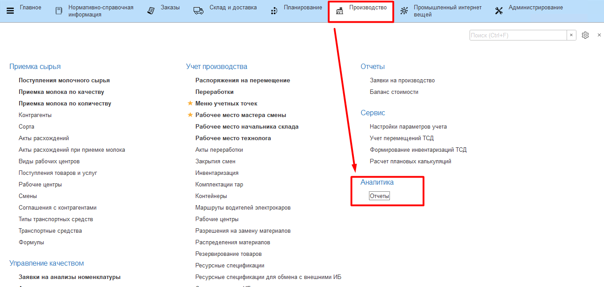
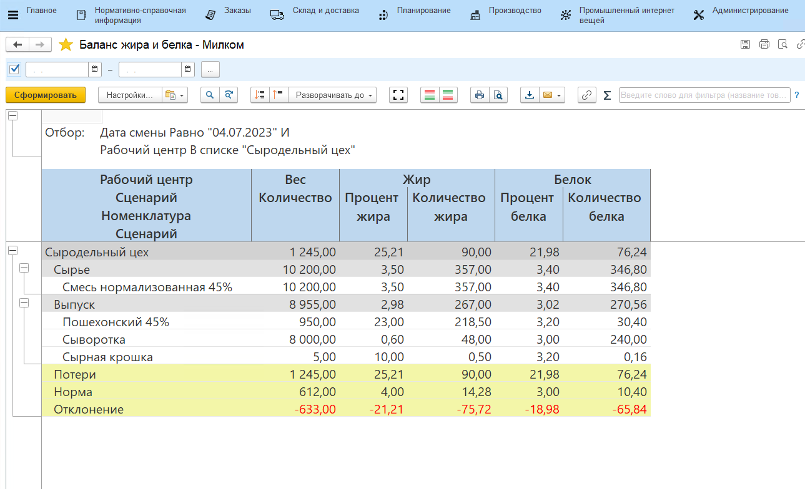
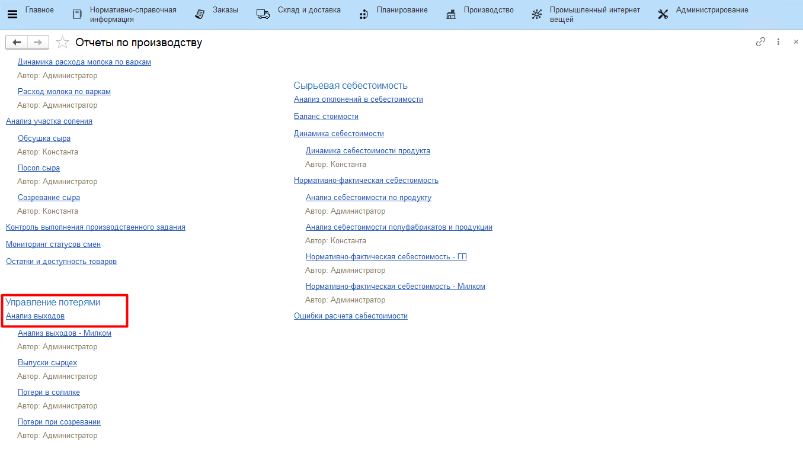
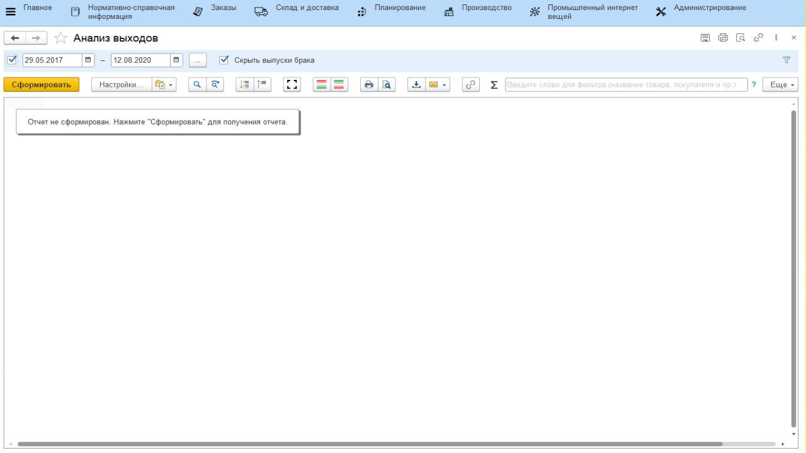
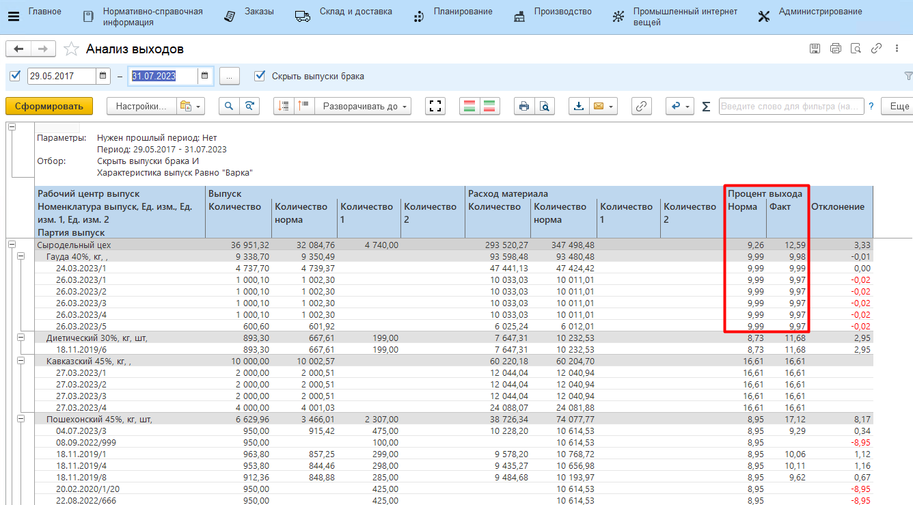

# Анализ потерь

Для анализа информации по участку варки сыра в системе есть
несколько отчетов. Все они находятся в подсистеме **"Производство"** -\>
"Отчеты":

Баланс по этапу варки сыра по кг, жкг и бкг можно посмотреть с помощью отчета **"Баланс жира и белка"**.

- Необходимо установить параметр:
    - Период. 
- Cформировать;
- Здесь можно видеть:
    -   Сколько какого продукта было выпущено, сколько при этом потратилось сырья;
    -   Какое было содержание жира и белка в сырье, какое получилось в выпусках (как в кг, так и в %);
    -   Получившийся процент потерь по кг, жкг и бкг и нормативный в пределах указанного в параметрах периода, а также отклонение от нормы.

Отчет **"Анализ выходов"** позволяет увидеть, какой должен был быть нормативный расход смеси в кг и какой в итоге получился:  

-   Указать период, характеристику выпуска *"Варка"* и сформировать:  

  
 
В отчете будет видна информация по расходу по каждой варке сыра за указанный период:  

- колонка *"Процент выхода норма"* - процентное отношения выпуска сыра в кг, который должен получиться по норме, к нормативному количеству смеси в кг;
- колонка *"Процент выхода факт"* - процентное отношения выпуска сыра в кг, который получился по факту, к количеству потраченной смеси в кг.
  

