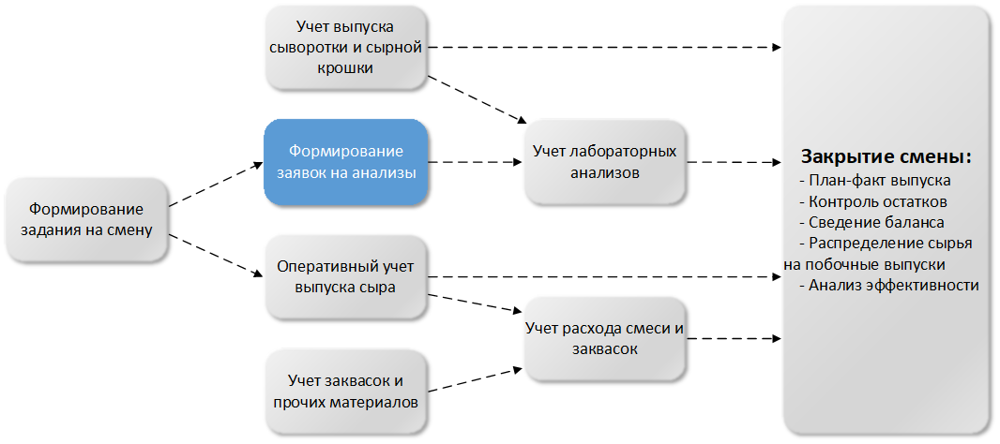

# Общая информация

Учет варки сыра схематично можно представить следующим образом:

 

На схеме серыми прямоугольниками отображены функции, выполняемые
пользователями системы, синими - функции, выполняемые автоматически.
Стрелочками показаны последовательность и взаимосвязи выполнения
операций.

 

**Особенности учета:**

-   Учет всех выпускаемых продуктов и полуфабрикатов ведется по партиям.
    Учет лабораторных анализов выполняется для всех выпускаемых партий
    продукции и полуфабрикатов. Партиями сыра на данном этапе являются
    варки;
-   Выпуск сыра учитывается в килограммах и штуках одновременно;
-   Расход нормализованного молока (смеси), заквасок и прочих
    используемых при варке ингредиентов, учитывается в разрезе варок;
-   Учтенное нормализованное молоко при закрытии смены частично
    распределяется на побочные выпуски для формирования стоимости
    побочных выпусков. База для распределения определяется согласно
    отраслевой методике, на основании фактического содержания жира и
    белка в сыре и побочных выпусках, с учетом коэффициентов ценности
    жира и белка.
     