**Рецептуры**
=============

Рецептуры по нормативному расходу сырья и ингредиентов на этапе варки
сыра задаются в справочнике "Ресурсные спецификации". При этом на сыры
разной жирности задаются разные рецептуры.

 

-   Открыть справочник и перейти к созданию нового элемента, выбрав создание через форму "Работа со спецификацией":  
    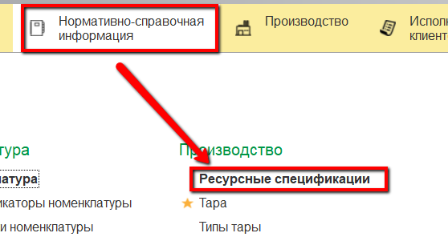
    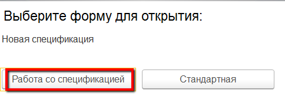
     
-   Нажать "Выбрать шаблон":  
    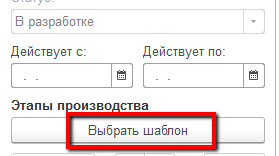

-   Указать сыр, для которого создается рецептура:  
    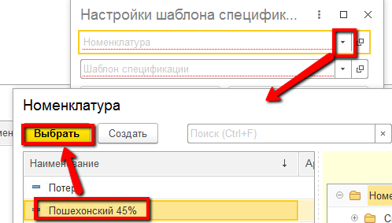
     
-   Выбрать шаблон, по которому будет создана рецептура:  
    
     
-   Нажать "Заполнить по шаблону". Заполнятся странички этапов:  
    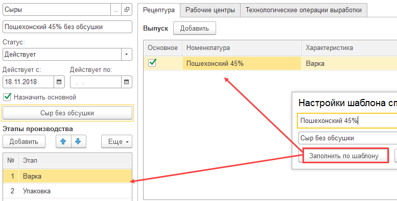
     
-   В первом этапе заполнить нормативное количество в кг одной варки данного вида сыра:  
    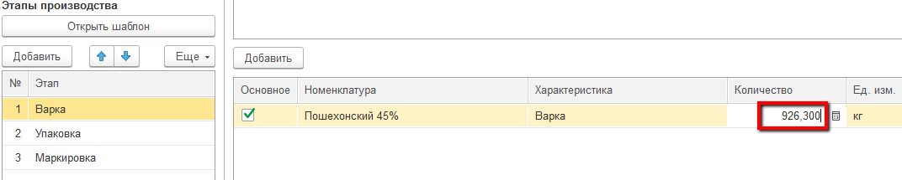
     
-   Заполнить материалы, которые используются при варке: основной - смесь с соответствующей жирностью, и все вспомогательные материалы, и их нормативное количество на указанный объем сыра:  
    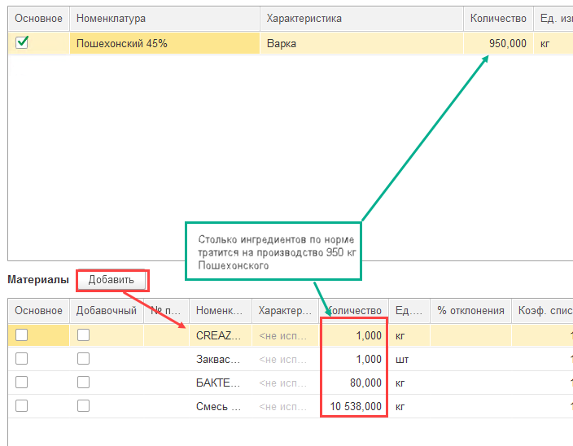
     
-   Отметить галочкой основной материал - смесь:  
    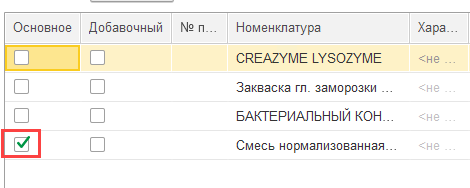
     
-   При этом, если такие ингредиенты, как закваски, ферменты и прочее насыпаются в пакеты, затем передаются сыровару для внесения в котел, это тоже нужно отразить в спецификации, заполнив столбец "N пакета"  
    - Ингредиенты с одинаковым номером пакета, соответственно, насыпаются в один пакет:  
    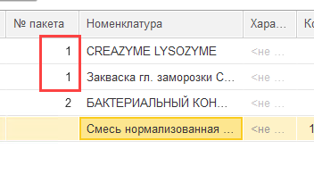
     
    - Если каждый ингредиент - это отдельный пакет, то можно просто проставить номера в порядке возрастания:  
    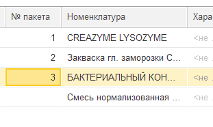
     
    - Если пакеты не используются, не вносить информацию в этот столбец.
     
-   Указать нормативное время внесения ингредиентов от начала варки сыра:  
    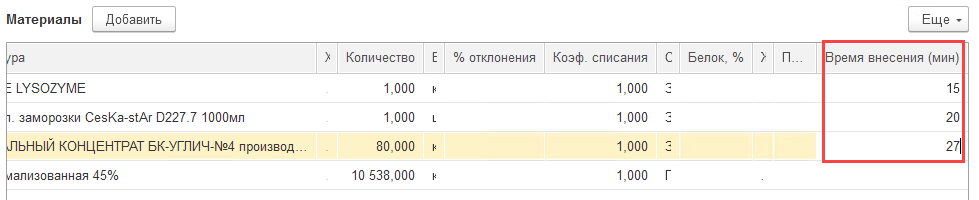
     
-   Указать побочные выпуски текущего этапа (сыворотка, сырная крошка) и их количества:  
    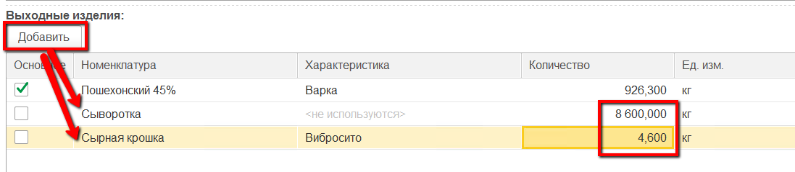
     
-   Перейти к этапу упаковки:  
    !Количество и сами этапы могут быть разными для разных предприятий, здесь описывается универсальный вариант!  
    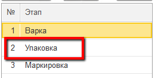
     
-   Указать количество сыра после соления указанного в материалах объема варки:  
    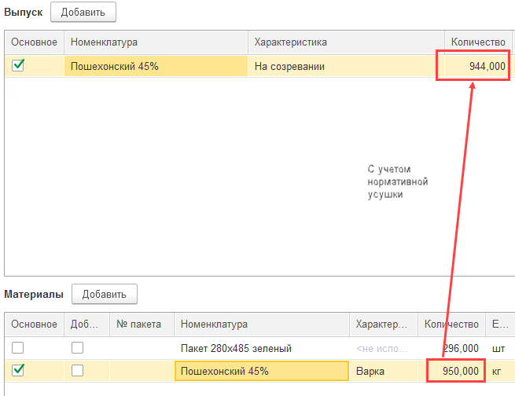

-   Указать пакеты, в которые упаковывается сыр после соления, и их нормативное количество на указанный объем выпуска этапа:  
    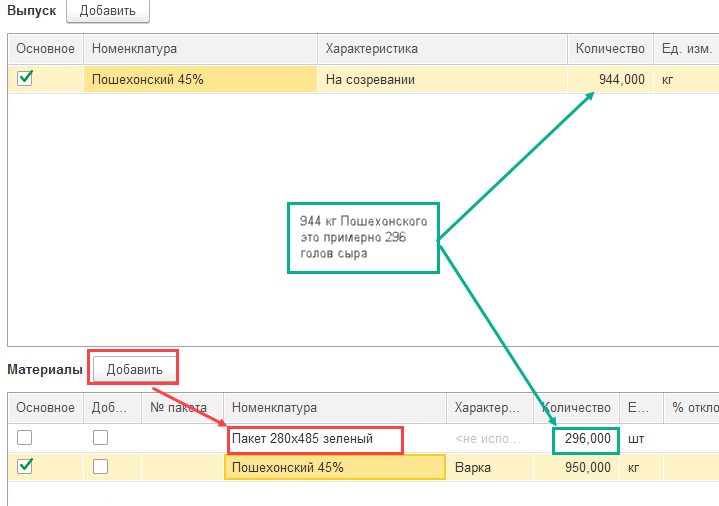
     
-   Перейти к этапу созревания:  
    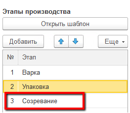
     
-   Указать количество сыра после созревания с учетом усушки количества после солилки:  
    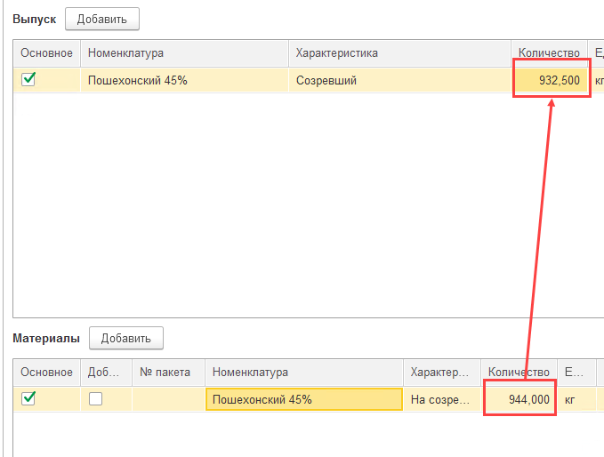

-   Указать материалы, которые используются при упаковке сыра после созревания (гофрокороба, этикетки, скотчи и прочее), и их нормативное количество на указанный объем выпуска:  
    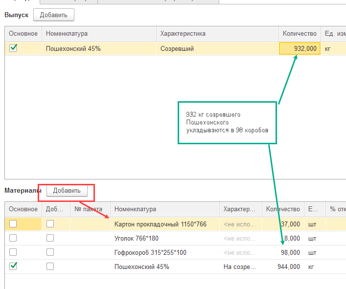
     
-   Указать дату начала действия рецептуры (при необходимости - дату окончания):  
    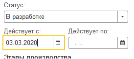
     
-   Указать, что рецептура действующая:  
    
     
-   Нажать "Записать" и закрыть.

