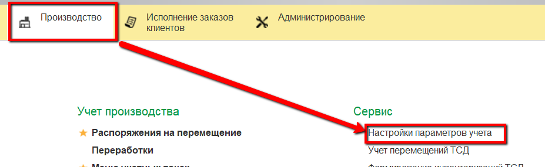
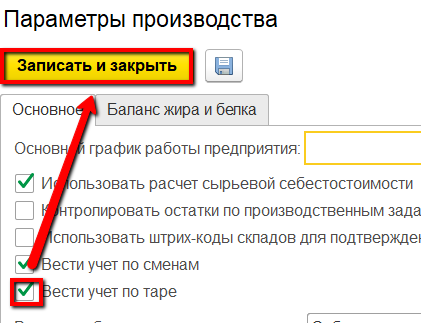
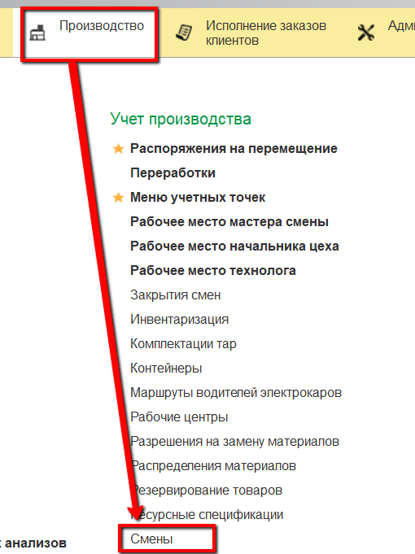
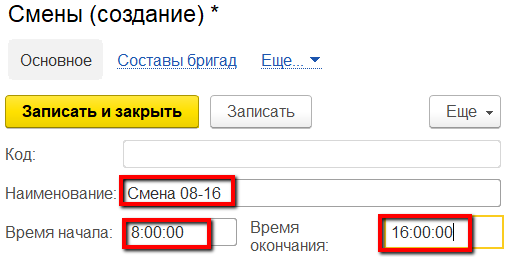

**Смены**
=========

Если на предприятии производство идет в несколько смен (а не в одну
24ч), то необходимо разделять посменный учет. Информация по сменам
хранится в справочнике "Смены".

 

Для начала, нужно включить посменный учет. Для этого в настройках
параметров учета отметить галочкой соответствующий пункт:

После этого можно заполнять справочник.

 

-   Открыть справочник "Смены" и перейти к созданию нового элемента:
    
     
-   Указать наименование, время начала и окончания смены:
    
     
-   Нажать "Записать и закрыть".
     

