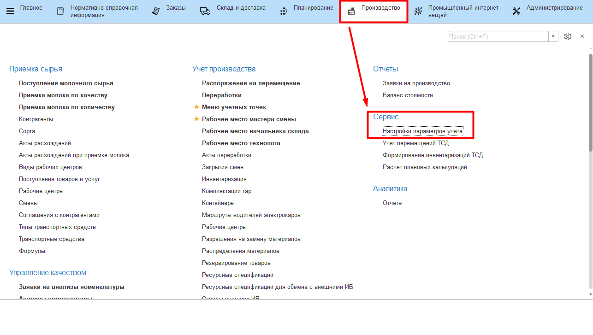
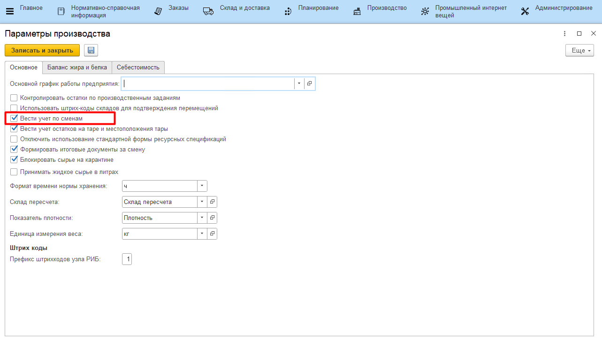
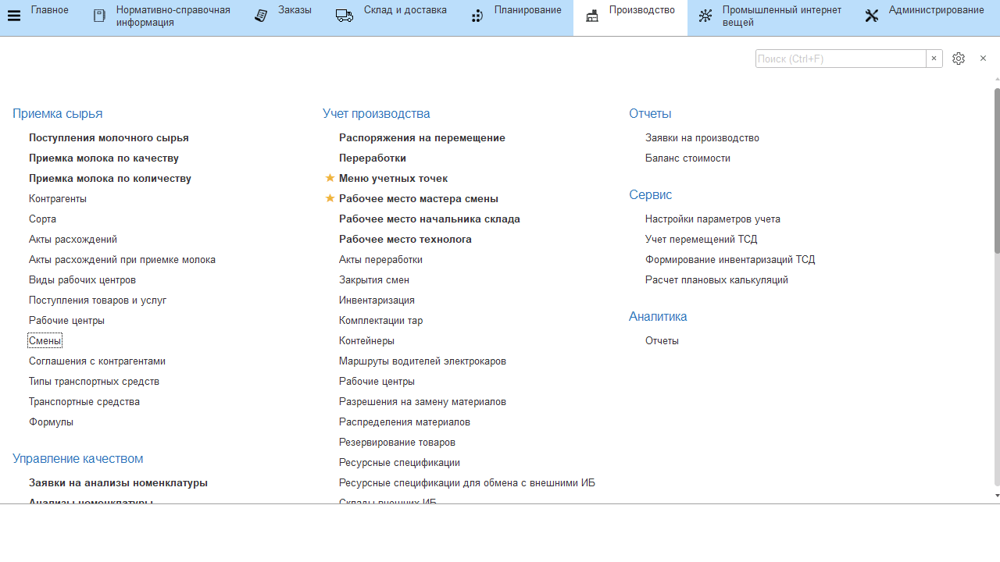

# Смены

Если на предприятии производство идет в несколько смен (а не в одну
24ч), то необходимо разделять посменный учет. Информация по сменам
хранится в справочнике **"Смены"**.

Сначала нужно включить посменный учет. Для этого в **"Настройках параметров учета"** отметить галочкой соответствующий пункт:

После этого заполнить НСИ.

-   Открыть справочник **"Смены"** и перейти к созданию нового элемента;
-   Указать наименование, время начала и окончания смены;
-   Нажать **"Записать и закрыть"**.
     

