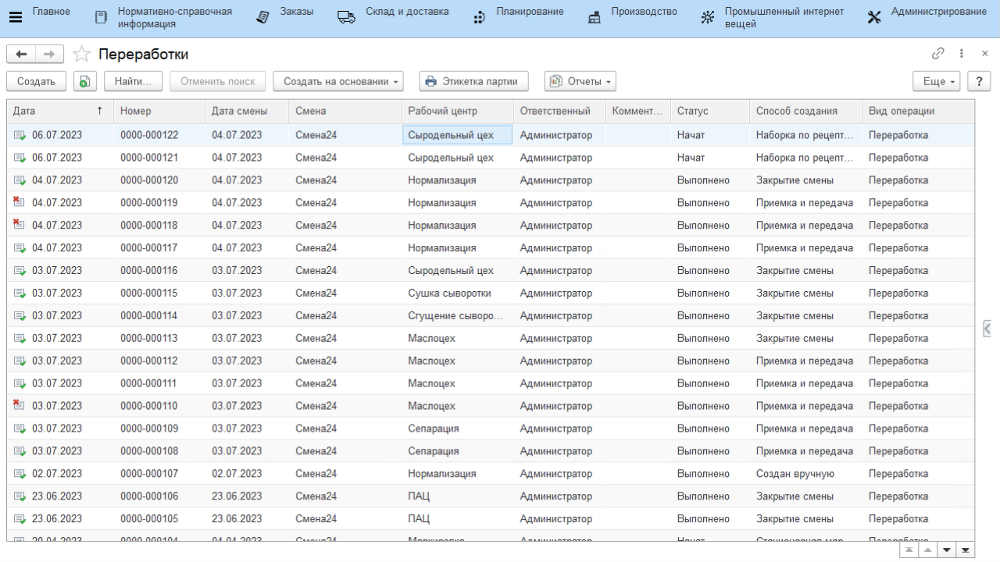
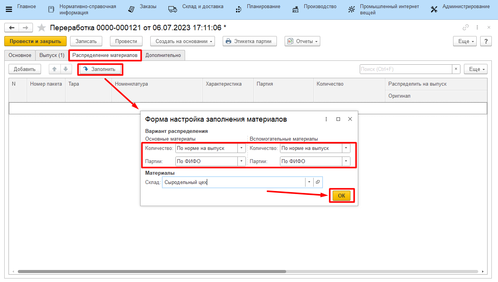
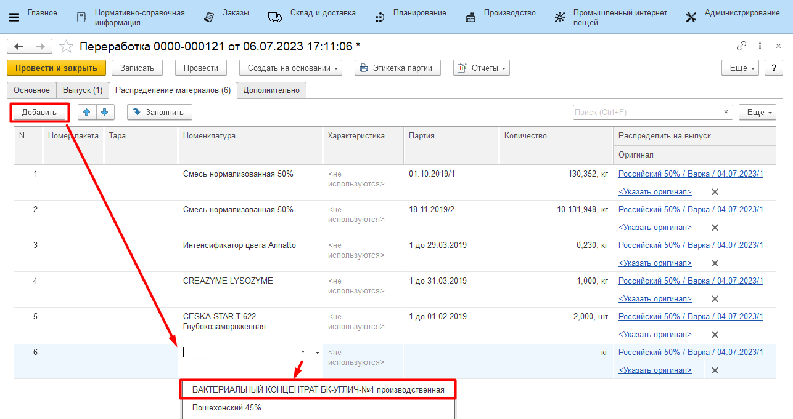
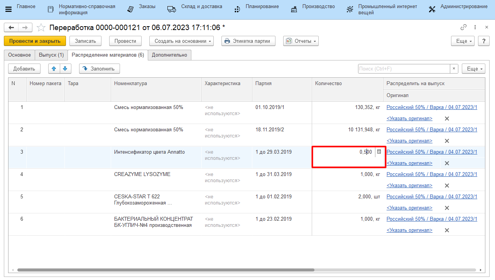

# Учет расхода мастером смены

Мастер смены может указать расход ингредиентов по всем варкам сыра за
смену.

-   Открыть документы **"Переработки"**;
-   Настроить отбор по участку сырцеха -  навести курсор на рабочий
    центр "Сыродельный цех", нажать правой кнопкой мыши на ячейку с ним и
    выбрать "Найти: Рабочий центр - Сыродельный цех";
-   Настроить отбор по дате - навести курсор на нужную дату смены,
    нажать правой кнопкой мыши на ячейку с ней и выбрать "Найти: Дата
    смены - <нужная дата>";
    

-   Во всех отобранных документах заполнить таблицу *"Распределение материалов"* следующим образом:

    - Открыть документ из списка;
    - Перейти на вкладку *"Распределение материалов"*, нажать кнопку **"Заполнить"**;
    - Указать для основного материала способ подбора партий, а распределение количества - по норме;
    - Указать для вспомогательных материалов способ подбора партий, а распределение количества - по норме;
    - Указать склад материалов и подтвердить:

-   При необходимости добавить или заменить материалы (если использовались аналоги) или их партии:

    
-   При необходимости изменить количества потраченных материалов:
    

-   Нажать **"Провести и закрыть"**. Повторить со всеми остальными отбранными документами, отражающими выпуски за смену.