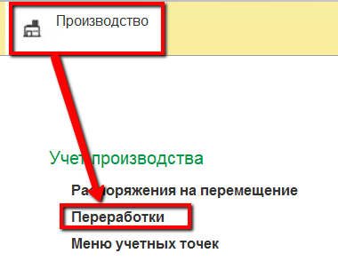
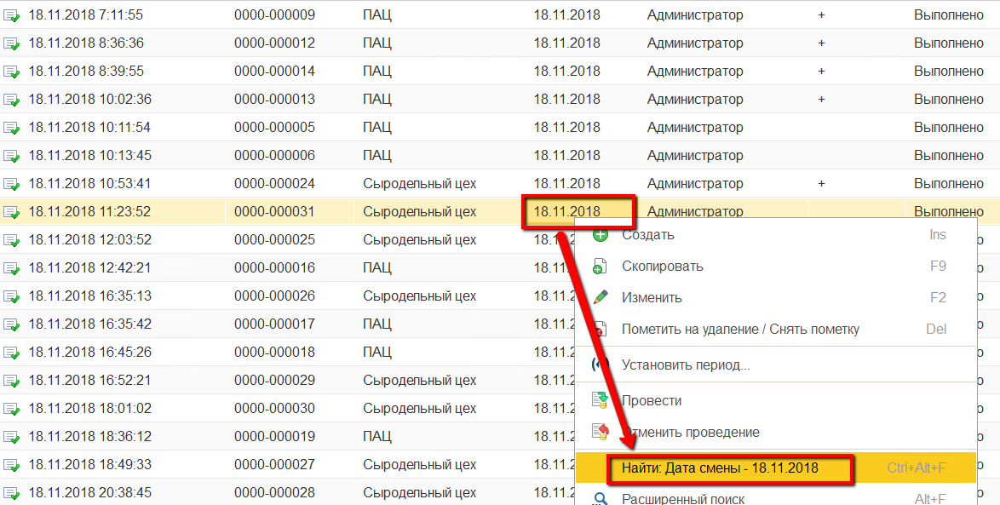
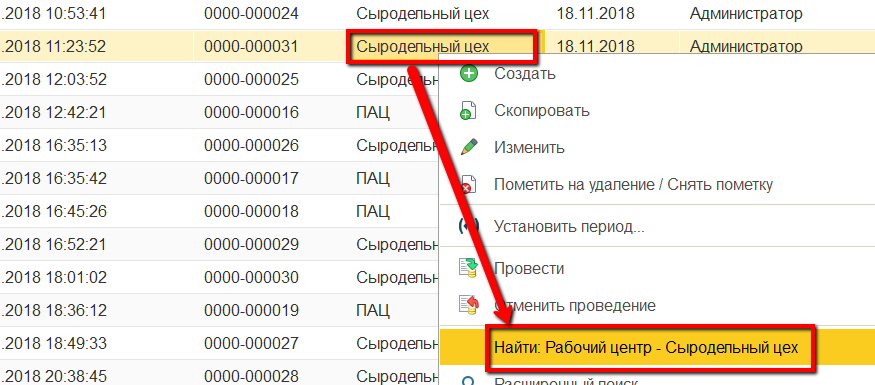
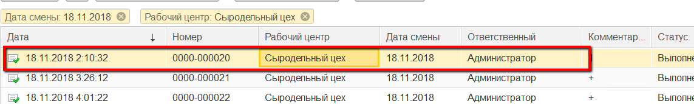
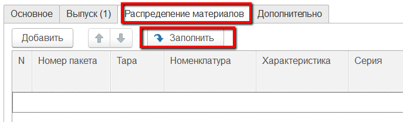
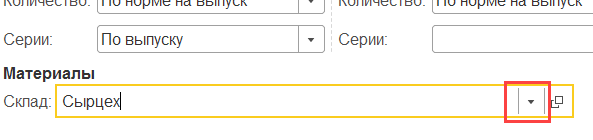
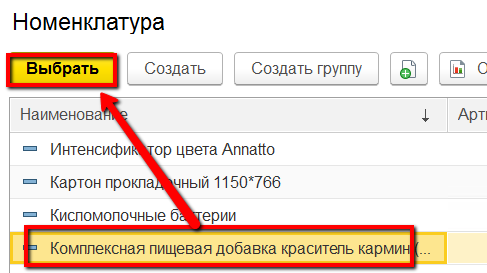
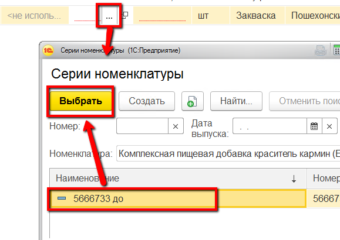
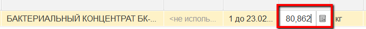

# Учет расхода мастером смены

Мастер смены может указать расход ингредиентов по всем варкам сыра за
смену.

 

 

-   Открыть документы "Переработки":
    
    
-   Настроить отбор по дате - навести курсор на нужную дату смены,
    нажать левой кнопкой мыши на ячейку с ней и выбрать "Найти: Дата
    смены - \<нужная дата\>":
    
    
-   Настроить отбор по участку сырцеха -  навести курсор на рабочий
    центр "Сыродельный цех", нажать левой кнопкой мыши на ячейку с ним и
    выбрать "Найти: Рабочий центр - Сыродельный цех":
    
    
-   Во всех отобранных документах заполнить таблицу "Распределение материалов" следующим образом:
        
    а) Открыть первый документ из списка двойным нажатием по
      строке:
    
    

    б) Перейти на вкладку "Распределение материалов", нажать кнопку "Заполнить":
    
    
в) Указать для основного материала, что его партия подбирается по выпуску, а количество по норме:
    
    
    г) Указать для остальных материалов правило использования
партий на предприятии (самые первые - по ФИФО, с самым ранним сроком
    годности - по ФЕФО):
    
    
    д) Указать склад материалов и подтвердить:
    )

-   При необходимости добавить или заменить материалы (если
    использовались аналоги) или их партии:
          
    
    
    
-   При необходимости изменить количества потраченных материалов:
    
    
-   Нажать "Провести и закрыть". Повторить со всеми остальными
    документами из п.3.