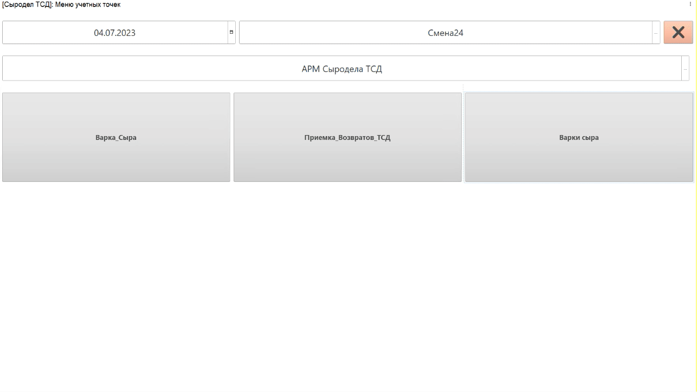

# Учет факта использования смеси для конкретной варки 

Если на предприятии есть возможность выдать сыроделу
устройство ТСД, он сможет через него указывать факт потраченного количества смеси.

-   Запустить на устройстве ТСД систему.
-   Нажать кнопку работы с заданиями;
-   Установить дату смены и смену, если они еще не указаны;
-   Зайти в учетную точку, отвечающую за операции сыродела через ТСД;
-   Нажать кнопку работы с варками сыра;
-   Откроется задание на текущую смену. Выбрать текущую варку и нажать **"Ингредиенты"**;  
-   В открывшемся окне можно видеть все ингредиенты, которые были
    набраны технологом (или мастером) под эту варку сыра;
-   Откроется либо окно с ингредиентами, учет по которым будет позже. В таком случае нажать **"Указать смесь"**;
-   Указать использовавшуюся партию, если она еще не указана;
-   Указать склад, с которого была смесь взята (либо с танка, либо уже с сырцеха, если в системе была учтена передача);
-   Нажать на поле указания количества и, используя клавиши на ТСД, указать фактически испольованное количество смеси для текущей варки;
-   Нажать **"Подтвердить"**:  

