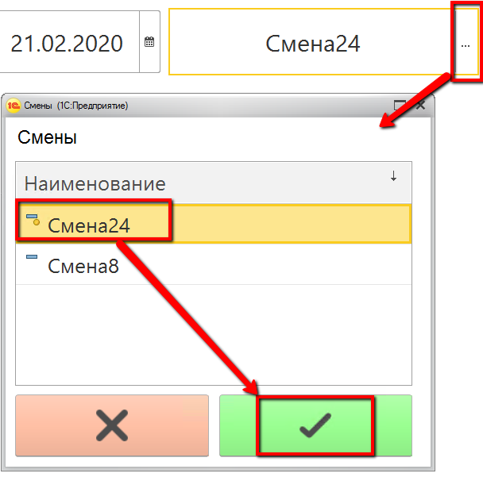
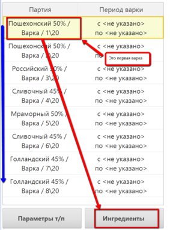
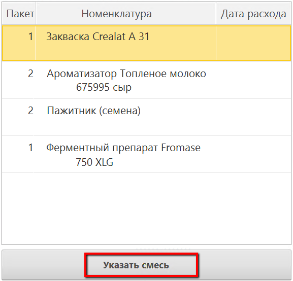
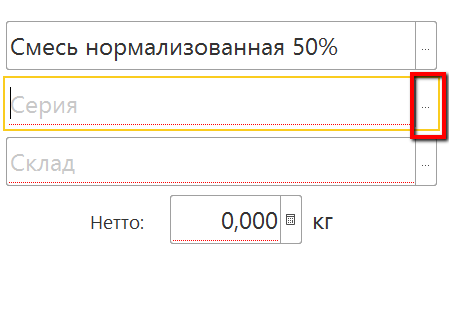
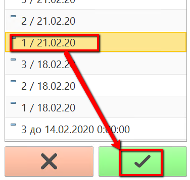
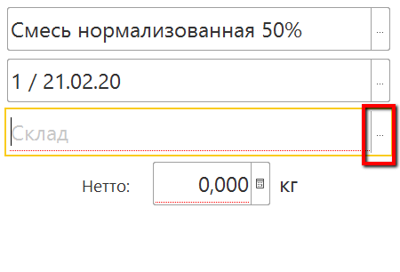
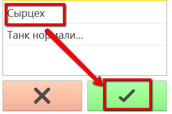
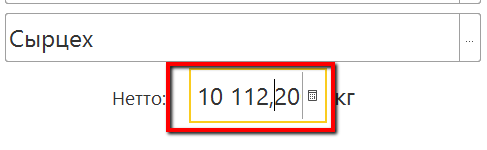
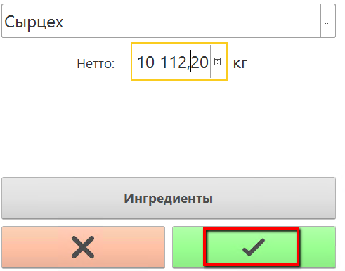

# Учет факта использования смеси для конкретной варки 

Если на предприятии есть возможность выдать сыроделу
устройство ТСД, он сможет через него указывать факт потраченного количества смеси.

 

 

-   Запустить на устройстве ТСД систему.
-   Нажать кнопку работы с варками сыра:  
    
    
-   Установить дату смены и смену, если они еще не указаны:  
    
           
    
    
-   Установить учетную точку, отвечающую за операции сыродела через ТСД:  
    
    
-   Нажать кнопку работы с варками сыра. Откроется задание на текущую смену. Выбрать первую варку и нажать "Ингредиенты":  
    
    
-   Откроется либо окно с ингредиентами, учет по которым будет позже. В таком случае нажать "Указать смесь":  
    
    
-   Либо же при нажатии кнопки ингредиентов сразу откроется окно учета смеси. Указать использовавшуюся партию, если она еще не указана:  
      
    
    
-   Указать склад, с которого была смесь взята (либо с танка, либо уже с сырцеха, если в системе была учтена передача):  
          
          

-   Нажать на поле указания количества и, используя клавиши на ТСД, указать фактическое испольованное количество смеси для текущей варки: 
        

- Подтвердить:  
        
