# Учет расхода сыроделом через сенсорный киоск

Сыродел указывает, сколько какого ингредиента он положил в котел для
конкретной варки сыра.

 

 

-   Открыть "Меню учетных точек":
    
-   Указать текущую дату и смену, если они еще не указаны:
    
-   Указать учетную точку, отвечающую за участок, где варится сыр:
    
-   Нажать кнопку, соответствующую указанию ингредиентов. Откроется
    задание на текущую смену. Выбрать первую варку и нажать
    "Ингредиенты":
    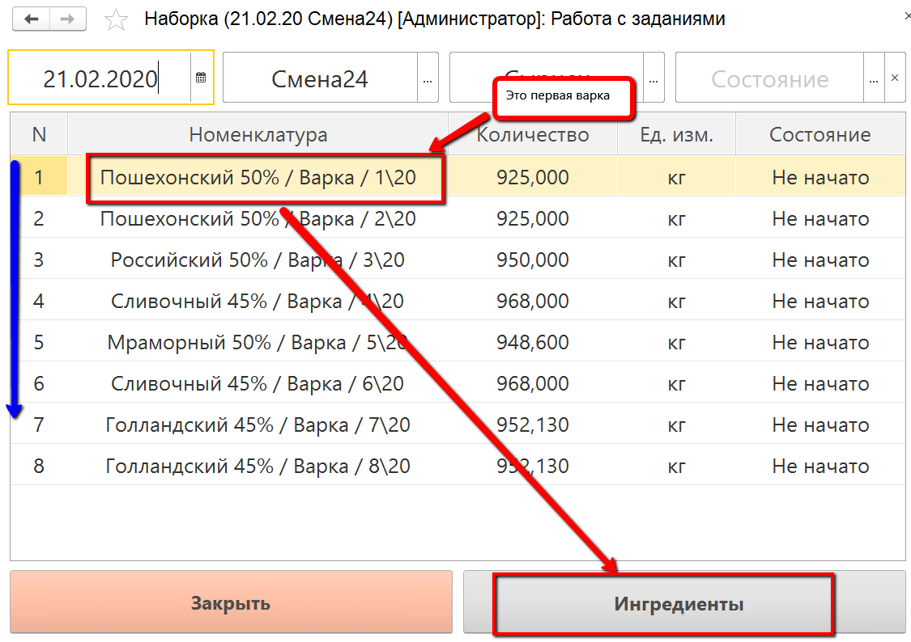
-   По умолчанию таблица заполняется ингредиентами по основной спецификации выбранного сыра. При этом возможны два сценария расчета норм ингредиентов (способ [настраивается в соответствующей кнопке учетной точки](../../../../CommonInformation/Handbooks/ButtonOfAccountPoint/WorkWithTasks/WorkWithTasks.md)).

## Расчет нормы ингредиентов от объема выпуска

- В случае расчета от объема выпуска при открытии уже будут видны нормы ингредиентов. При этом, если было указано [начало варки](../AccountingTimeBeginEndTSD/AccountingTimeBeginEndTSD.md), то будет указано и плановое время внесения каждого ингредиента:

  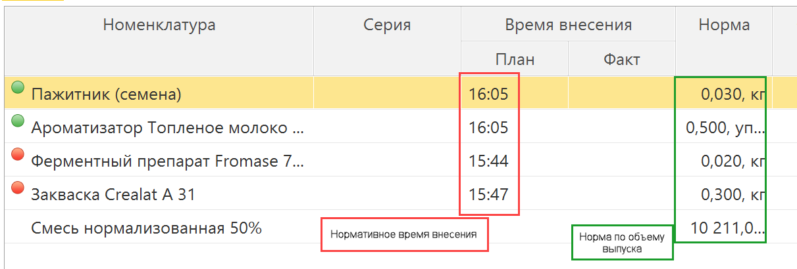

-   Далее возможно ручное указание ингредиентов, в случае если до этого не было их [наборки](../../SetIngredients/SetIngredients.md), или сканирование набранных пакетов, по которому заполняется время соответствующих ингредиентов. 

### Ручной ввод
-   Если какого-то ингредиента нет в списке, добавить его:
    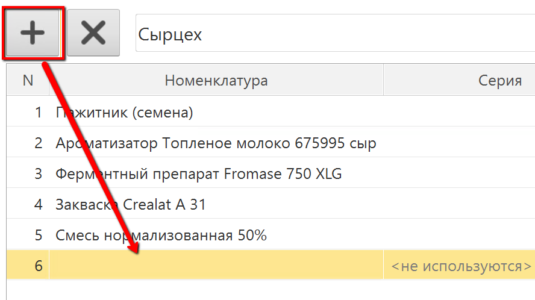
             
    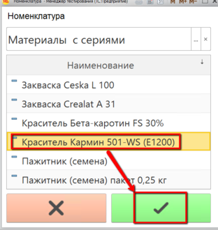
-   Выбрать первый использованный ингредиент, указать его партию:
    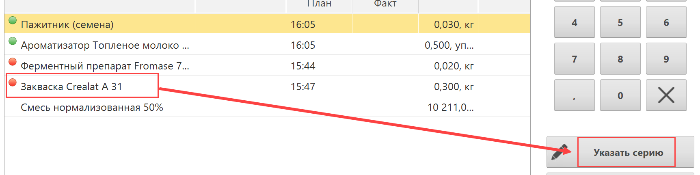
    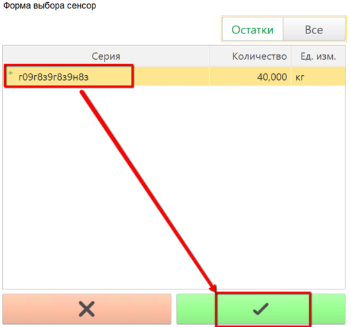
-   Указать количество ингредиента и нажать "Подтвердить":
    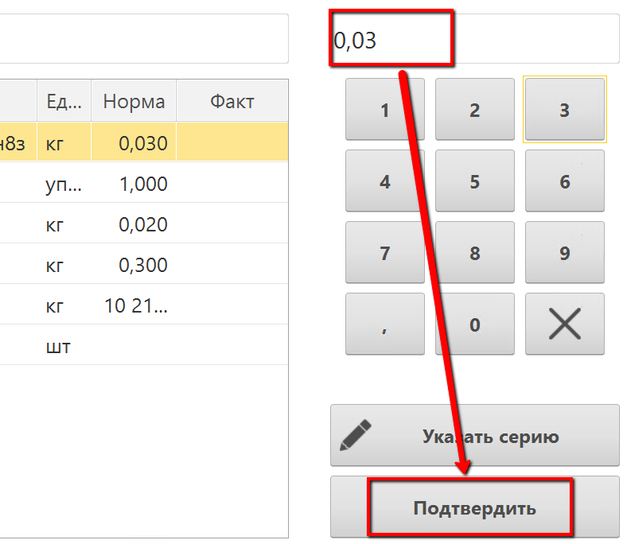

- Если указание количества основного материала происходит в литрах (если это [настроено в соответствующей кнопке учетной точки](../../../../CommonInformation/Handbooks/ButtonOfAccountPoint/WorkWithTasks/WorkWithTasks.md)), то при подтверждении будет сделан пересчет в кг (если лаборантами был внесен показатель плотности):

  

- Аналогично заполнить остальные. Нажать кнопку сохранения:
  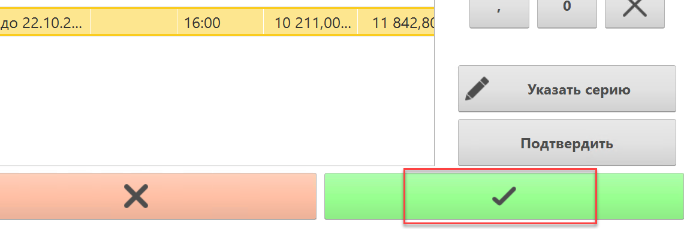

### Сканирование
-   Когда придет время внесения первого пакета, в открытой форме отсканировать QR-код, напротив ингредиентов, которые были засыпаны в пакет, проставится текущее время. Далее пакет высыпается в котел.
    
    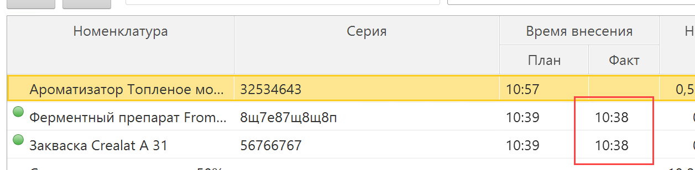
    
-   Так сканируются остальные пакеты. После каждого можно сохранять данные по кнопке:
    

## Расчет нормы ингредиентов от объема смеси

- В случае расчета от объема смеси при открытии нормы ингредиентов будут пустыми. При этом, если было указано [начало варки](../AccountingTimeBeginEndTSD/AccountingTimeBeginEndTSD.md), то будет указано и плановое время внесения каждого ингредиента:

  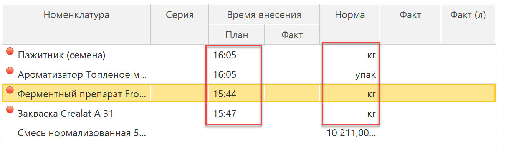

- При указании количества смеси происходит расчет и остальных норм:

  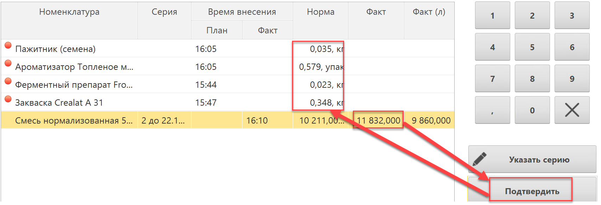

- Остальное заполнение делается аналогично предыдущему разделу.