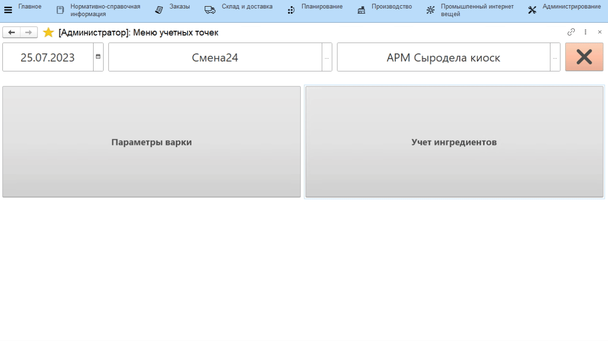
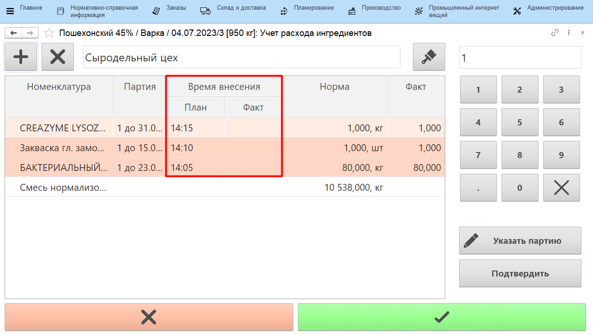
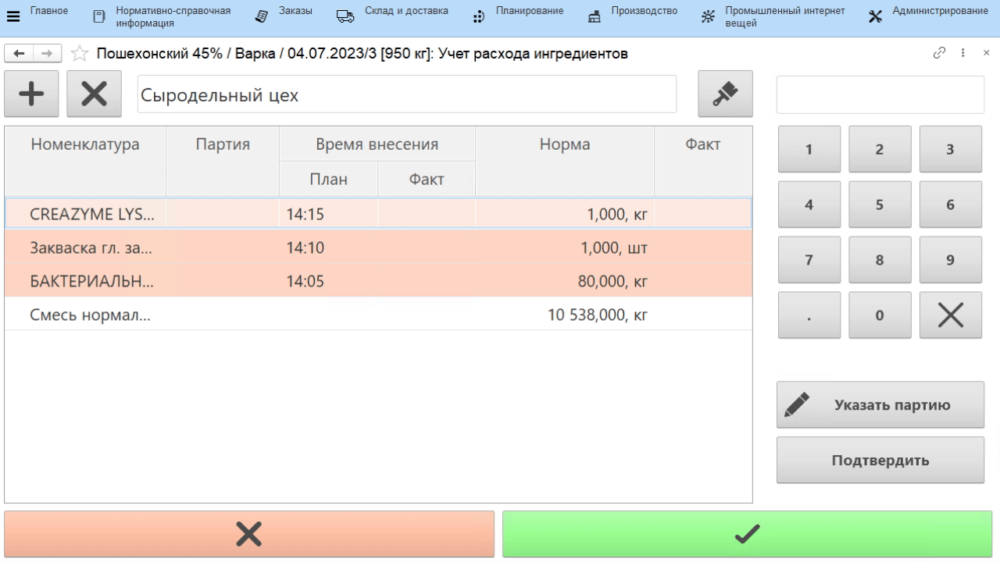
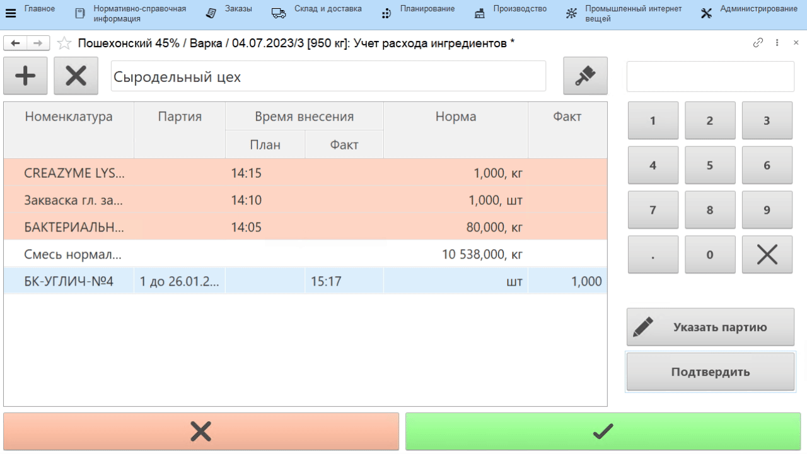
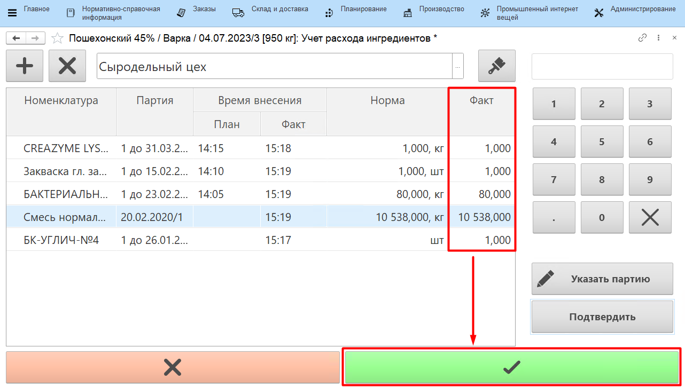
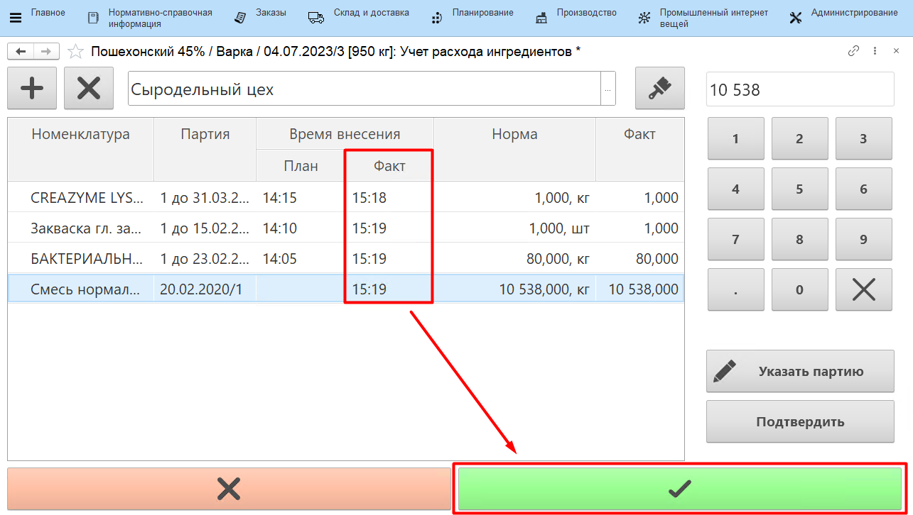

# Учет расхода сыроделом через сенсорный киоск

Сыродел указывает, сколько какого ингредиента он положил в котел для конкретной варки сыра.

-   Открыть **"Меню учетных точек"**;
-   Указать текущую дату и смену, если они еще не указаны;
-   Указать учетную точку, отвечающую за участок, где варится сыр;
-   Нажать кнопку, соответствующую указанию ингредиентов. Откроется задание на текущую смену. Выбрать первую варку и нажать **"Ингредиенты"**:

По умолчанию таблица заполняется ингредиентами по основной спецификации выбранного сыра. При этом возможны два сценария расчета норм ингредиентов (способ [настраивается в соответствующей кнопке учетной точки](../../../../CommonInformation/Handbooks/ButtonOfAccountPoint/WorkWithTasks/WorkWithTasks.md)).

## Расчет нормы ингредиентов от объема выпуска

В случае расчета от объема выпуска при открытии уже будут видны нормы ингредиентов. При этом, если было указано [начало варки](../AccountingTimeBeginEndTSD/AccountingTimeBeginEndTSD.md), то будет указано и плановое время внесения каждого ингредиента:

Далее возможно ручное указание ингредиентов, в случае если до этого не было их наборки, или сканирование набранных пакетов, по которому заполняется время внесения соответствующих ингредиентов. 

### Ручной ввод

-   Если какого-то ингредиента нет в списке, добавить его по кнопке **"+"**:

-   Выбрать первый использованный ингредиент, указать его партию;
-   Указать количество ингредиента и нажать **"Подтвердить"**:

!!! info ""
    Если указание количества основного материала происходит в литрах (если это [настроено в соответствующей кнопке учетной точки](../../../../CommonInformation/Handbooks/ButtonOfAccountPoint/WorkWithTasks/WorkWithTasks.md)), то при подтверждении будет сделан пересчет в кг (если лаборантами был внесен показатель плотности).

-   Аналогично заполнить информацию по внесению остальных ингредиентов. Нажать кнопку **"Подтвердить"**:

### Сканирование

Если наборка ингредиентов по пакетам была совершена заранее на отдельном [киоске](../../SetIngredients/SetIngredients.md), то в текущей учетной точке необходимо:

- когда придет время внесения первого пакета, в открытой форме отсканировать QR-код;
- согласно плановому времени внесения отсканировать остальные пакеты.

Напротив ингредиентов, которые были засыпаны в пакет, проставится фактическое время внесения. Далее пакет высыпается в котел.
    
По завершении нажать на кнопку **"Подтвердить"**:

## Расчет нормы ингредиентов от объема смеси

Если расчет количества вспомогательных материалов выполняется от количества смеси, то при открытии формы нормы дополнительных ингредиентов будут пустыми. 

При указании количества смеси происходит расчет и остальных норм:

Остальное заполнение делается аналогично предыдущему разделу.