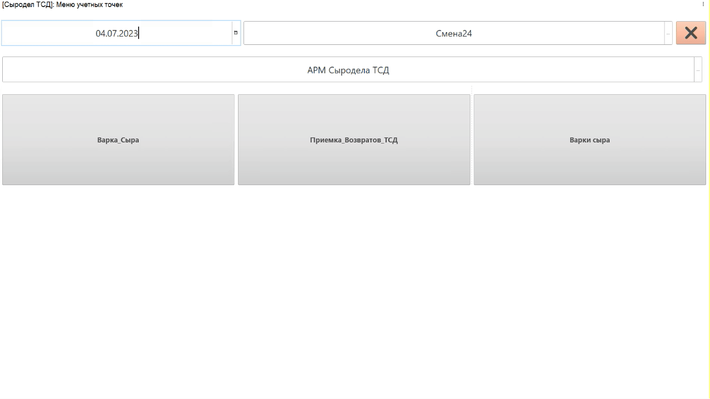
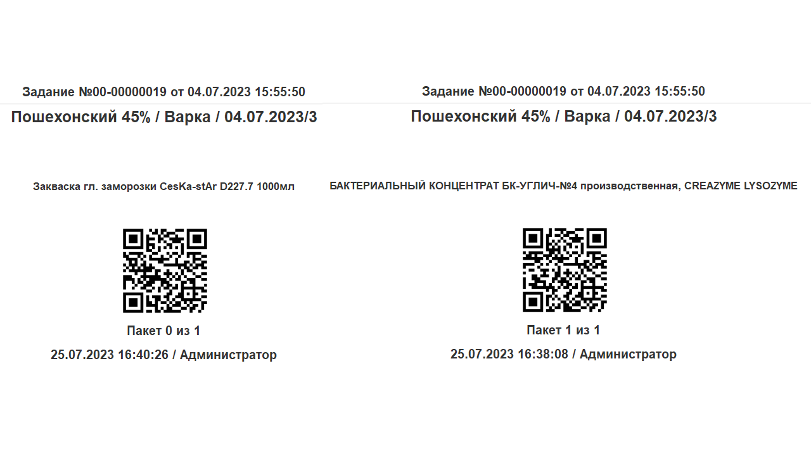
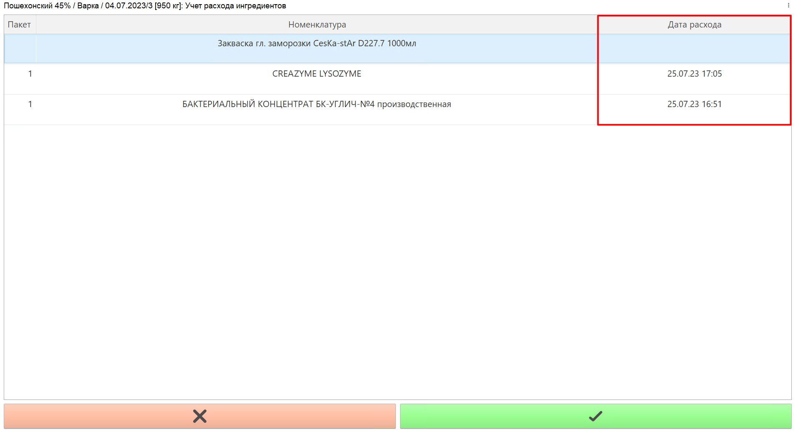
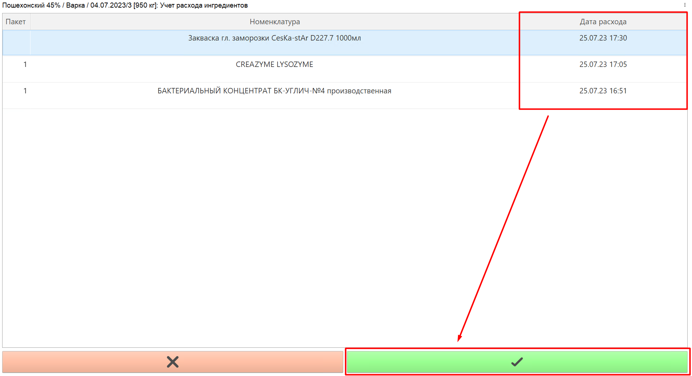

# Учет времени внесения ингредиентов сыроделом через ТСД (Терминал сбора данных)

Если на предприятии установлен учет наборки ингредиентов под варки сыра
(см.раздел ["Наборка ингредиентов под варки сыра"](../../SetIngredients/SetIngredients.md)), то можно также установить контроль времени внесения этих ингредиентов, выдав сыроделу
устройство ТСД. Необходимо для фактических расчетов устанавливать как
время внесения каждого ингредиента, так и время начала варки. 

-   Запустить на устройстве ТСД систему.
-   Нажать кнопку работы с заданиями;
-   Установить дату смены и смену, если они еще не указаны;
-   Зайти в учетную точку, отвечающую за операции сыродела через ТСД;
-   Нажать кнопку работы с варками сыра;
-   Откроется задание на текущую смену. Выбрать текущую варку и нажать **"Ингредиенты"**;  
-   В открывшемся окне можно видеть все ингредиенты, которые были
    набраны технологом (или мастером) под эту варку сыра:

    
-   Сыроделу должны быть переданы пакеты (или один) со всеми взвешенными
    ингредиентами. На каждом таком пакете есть уникальный штрихкод, а
    также наименование варки, под которую пакет был набран:  

    
-   Для указания точного времени внесения ингредиента в момент, когда
    пакет будет высыпан в котел, нужно отсканировать, используя сканер
    ТСД, этикетку этого пакета. Тогда напротив каждого ингредиента из
    этого пакета зафиксируется текущее время как время внесения:

    
-   Подтвердить:  

