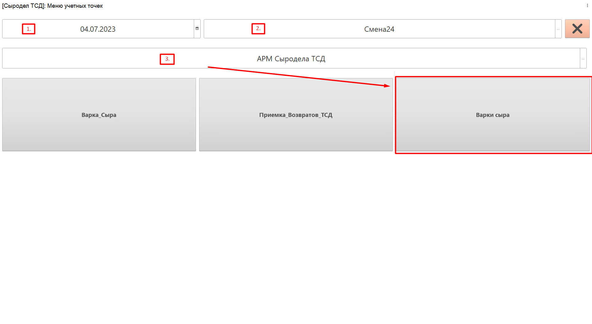
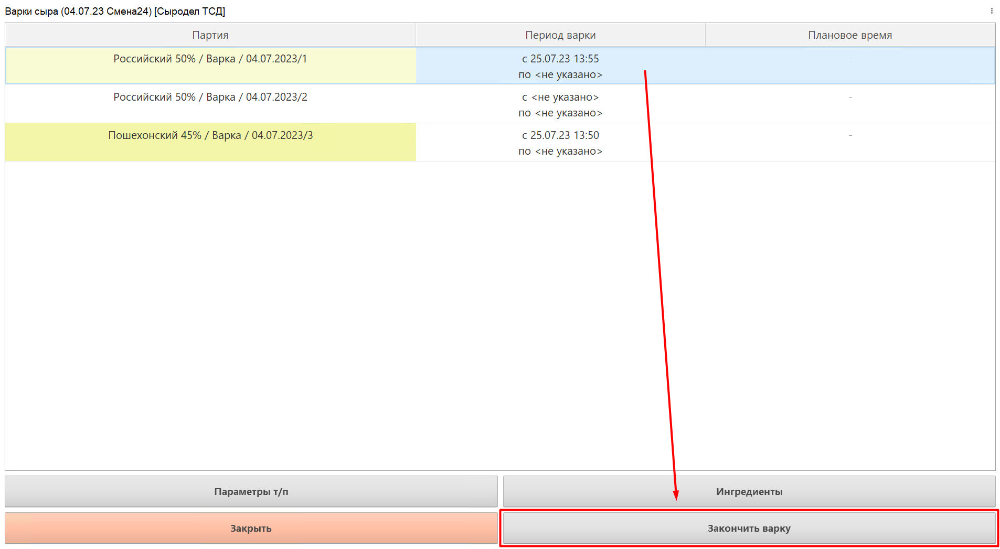
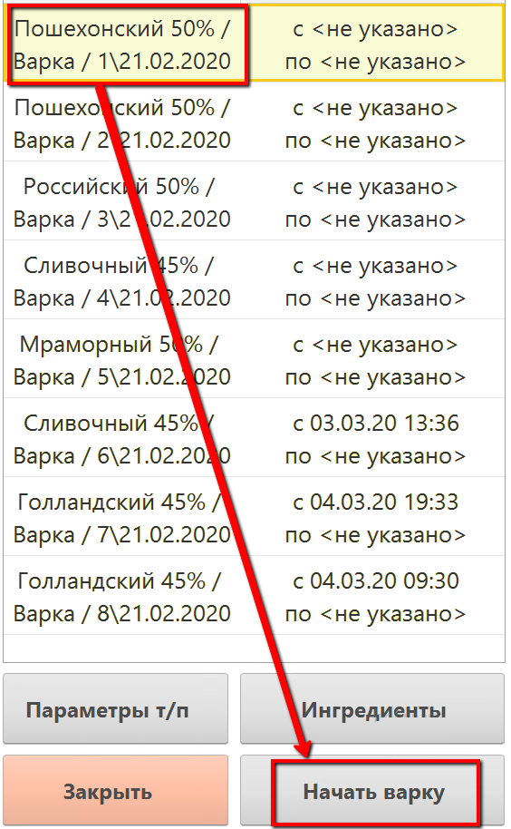
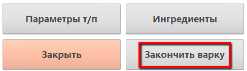

# Учет времени начала/окончания варки сыра

Учет времени начала/оконачания варки сыродел может производить, используя выданное ему устройство ТСД. 

 

-   Запустить на устройстве ТСД систему.
-   Нажать кнопку работы с варками сыра:  
    
    
-   Установить дату смены и смену, если они еще не указаны:  
    
           
    
    
-   Установить учетную точку, отвечающую за операции сыродела через ТСД:  
    
    
-   Нажать кнопку работы с варками сыра. Откроется задание на текущую
    смену. Выбрать первую варку и нажать "Начать варку" - зафиксируется
    время начала варки как текущее:  
    
    
-   После завершения варки сыра, вновь повторить преыдущие действия, теперь вместо кнопки "Начать варку" - кнопка "Закончить варку". Нажать на нее, время окончания зафиксируется.  
    
    
