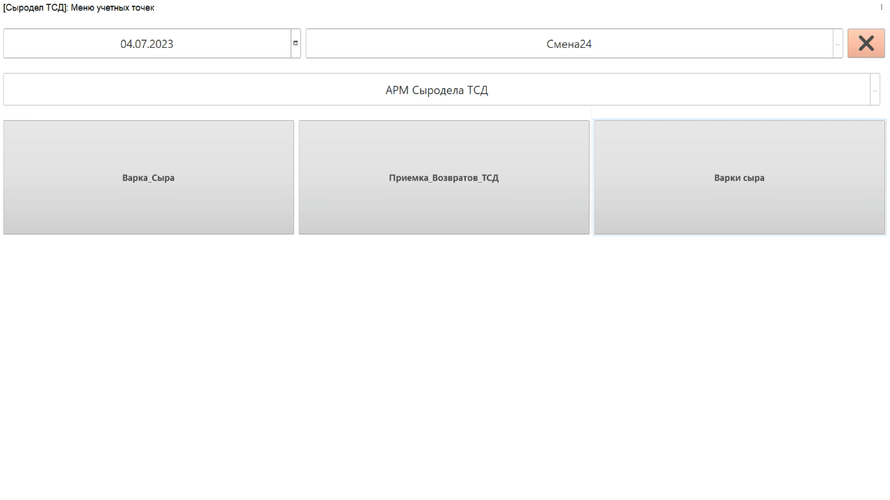

# Учет времени начала/окончания варки сыра

Учет времени начала/оконачания варки сыродел может производить, используя выданное ему устройство ТСД. 

-   Запустить на устройстве ТСД систему.
-   Нажать кнопку работы с заданиями;
-   Установить дату смены и смену, если они еще не указаны;
-   Зайти в учетную точку, отвечающую за операции сыродела через ТСД;
-   Нажать кнопку работы с варками сыра: 

Откроется задание на текущую смену. Выбрать первую варку и нажать **"Начать варку"** - зафиксируется время начала варки как текущее:

После завершения варки сыра, вновь повторить преыдущие действия. Нажать на кнопку **"Завершить варку"**, время окончания зафиксируется. 
 

    
