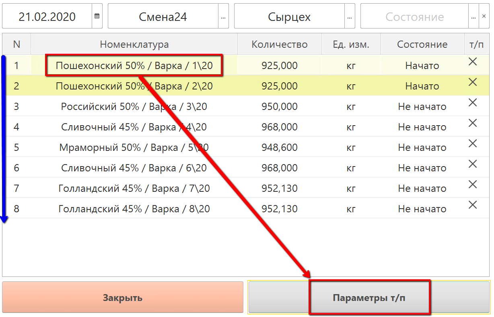
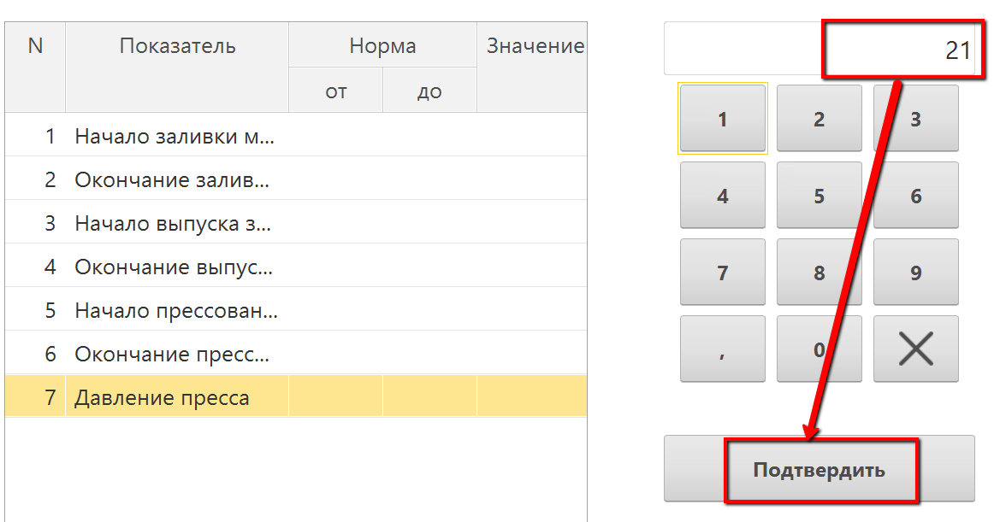
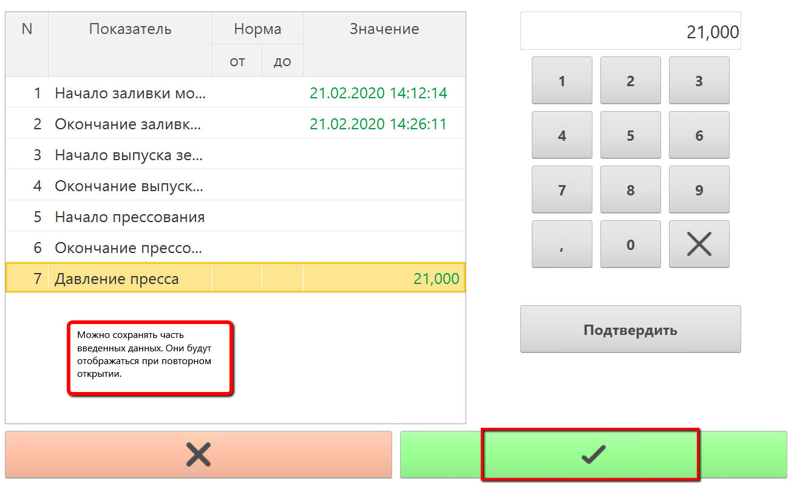
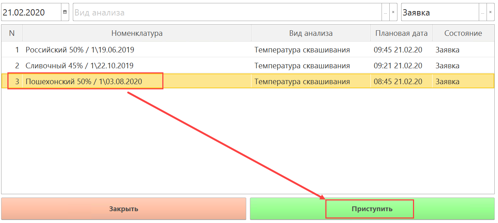
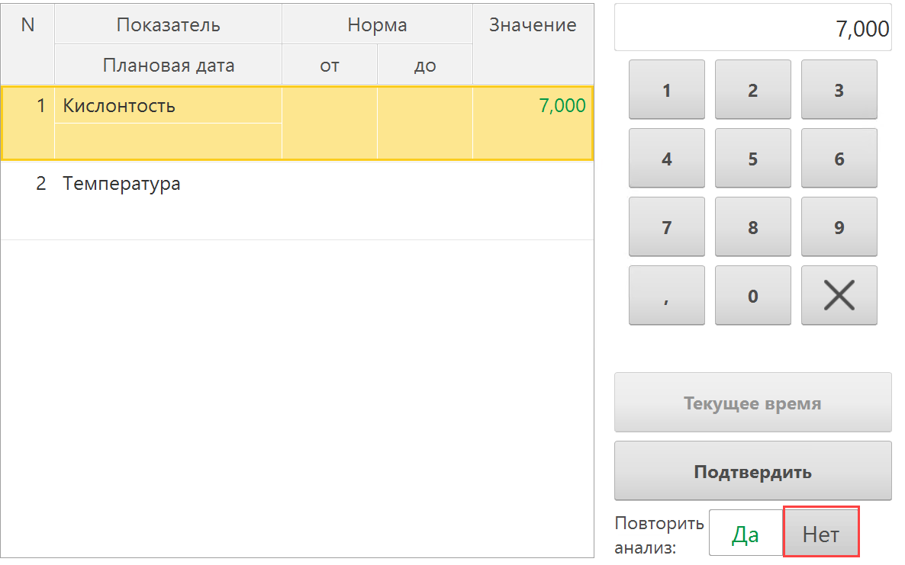
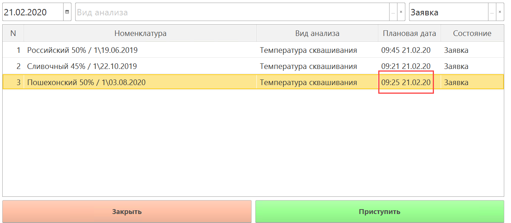

# Внесение параметров через сенсорный киоск

Сыродел оперативно указывает, какие были параметры технологического процесса
во время каждой варки сыра. 

 При этом, заполнение периодических показателей несколько отличается от обычных.

## Непериодические показатели

-   Открыть "Меню учетных точек":  
    
    
-   Указать текущую дату и смену, если они еще не указаны:
    
    
-   Указать учетную точку, отвечающую за участок, где варится сыр:
    
    
-   Нажать кнопку, соответствующую указанию параметров варки сыра.
    Откроется задание на текущую смену. Выбрать первую варку и нажать
    "Параметры т/п":
    
    
-   Откроется список параметров, которые необходимо зафиксировать в
    системе. При этом:
    - Если параметр типа "Число", то ввести его вручную:  
    
    - Если параметр типа "Дата" нужно заполнять оперативно, то это делается по кнопке "Текущее время", соответственно, подставляется текущее время, либо же полный ручной ввод информации.
    
-   Сохранить:
    

## Периодические показатели

- Открыть "Меню учетных точек":  
  

- Указать текущую дату и смену, если они еще не указаны:
  

- Указать учетную точку, отвечающую за участок, где варится сыр:
  

- Нажать кнопку, соответствующую указанию периодических параметров варки сыра. Откроется заявки на внесение данных по текущей смене. Выбрать нужную варку и нажать "Приступить":
  

- Откроется список периодических параметров, которые необходимо зафиксировать в
  системе. 

- Ввод значений таких параметров осуществляется как и ввод обычных, однако, при сохранении, в случае, если данный показатель больше не будет указываться, нужно снимать соответствующий признак:

  

- После сохранения создается заявка на ввод этих же показателей с новым плановым временем. Ввод нового значения делать уже по ней:

  