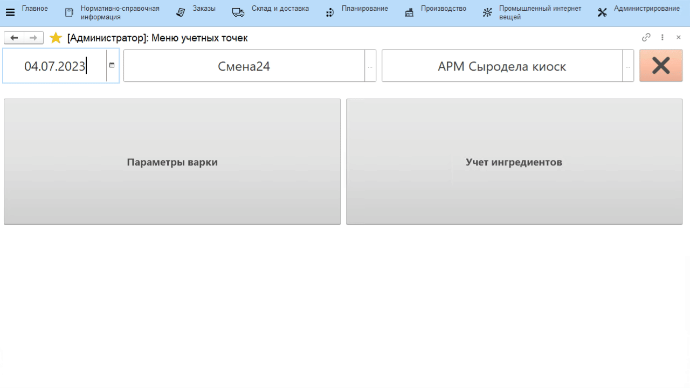
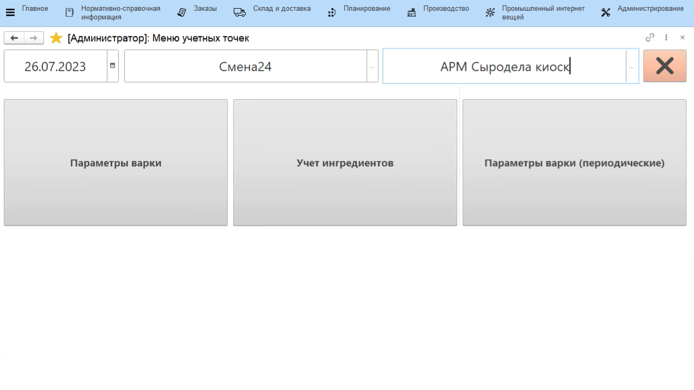
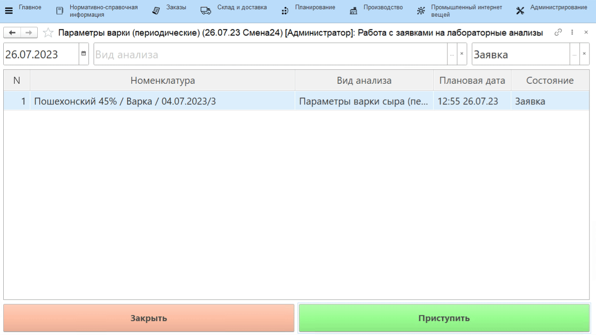

# Внесение параметров через сенсорный киоск

Сыродел оперативно указывает, какими были параметры технологического процесса
во время каждой варки сыра. 

При этом, заполнение периодических показателей несколько отличается от обычных.

## Непериодические показатели

-   Открыть **"Меню учетных точек"**:  
-   Указать текущую дату и смену, если они еще не указаны
-   Указать учетную точку, отвечающую за участок, где варится сыр
-   Нажать кнопку, соответствующую указанию параметров варки сыра.
    Откроется задание на текущую смену. Выбрать первую варку и нажать
    **"Параметры т/п"**;
-   Откроется список параметров, которые необходимо зафиксировать в
    системе. При этом:
        - Если параметр типа *"Число"*, то ввести его вручную;
        - Если параметр типа *"Дата"* нужно заполнять оперативно, то это делается по кнопке **"Текущее время"**, соответственно, подставляется текущее время. Если оперативность не требуется, доступен ручной ввод информации.
    
-   Нажать **"Подтвердить"**.

## Периодические показатели

- В меню учетных точек нажать кнопку, соответствующую указанию периодических параметров варки сыра. Откроются заявки на внесение данных по текущей смене. Выбрать нужную варку и нажать **"Приступить"**. Откроется список периодических параметров, которые необходимо зафиксировать в системе. 

Ввод значений таких параметров осуществляется как и ввод обычных, однако, при сохранении, в случае, если данный показатель будет замерян еще раз через некоторое время, нужно установить соответствующий признак (**"Нет"**). После сохранения создается заявка на ввод этих же показателей с новым плановым временем. Ввод нового значения делать уже по ней:

- Если взят последний анализ и вводить информацию больше не нужно, установить признак **"Да"**:

