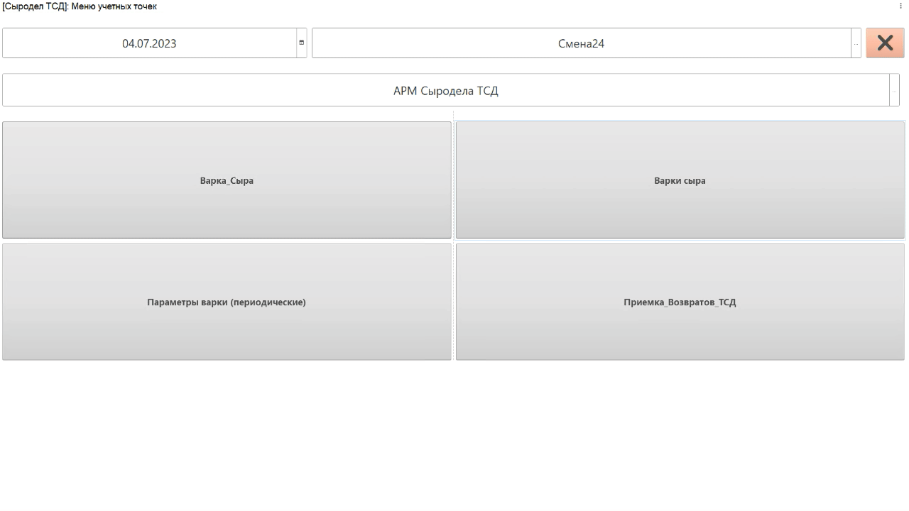
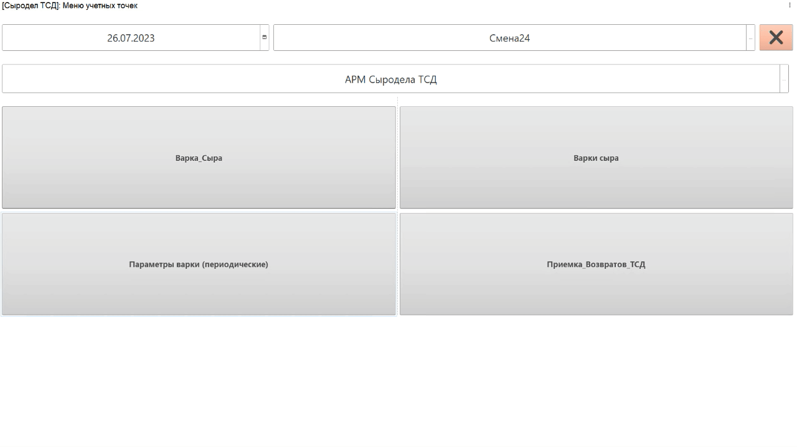
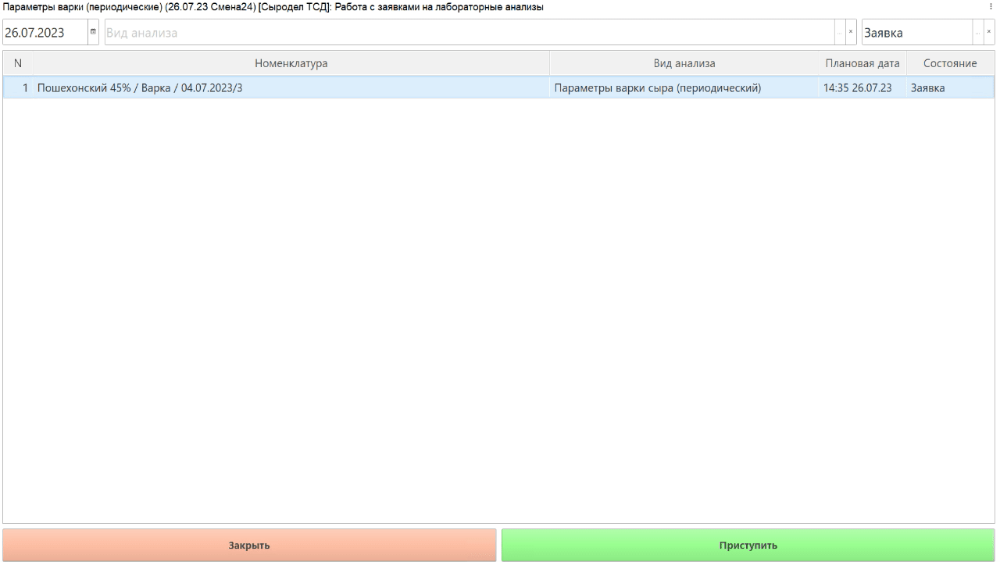

# Внесение параметров через ТСД

Если сыроделу выдается устройство ТСД, то учитывать параметры варки и
прессования он сможет через него.

При этом, заполнение периодических показателей несколько отличается от обычных.

## Непериодические показатели

-   Запустить на устройстве ТСД систему.
-   Нажать кнопку работы с заданиями;
-   Установить дату смены и смену, если они еще не указаны;
-   Зайти в учетную точку, отвечающую за операции сыродела через ТСД;
-   Нажать кнопку работы с варками сыра;
-   Откроется задание на текущую смену. Выбрать первую варку и нажать **"Параметры т/п"**;
-   Откроется список параметров, которые необходимо зафиксировать в
    системе. При этом:
    - Если параметр типа *"Число"*, то ввести его вручную;
    - Если параметр типа *"Дата"* нужно заполнять оперативно, то это делается по кнопке **"Текущее время"**, соответственно, подставляется текущее время. Если оперативность не требуется, доступен ручной ввод информации.
-   Сохранить:
    

## Периодические показатели

- Выбрать кнопку, соответствующую указанию периодических параметров варки сыра. Откроются заявки на внесение данных по текущей смене. Выбрать нужную варку и нажать **"Приступить"**. Откроется список периодических параметров, которые необходимо зафиксировать в системе. 

Ввод значений таких параметров осуществляется как и ввод обычных, однако, при сохранении, в случае, если данный показатель будет замерян еще раз через некоторое время, нужно установить соответствующий признак (**"Нет"**). После сохранения создается заявка на ввод этих же показателей с новым плановым временем. Ввод нового значения делать уже по ней:

- Если взят последний анализ и вводить информацию больше не нужно, установить признак **"Да"**:

