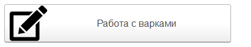
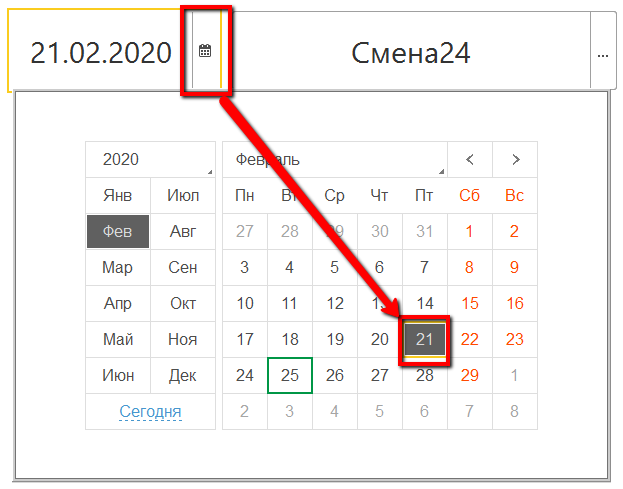
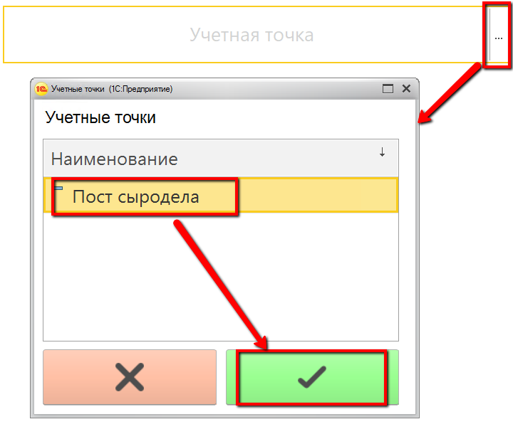
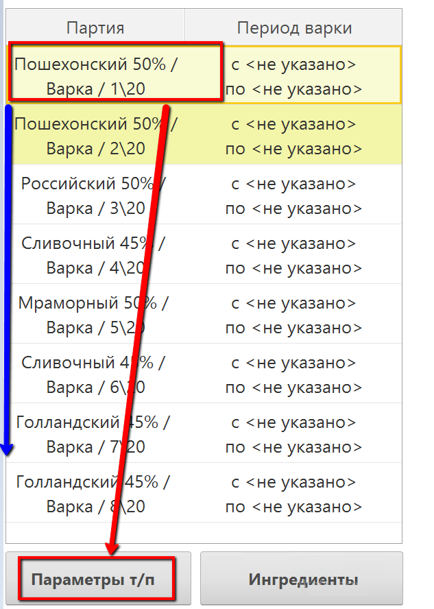
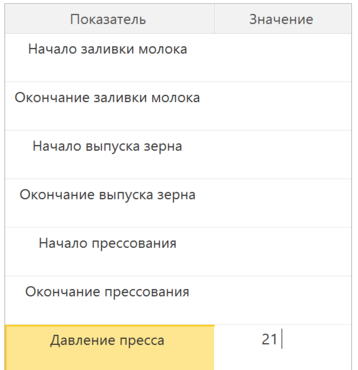
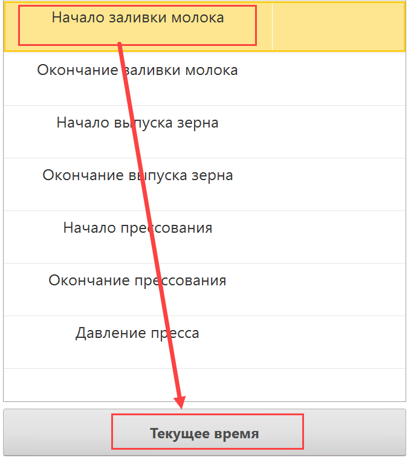
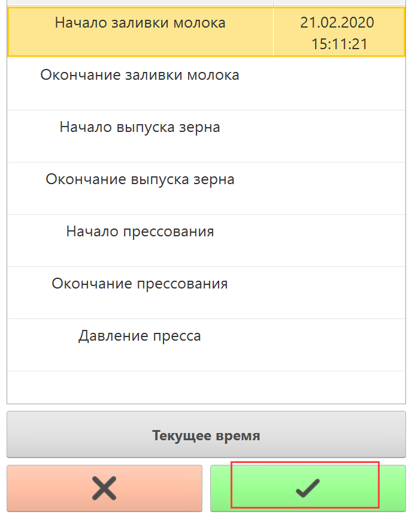

# Внесение параметров через ТСД

Если сыроделу выдается устройство ТСД, то учитывать параметры варки и
прессования он сможет через него.

  При этом, заполнение периодических показателей несколько отличается от обычных.

 ## Непериодические показатели

-   Запустить на устройстве ТСД систему.

-   Нажать кнопку работы с варками сыра:  
    
    
-   Установить дату смены и смену, если они еще не указаны:  
            
    
    
-   Установить учетную точку, отвечающую за операции сыродела через ТСД:  
    
    
-   Нажать кнопку работы с варками сыра. Откроется задание на текущую
    смену. Выбрать первую варку и нажать "Параметры т/п":  
    
    
-   Откроется список параметров, которые необходимо зафиксировать в
    системе. При этом:
    
    - Если параметр типа "Число", то ввести его, используя клавиши на
      устройстве ТСД:  
    
      
    
    - Если параметр типа "Дата" нужно оперативно, то это можно сделать по кнопке "Текущее время", соответственно, подставляется текущее время.  
    
    
-   Сохранить:
    
    
