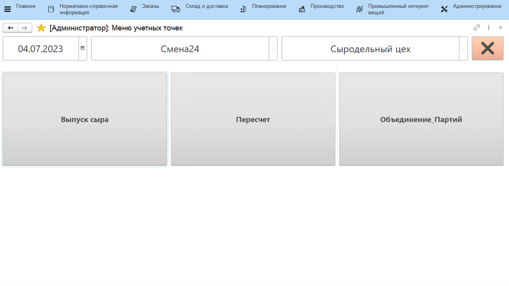

# Выпуск сыра

-   Открыть **"Меню учетных точек"**;
-   Указать текущую дату и смену, если они еще не указаны;
-   Указать учетную точку, отвечающую за участок, где варится сыр;
-   Нажать на кнопку, соответствующую операции выпуска сыра. Откроется
    окно с заданием на указанную смену. Выбрать первую варку и нажать
    **"Приступить"**;
-   Указать, на какой склад передается сваренный сыр;
-   Указать вес и количество голов в варке;
-   Подтвердить выпуск:

