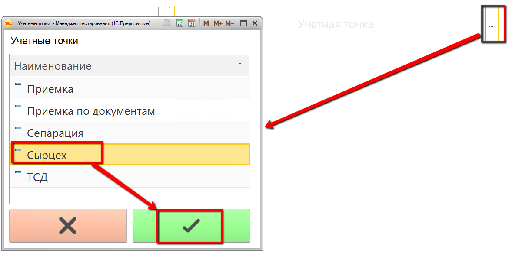
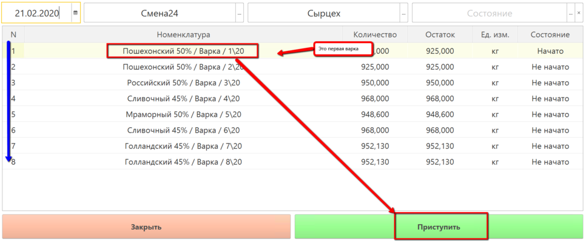
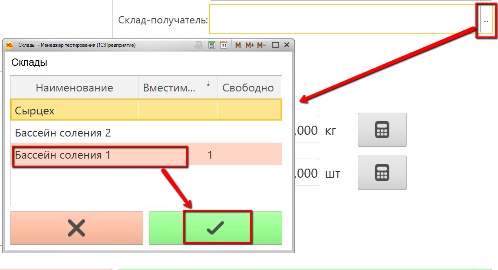
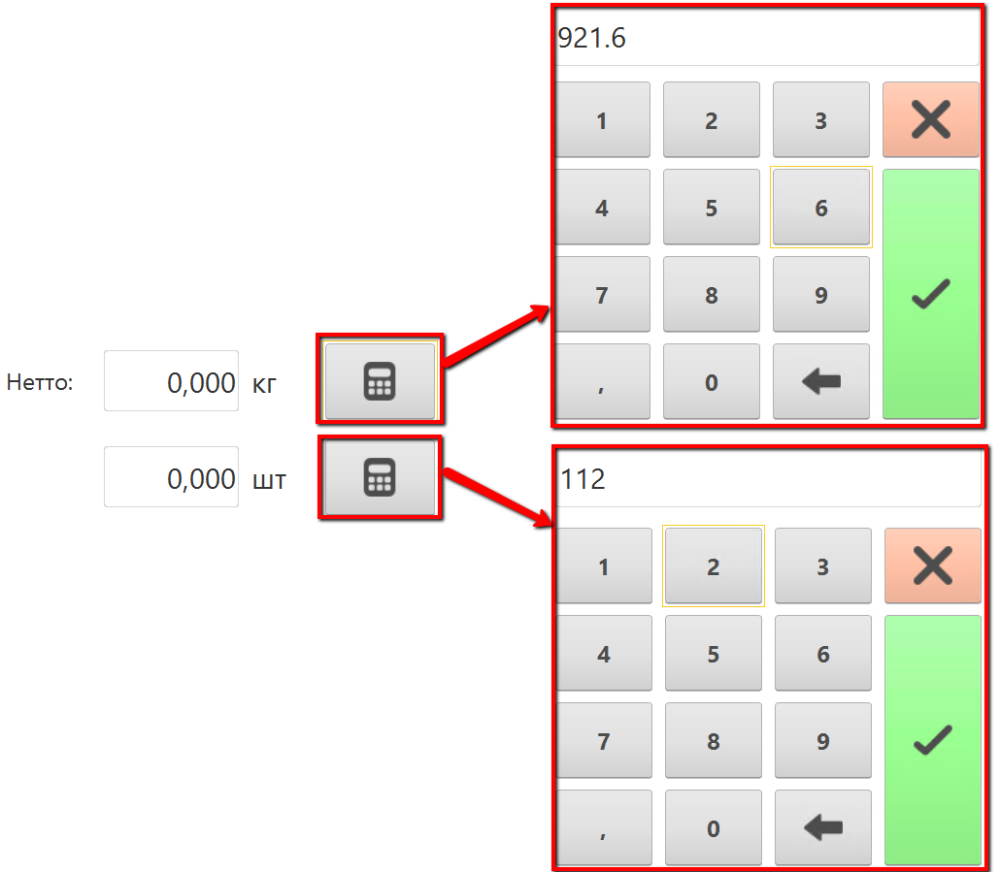
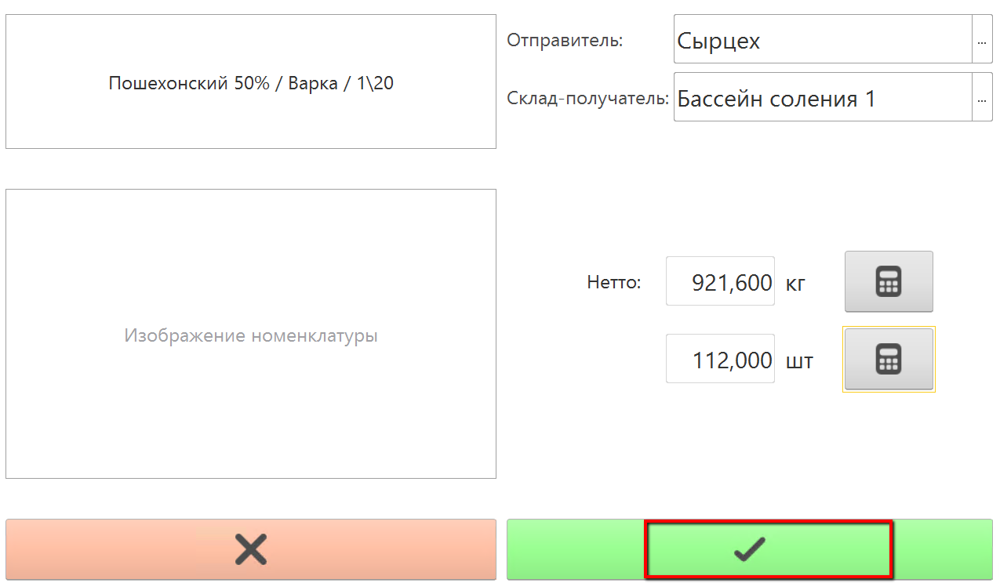

# Выпуск сыра

-   Открыть "Меню учетных точек":
    
     
-   Указать текущую дату и смену, если они еще не указаны:
    
    
-   Указать учетную точку, отвечающую за участок, где варится сыр:
    
    
-   Нажать на кнопку, соответствующую операции выпуска сыра. Откроется
    окно с заданием на указанную смену. Выбрать первую варку и нажать
    "Приступить":
    
    
-   Указать, куда передается сваренный сыр:
    
     
-   Указать вес и количество голов в варке:
    

-   Подтвердить выпуск:
    
