# Выпуск сырной крошки

Обычно всю сырную крошку собирают в одну партию за месяц, ежесменно
фиксируя её выходы с разных варок сыра. Мастер смены учитывает эту
операцию ручным созданием документа "Переработка".
 

 

1.   Открыть документы "Переработка" и перейти к созданию нового:
    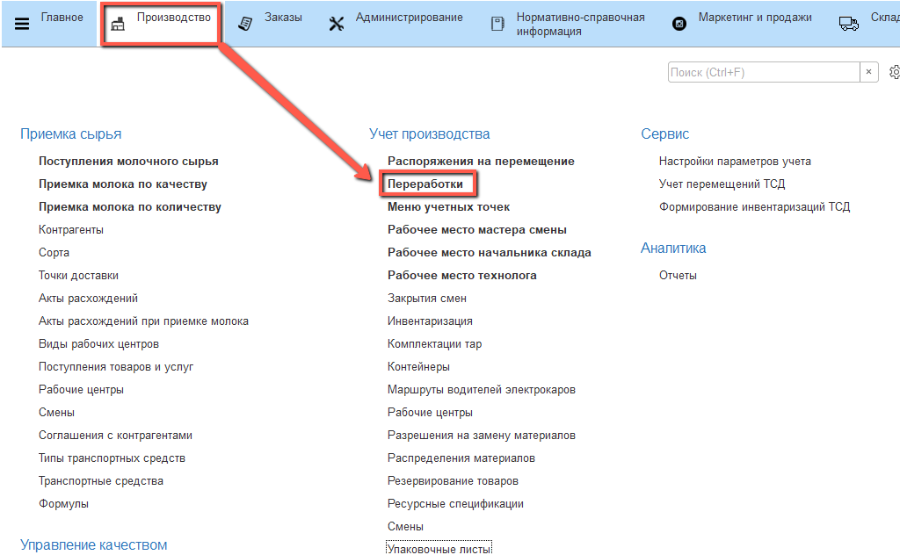
     
2.   Указать текущую дату смены и смену:
    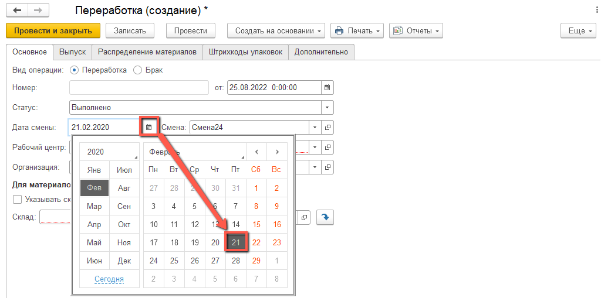   
    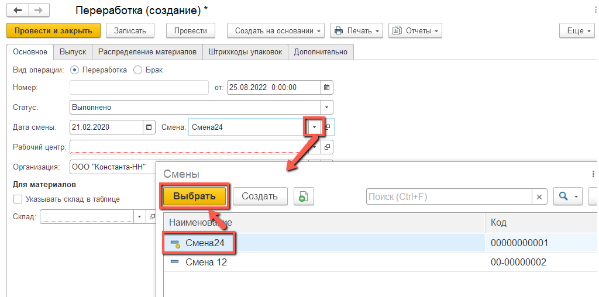
    
3.   Указать участок, где варится сыр:
    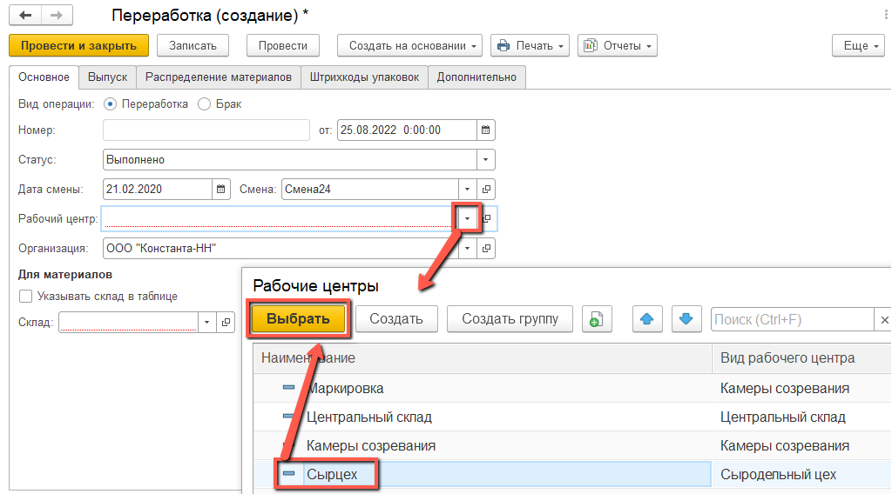
     
4.   Установить статус "Выполнено":
    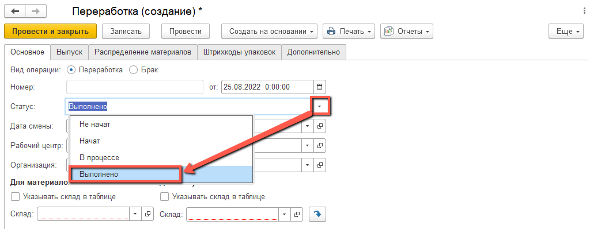
     
5.   Указать, что склады указываются в табличной части:
    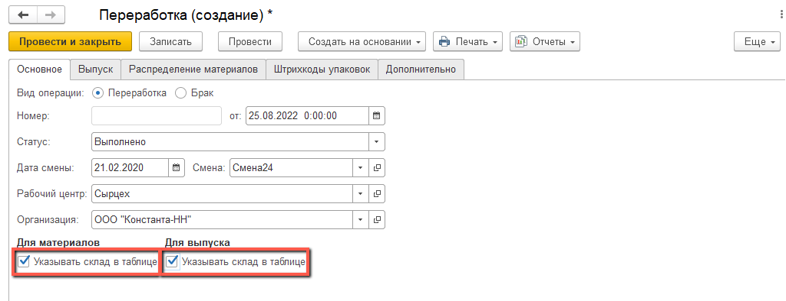
     
6.   В таблице "Выпуск" добавить позицию "Сырная крошка":
    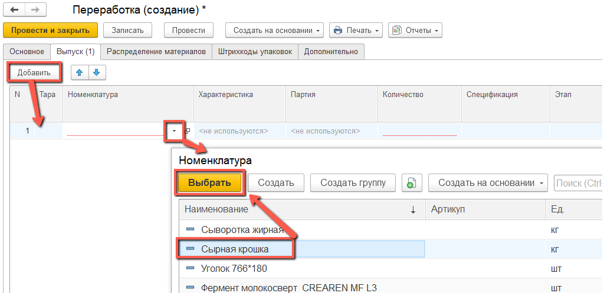
     
7.   Если это первый за месяц выпуск сырной крошки, то нужно создать
    партию (если не первый, то перейти к пункту 9). Для этого открыть
    список серий и перейти к созданию новой:
    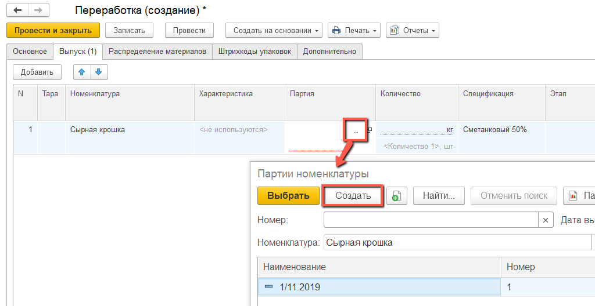
     
8.   Указать дату выпуска и номер "1":
    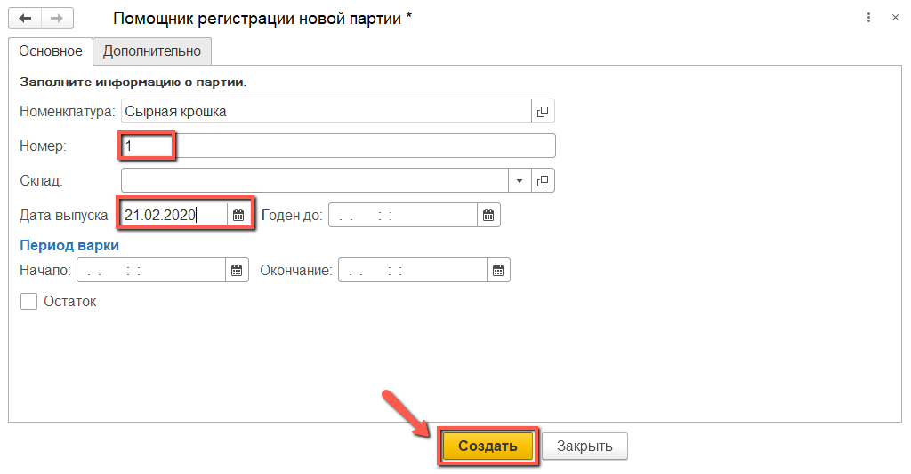
     
9.   Выбрать партию текущего месяца:
    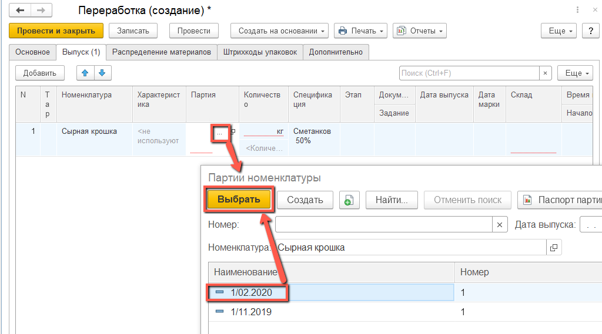
     
10.   Указать количество сырной крошки за смену;
    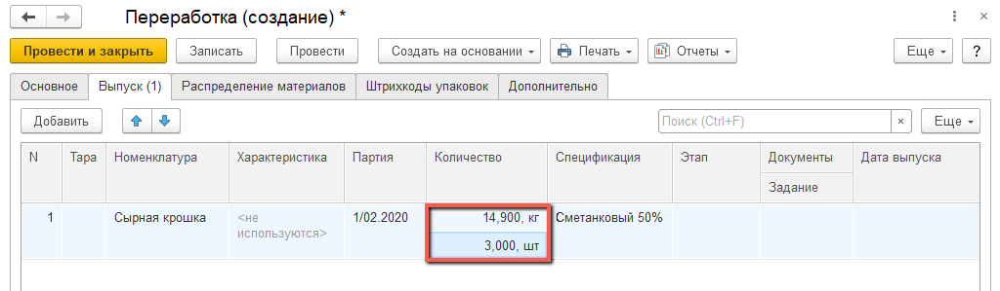
     
11.   Указать склад выпуска:
    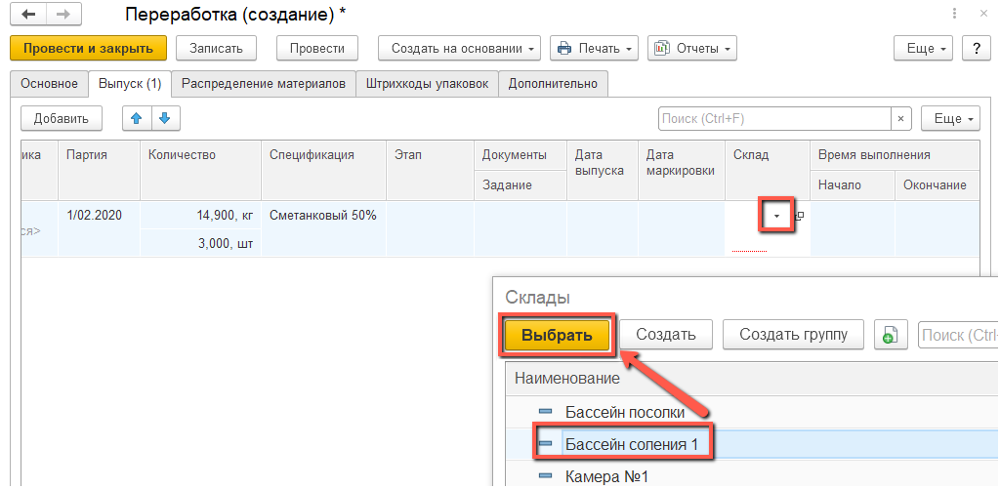
     
12.   Нажать "Провести и закрыть".
     

