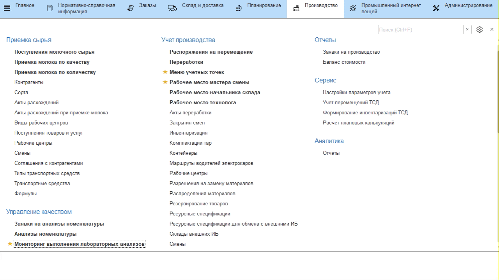
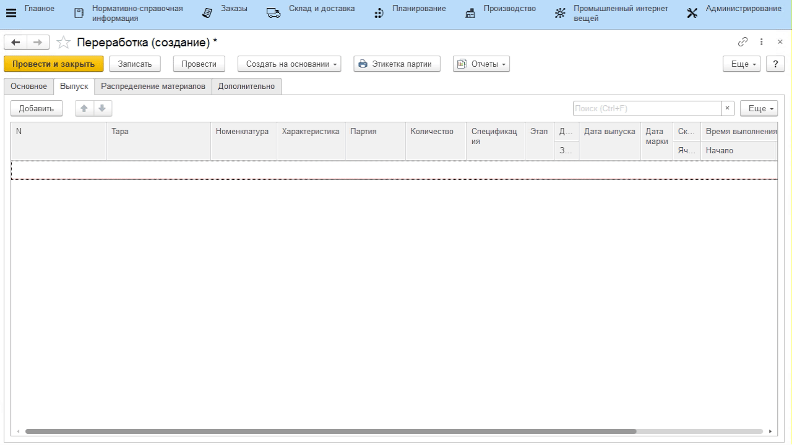
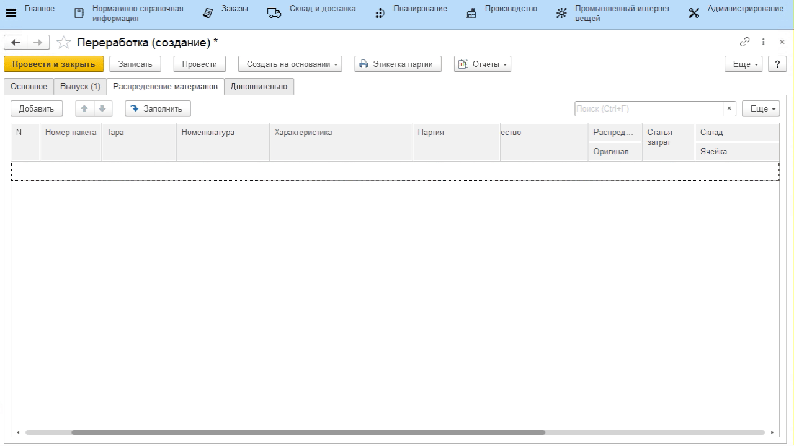

# Выпуск производственной закваски

В случае, если на предприятии выпускается своя производственная
закваска, это тоже нужно отразить в системе. Проще всего это сделать
мастеру смен, создав соответствующий документ переработки.

-   Открыть документы **"Переработки"** и перейти к созданию нового;
-   Указать текущую дату и смену;
-   Указать участок, на котором выпускается производственная закваска;
-   Установить галочку указания складов в таблицах;
-   Указать статус переработки - *"Выполнено"*;
-   Перейти на вкладку *"Выпуск"*. Добавить новую строку и указать, какая
    производственная закваска выпускается;

-   Создать партию для выпускаемой закваски;
-   Указать наименование (номер или буквенное название партии) и дату
    выпуска;
-   Нажать **"Создать"**;
-   Выбрать созданную партию;
-   Указать количество производственной закваски в кг;
-   Указать склад, на который была выпущена производственная закваска;

-   Перейти на вкладку *"Распределение материалов"*, нажать **"Добавить"**;
-   Указать, из какого материала была изготовлена производственная закваска;
-   Указать партию материала;
-   Указать использованное количество;
-   Указать, с какого склада взяли материал;
-   Если было использовано несколько материалов или партий, то повторить добавление для остальных материалов и нажать **"Провести и закрыть"**.

