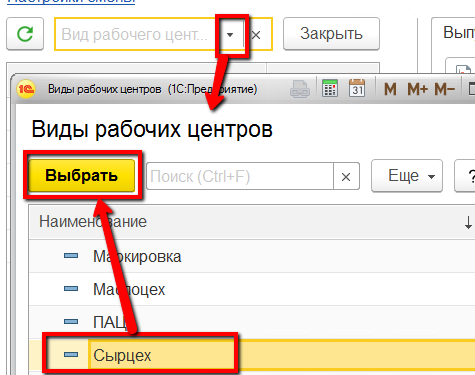
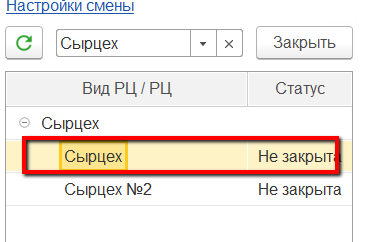
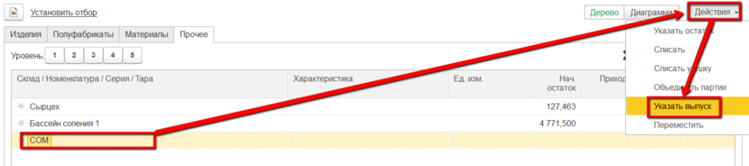
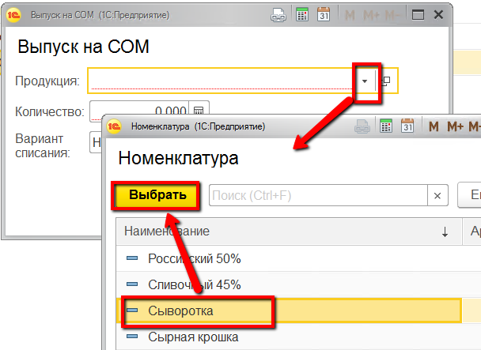
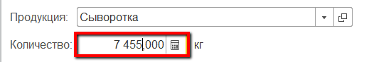
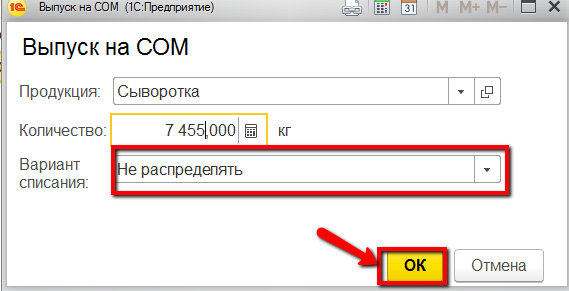

# Выпуск сыворотки

Каждая передача сыворотки, по которой были взяты лаб.анализы должна
фиксироваться отдельным выпуском в системе. Эту операцию мастер смены
может выполнить через свое рабочее место.

 

 

-   Открыть "Рабочее место мастера смены":
    
     
-   Указать дату смены, смену и участок сырцеха:
    
    
     
-   Выбрать участок сырцеха:
    
     
-   Перейти на вкладку "Остатки" -\> "Прочее" :
    
     
-   Выбрать склад, на который передается сыворотка. Нажать "Указать
    выпуск":
    
     
-   Указать, что это выпуск сыворотки и указать её количество:
        
    
     
-   Указать, что при этом нет списания смеси (т.к. она будет списана в
    конце смены при наличии в системе показателей жира и белка по всем
    выпускам за смену) и подтвердить:
    
