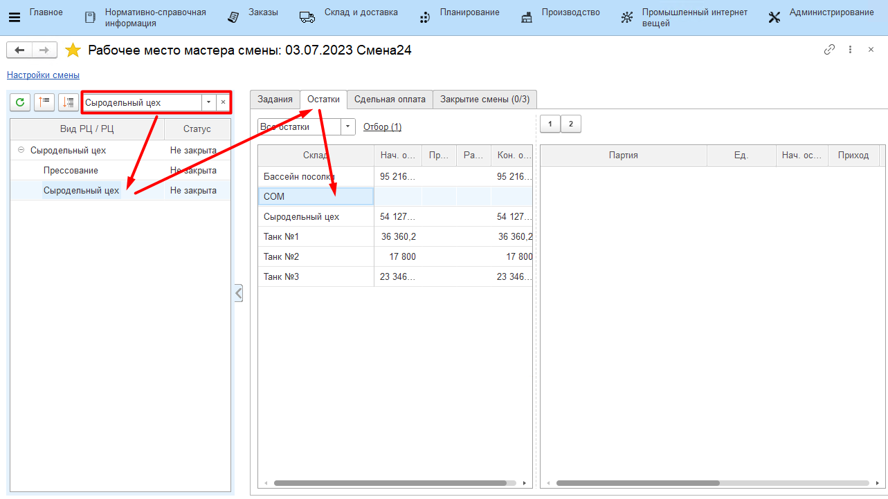
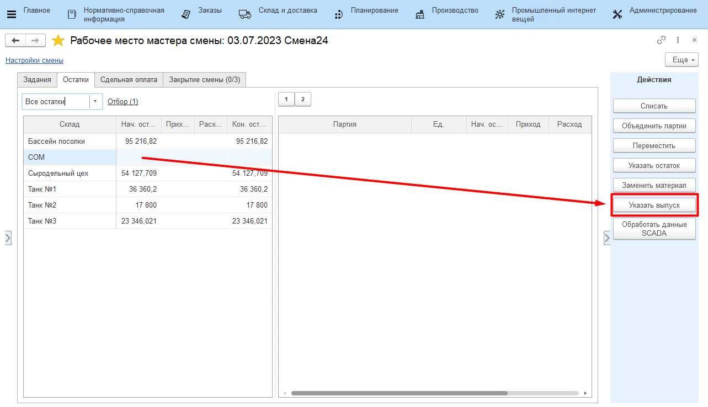
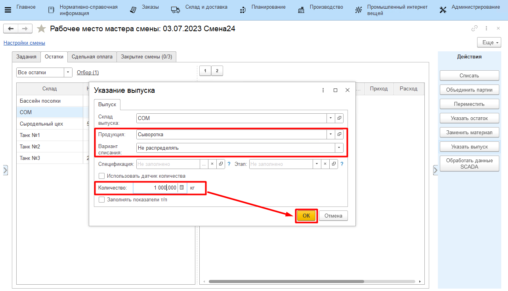

# Выпуск сыворотки

Каждая передача сыворотки, по которой были взяты лаб.анализы должна
фиксироваться отдельным выпуском в системе. Эту операцию мастер смены
может выполнить через свое рабочее место.

-   Открыть **"Рабочее место мастера смены"**;
-   Указать дату смены, смену и вид рабочего центра, к которому относится участок сырцеха;
-   Выбрать участок сырцеха;
-   Перейти на вкладку *"Остатки"*;

-   Выбрать склад, на который передается сыворотка. Нажать **"Указать выпуск"**;

-   Указать, что это выпуск сыворотки и указать её количество;
-   Указать, что при этом нет списания смеси (т.к. она будет списана в
    конце смены при наличии в системе показателей жира и белка по всем
    выпускам за смену) и подтвердить;

