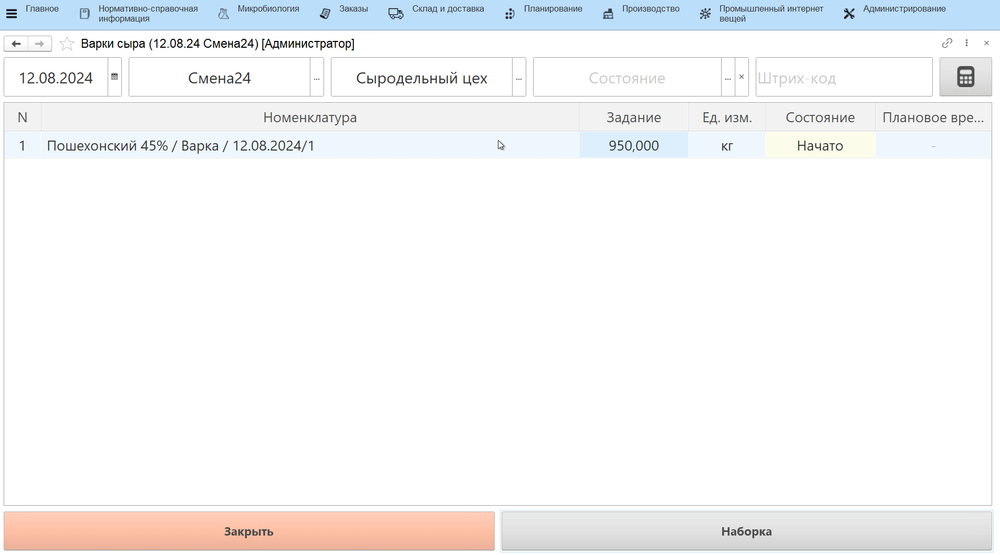

# Наборка ингредиентов под варки сыра

Под каждую варку сыра заранее осуществляется наборка ингрединтов - один
или несколько пакетиков с заквасками, красителями, ферментами, которые
сыродел должен засыпать в котел в определенные временные промежутки. В
системе также можно учитывать эту операцию.

!!! info ""
    Для упрощения выбора ингредиентов можно использовать сканирование этикеток их партий

-   Открыть **"Меню учетных точек"**;
-   Указать текущую дату и смену, если они еще не указаны;
-   Указать учетную точку, которая соответствует участку наборки
    ингредиентов;

-   Нажать кнопку, соответствующую операции наборки. Отобразится задание
    на выпуск варок сыра в производственном задании. Выбрать первую и
    нажать **"Наборка"**;
-   Откроется окно наборки ингредиентов. По умолчанию список заполняется
    материалами из основной рецептуры выбранного сыра. Для каждого
    ингредиента задано нормативное значение. Если несколько ингредиентов
    идут в один пакет (засыпаются вместе в котел), то у них стоит общий
    номер пакета;
-   Начать наборку первого пакета, выбрав в таблице ингредиент из пакета 1;
-   Указать партию, которая будет использоваться (если партия отлична от
    той, которая заполнилась автоматически);
-   Указать количество ингредиента. При этом:
    -   Если ингредиент весовой, то насыпать его на весы и нажать кнопку
    получения веса с весов;
    -   Если ингредиент невесовой, то вручную указать его количество;
-   Если вместо ингредиента из основной рецептуры используется его
    аналог, то нажать **"Заменить материал"**, выбрать аналог и так же указать его партию и количество;
-   По итогам наборки первого пакета печатается этикетка на этот
    пакет с указанием состава и для какой варки сыра она предназначена;
-   Набрать остальные пакеты и нажать кнопку завершения.

