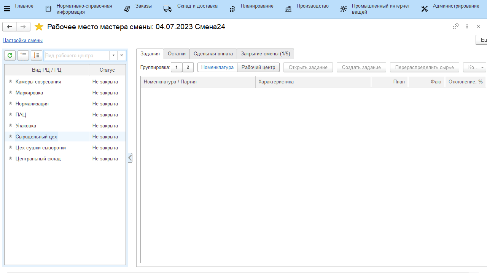

# Формирование задания на смену

В начале каждой смены мастер выдает работникам сырцеха задание на варку сыров. В системе это отражается документом **"Производственное задание"**.

-   Открыть **"Рабочее место мастера смены"**;
-   Указать дату смены и смену;  
-   Указать вид рабочего центра и участок, на котором варится сыр;
-   На вкладке *"Задания"* нажать **"Создать задание"**. 
-   В открывшемся документе на вкладке *"Задание"* указать все варки сыра, которые планируется сварить за указанную смену. При этом важно соблюдать порядок - указывать варки в производственном порядке.
-   Нажать **"Провести"**, серии заполнятся по порядку, автоматически.

