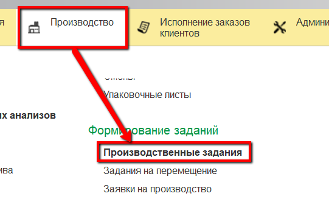
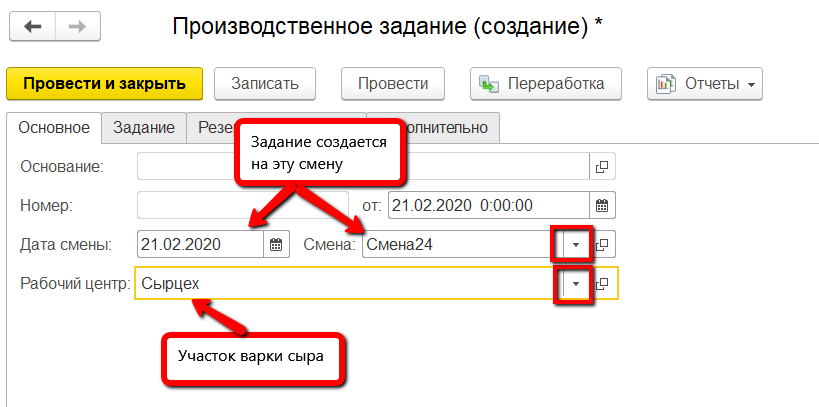
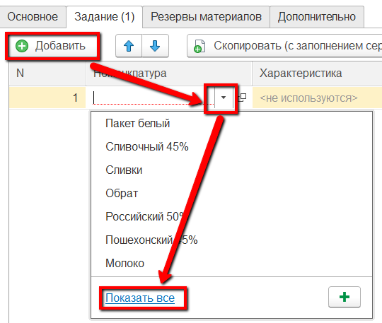
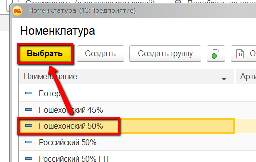
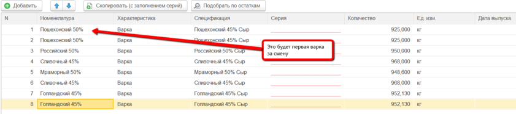
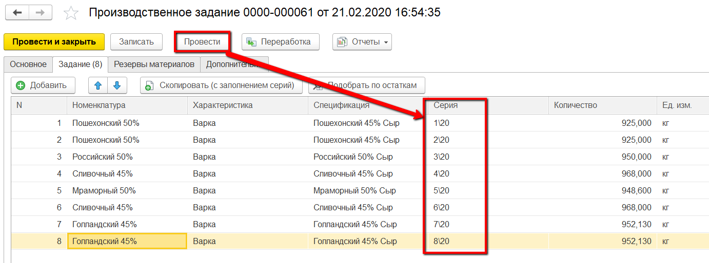

# Формирование задания на смену

В начале каждой смены мастер выдает работникам сырцеха задание на варку
сыров. В системе это отражается документом "Производственное задание".

 

 

-   Открыть документы "Производственные задания" и перейти к созданию
    нового:
    
     
-   Указать смену и участок, на котором варится сыр:
    
     
-   Перейти на вкладку «Задание». Здесь нужно указать все варки сыра,
    которые планируется сварить за указанную смену. При этом важно
    соблюдать порядок - указывать сыры в производственном порядке:
    
    
     
-   Повторить п.3 для всех варок:
    
     
-   Нажать "Провести", серии заполнятся по порядку, автоматически:

    

 
