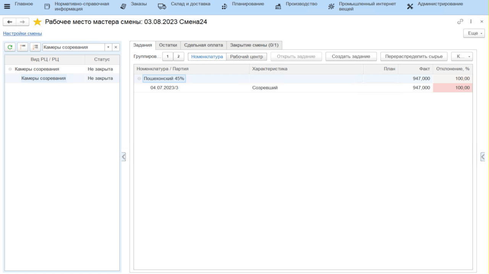

# Задание на маркировку

Задание на маркировку может сформировать мастер смены из своего рабочего места. В системе это отражается документом **"Производственное задание"**.

-   Открыть **"Рабочее место мастера смены"**;
-   Указать дату смены;
-   Выбрать вид участка и участок на котором сыр перевзвешивается и маркируется;
-   На вкладке *"Задания"* нажать **"Создать задание"**;
-   На вкладке *"Основное"* указать смену и участок, на котором сыр перезавешивается и маркируется;   
-   На вкладке *"Задание"* нажать **"Добавить"** и указать первый вид продукции, который нужно будет промаркировать;
-   Поле *"Партия"* заполнится автоматически (если в виде рабочего центра включена соответствующая настройка), либо можно нажать кнопку **"Создать партии"**;
-   Указать, сколько кг продукции данного вида надо промаркировать указанной датой;
-   Повторить для остальных видов продукции и нажать **"Провести и закрыть"**.

