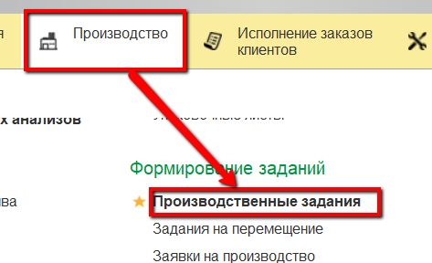
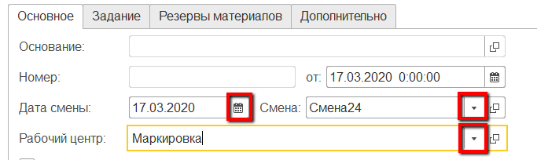
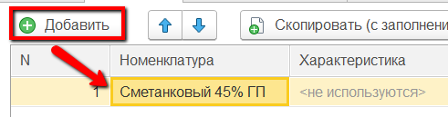
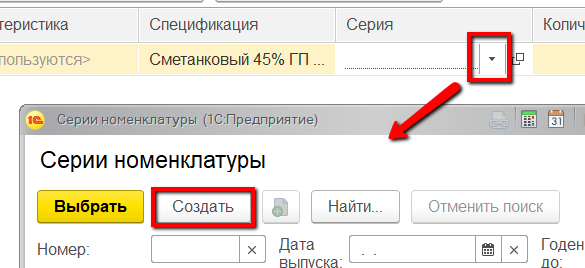
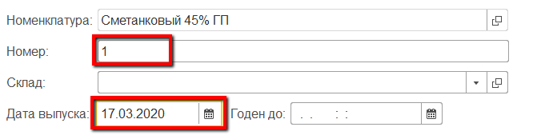
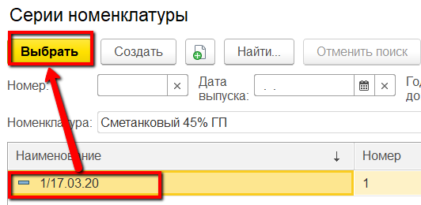
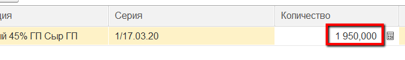

# Задание на маркировку

 

-   Открыть документы "Производственные задания" и перейти к созданию
    нового:
    
     
-   На вкладке "Основное" указать смену и участок, на котором сыр
    перезавешивается и маркируется:
    
     
-   На вкладке "Задание" нажать "Добавить" и указать первый вид
    продукции, который нужно будет промаркировать:
    
     
-   Для того, чтобы задать, какой датой будет промаркирована продукция,
    нужно использовать соответствующую серию продукции. Открыть поле
    "Серия" и перейти к созданию новой:
    
     
-   Указать номер партии и дату выпуска, которая будет равна дате
    маркировки:
    
     
-   Сохранить серию и выбрать её в задание:
    
     
-   Указать, сколько кг продукции данного вида надо промаркировать
    указанной датой:
    
     
-   Повторить п.3-7 для остальных видов продукции и нажать "Провести и
    закрыть".

