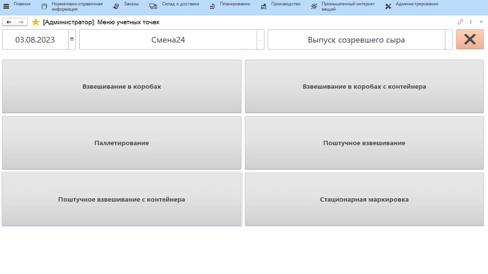
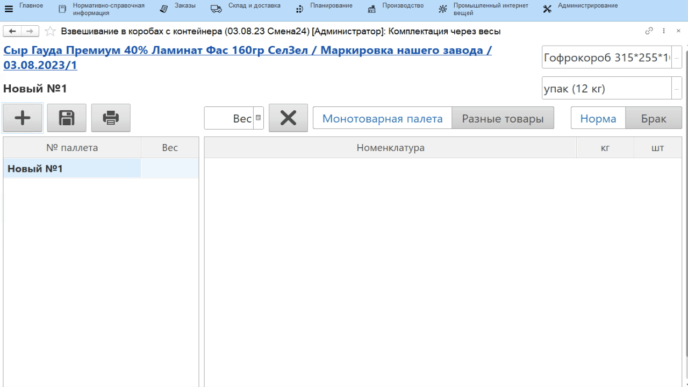
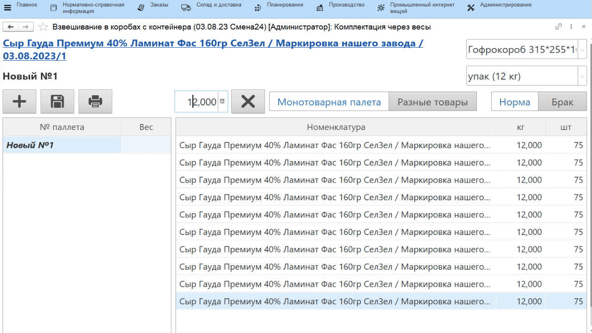

# Взвешивание маркированной продукции со сканированием контейнеров

На контейнеры (или иные тары), на которых сыр отправляют созревать,
обычно наклеивают этикетки, печатаемые из МЕС-системы. Они выглядят
следующим образом:

Именно такие этикетки используются для идентификации используемых варок
в процессе перевзвешивания сыра. При этом важно понимать, что на
контейнере должна лежать продукция (номенклатура-характеристика),
которая указана в качестве материала в спецификации нужной строки
задания.

-   Открыть **"Меню учетных точек"**;  
-   Указать дату и смену, если они еще не указаны;
-   Указать учетную точку, отвечающую за участок, где перевешивается сыр;
-   Нажать кнопку, соответствующую поштучному или коробочному
    взвешиванию. Откроется задание на текущую смену. 
-   Встать на строку задания, отсканировать контейнер с материалом, который перевешивается для данного выпуска;
-   Нажать **"Приступить"**;
-   Откроется форма набираемых паллет. Указать, что набирается новая
    паллета по кнопке **"+"**;
-   Указать, в какие короба укладывается сыр (если они отличны от тех,
    что подставились по умолчанию);
-   Указать, по сколько голов сыр укладывается в эти короба;
    

-   Поставить первый короб (или голову) на весы, вес фиксируется. 
-   Печатается этикетка короба (или головы), наклеить её на короб (или
    голову);

-   Завесить так все короба одной паллеты. Нажать **"Записать паллету"**;
-   Указать вес всей паллеты, после подтверждения печатаются
    спецификация и расшифровка содержимого паллеты.

