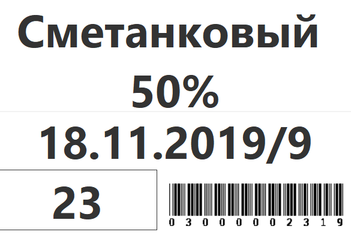
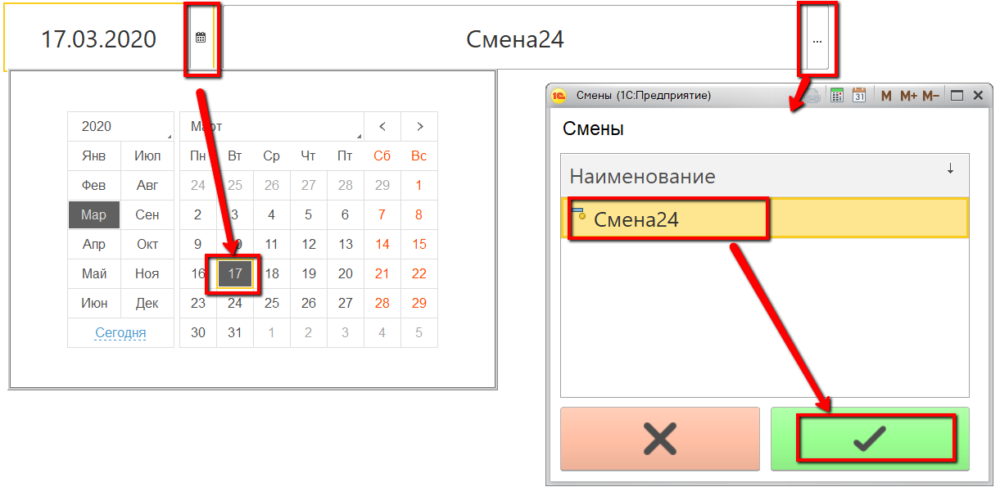
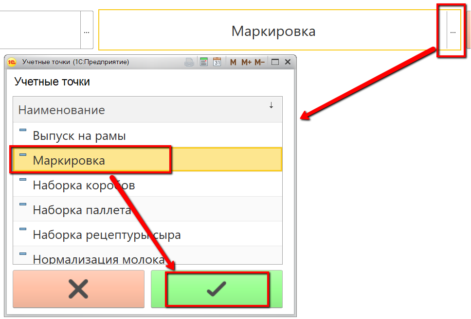
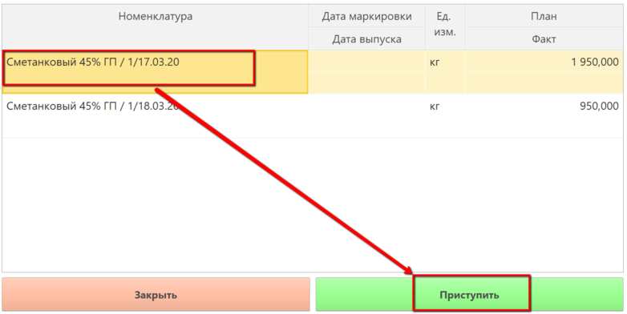
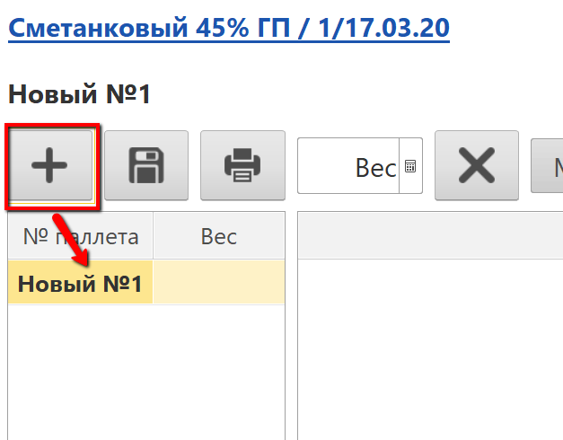
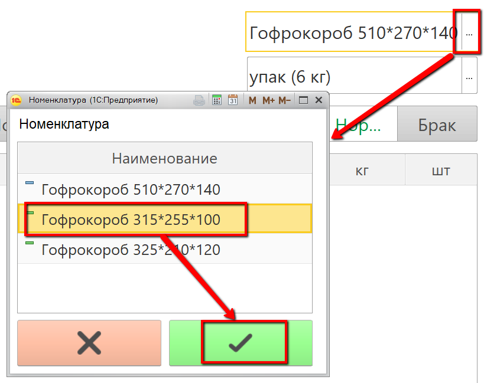
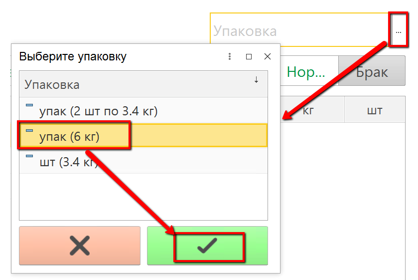
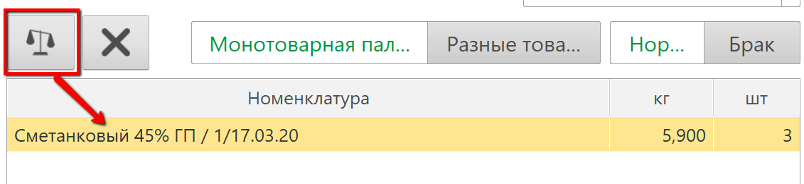
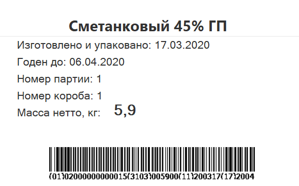
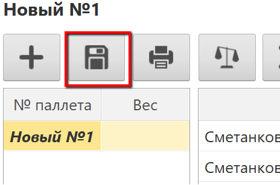

# Взвешивание маркированной продукции со сканированием контейнеров

На контейнеры (или иные тары), на которых сыр отправляют созревать,
обычно наклеивают этикетки, печатаемые из МЕС-системы. Они выглядят
следующим образом:

 

Именно такие этикетки используются для идентификации используемых варок
в процессе перевзвешивания сыра. При этом важно понимать, что на
контейнере должна лежать продукция (номенклатура-характеристика),
которая указана в качестве материала в спецификации нужной строки
задания.

 

-   Открыть "Меню учетных точек":
    
    
-   Указать дату и смену, если они еще не указаны:
    
    
-   Указать учетную точку, отвечающую за участок, где перевзвешивается
    сыр:
    
    
-   Нажать кнопку, соответствующую поштучному или коробочному
    взвешиванию. Откроется задание на текущую смену. Просканировать
    этикетку контейнера, выбрать строку задания и нажать приступить:
    
    
-   Откроется форма набираемых паллет. Указать, что набирается новая
    паллета:
    
    
-   Указать, в какие короба укладывается сыр (если они отличны от тех,
    что подставились по умолчанию):
    
    
-   Указать, по сколько голов сыр укладывается в эти короба:
    
    
-   Поставить первый короб (или голову) на весы, нажать кнопку
    завешивания :
    Если настроено автовзвешивание, то эта же кнопка его включает -
    можно не нажимать каждый раз кнопку, а положить, вес фиксируется,
    снять, положить следующий короб (голову).
    
    
-   Печатается этикетка короба (или головы), наклеить её на короб (или
    голову):
    
    
-   Завесить так все короба одной паллеты. Нажать "Записать паллету":
    
    
-   Указать вес всей паллеты, после подтверждения печатаются
    спецификация и расшифровка содержимого паллеты.