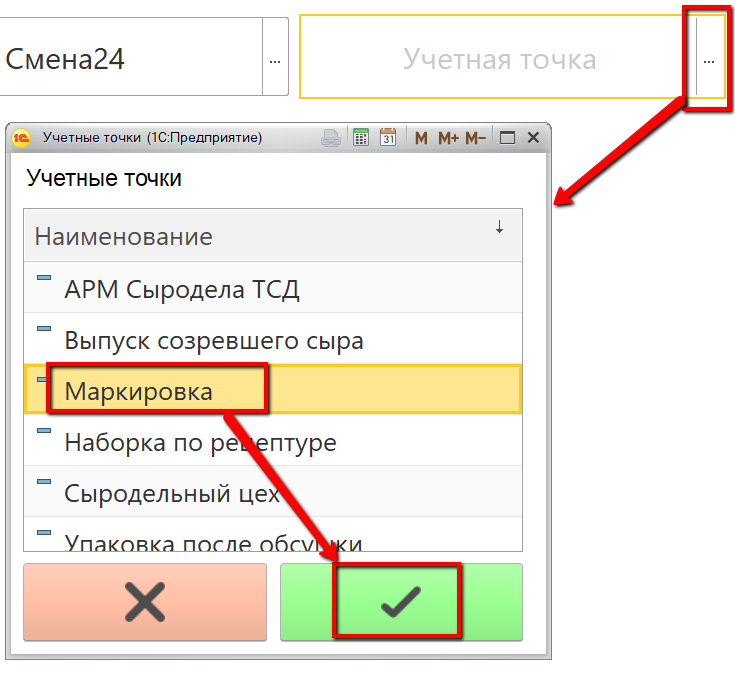
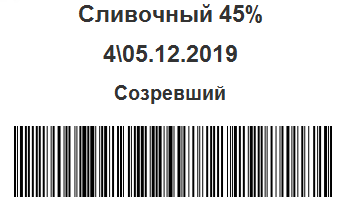
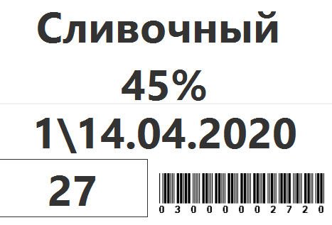
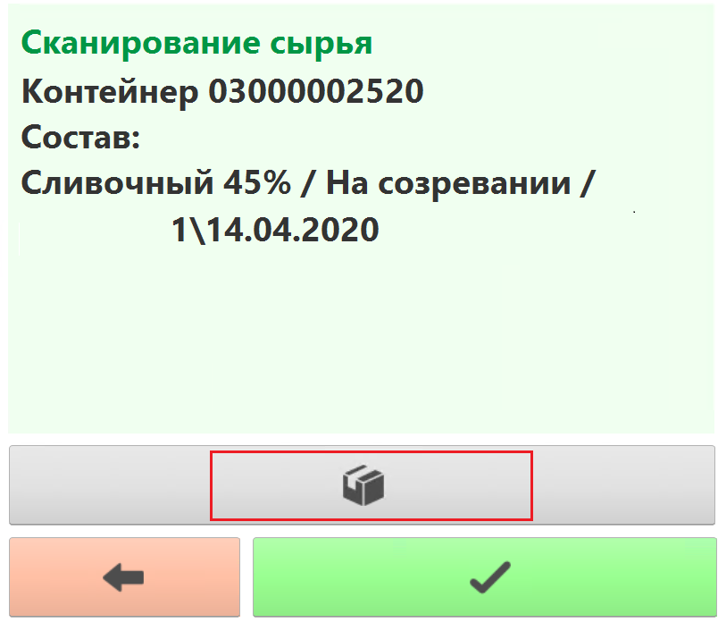
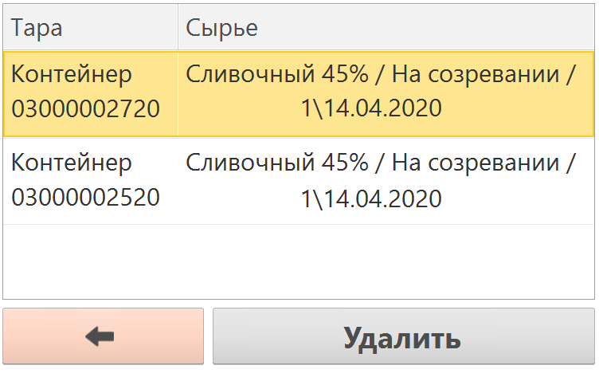
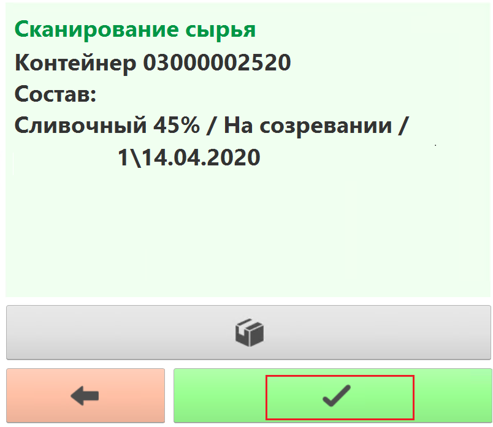
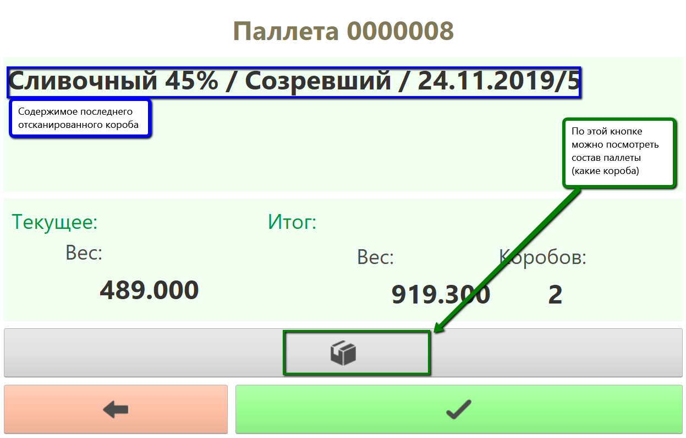
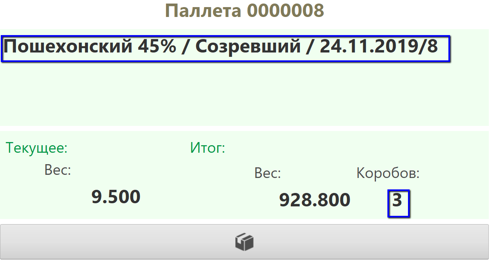

# Паллетирование

Удобнее всего наборку паллета проводить с использованием ТСД (Терминала
сбора данных). Интерфейс адаптирован именно под мобильное разрешение, но
может быть также настроен под киоск, к которому будет подключен сканер
штрихкодов.

По итогу операции формируется документ выпуска сканируемой продукции и
упаковочный лист - паллета (подробнее см.раздел "[Кнопки учетных точек.ТСД](../../../../CommonInformation/Handbooks/ButtonOfAccountPoint/DataCollectionTerminal/DataCollectionTerminal.md)") .

 

 

-   Открыть "Меню учетных точек":
    
     
-   Указать дату и смену, если они еще не указаны:
    
     
-   Указать учетную точку, отвечающую за участок, где идет
    паллетирование:
    
     
-   Нажать кнопку, соответствующую набору паллеты. 

<h4> Сканирование сырья </h4>

Если опция сканирования сырья отключена в системе, то пропустить этот раздел. 

- Откроется форма сканирования сырья:

- Просканировать этикетку партий или контейнеров, с которого было взято сырье на выпуск. Примерный вид этикеток:
    - Этикетка партии:  
    
    - Этикетка контейнера:  
    
> Важно заметить, что в качестве сырья может выступать только один вид продукции, но разными партиями  
- После каждого сканирования в таблицу сырья добавляется новая информация. Полный состав можно посмотреть по соответствующей кнопке:
  

- По итогу сканирования сырья нажать кнопку сохранения:

<h4> Сканирование выпуска </h4>

- Откроется форма наборки. Если паллета уже была начата, просканировать штрихкод паллеты, тогда  подтянется весь её состав, а последующие отсканированные короба будут приписаны к ней:  

-   Если нет, то просто начать сканирование. По итогам будет создана новая паллета.
-   Отсканировать следующий короб паллеты и далее:  

-   После завершения набора паллеты нажать кнопку сохранения - зеленую кнопку с галочкой.