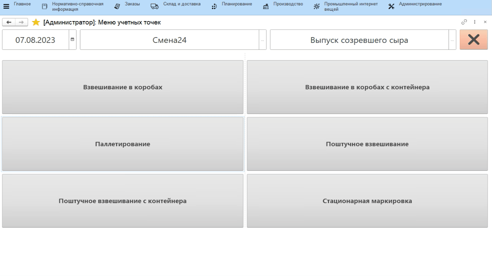
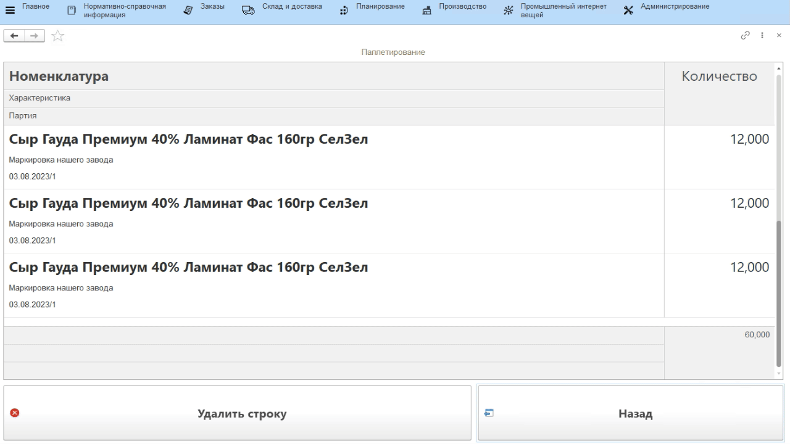

# Паллетирование

Удобнее всего наборку паллета проводить с использованием ТСД (Терминала
сбора данных). Интерфейс адаптирован именно под мобильное разрешение, но
может быть также настроен под киоск, к которому будет подключен сканер
штрихкодов.

По итогу операции формируется документ выпуска сканируемой продукции и
упаковочный лист - паллета (подробнее см.раздел "[Кнопки учетных точек - ТСД](../../../../../../CommonInformation/ButtonOfAccountPoint/DataCollectionTerminal.md)") .

-   Открыть **"Меню учетных точек"**;
-   Указать дату и смену, если они еще не указаны;
-   Указать учетную точку, отвечающую за участок, где идет паллетирование;
-   Нажать кнопку, соответствующую набору паллеты.

### Сканирование выпуска

-   Откроется форма наборки. Если паллета уже была начата, просканировать штрихкод паллеты, тогда подтянется весь её состав, а последующие отсканированные короба будут приписаны к ней;
-   Если наборка паллеты еще не начата, то просто начать сканирование. По итогам будет создан новый документ;
-   По порядку отсканировать все короба, которые помещаются на паллету. По кнопке **"Состав"** можно посмотреть текущий состав паллеты:   

-   После завершения набора паллеты нажать кнопку **"Завершить"**.

