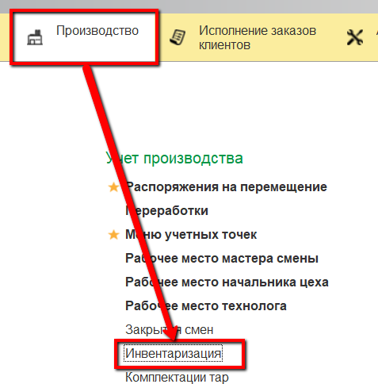
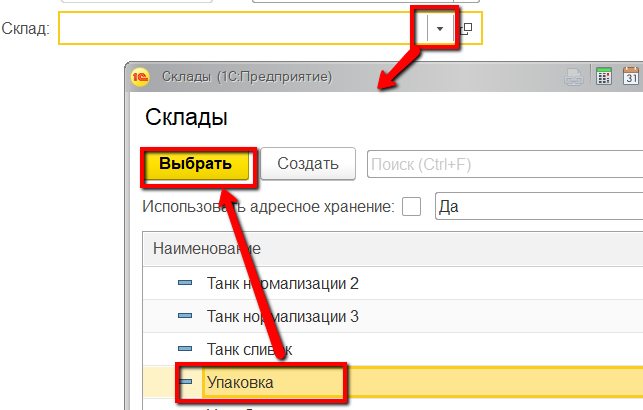
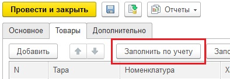
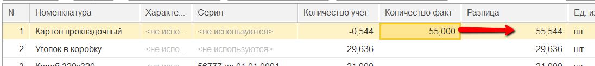
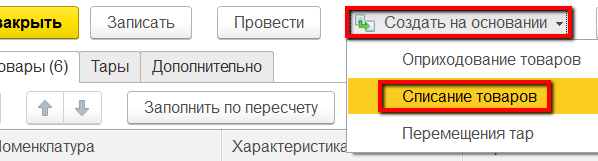
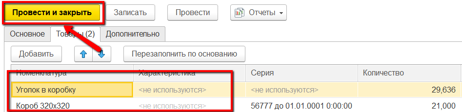
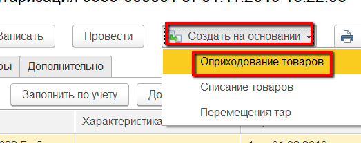
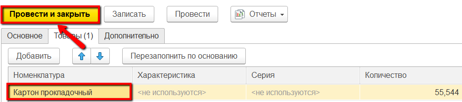

# Инвентаризация

Инвентаризации в системе фиксируются документом "Инвентаризация".

 

-   Открыть документы "Инвентаризация" и перейти к созданию нового:  
    
     
-   Указать склад, на котором была проведена инвентаризация:  
    
     
-   На вкладке "Товары" нажать "Заполнить по учету":  
      
    Таблица заполнится всеми материалами, которые по учету в системе находятся на выбранном складе. В столбце "Количество учет"
    отобразится количество каждого из них в соответствие с учетом в
    системе.
 
-   Если по какому-либо материалу по итогам инвентаризации было
    подсчитано другое количество, то полученную цифру нужно отразить в
    столбце "Количество факт" напротив этого материала. Автоматически
    рассчитается разница:  
    
     
-   Установить корректные цифры по всем материалам и нажать "Провести".
     
-   Если каких-то материалов после учета инвентаризации в системе стало
    меньше (столбец "Разница" имеет значение с минусом), то эти
    материалы нужно списать. Для этого нажать "Создать на основании" -\>
    "Списание материалов":  
    
     
-   На вкладке "Товары" можно увидеть списываемые материалы и их
    количество. Нажать "Провести и закрыть":  
    
     
-   Если каких-то материалов после учета инвентаризации в системе стало
    больше (столбец "Разница" имеет значение с плюсом), то эти материалы
    нужно оприходовать. Для этого нажать "Создать на основании" -\>
    "Оприходование материалов":  
    
     
-   На вкладке "Товары" можно увидеть приходуемые материалы и их
    количество. Нажать "Провести и закрыть":  
    