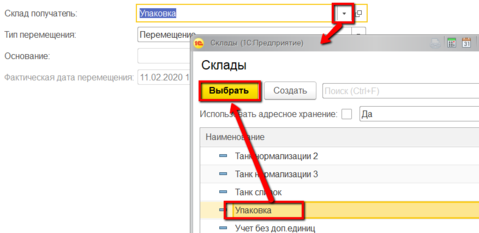
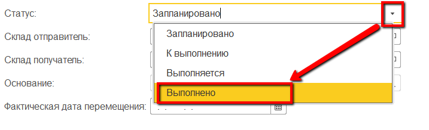
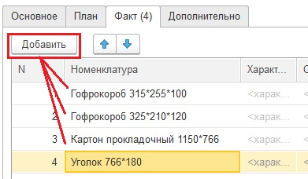
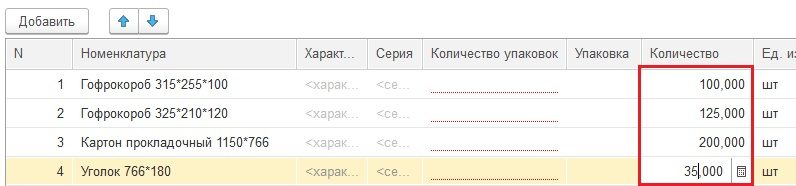

# Перемещение с другого склада

Перемещение материалов с другого склада в системе фиксируется документом
"Распоряжение на перемещение".

 

-   Открыть документы "Распоряжение на перемещение" и перейти к созданию
    нового:
    
     
-   Указать, с какого склада поступили материалы:
    
     
-   Указать, на какой склад поступили материалы:
    
     
-   Отметить, что материалы уже поступили:
    
     
-   Если учет поступлений идет неоперативно (поступление было предыдущим
    днем, неделей и т.п.), то указать фактическую дату поступления:
    
     
-   На вкладке "Факт" добавить все поступившие материалы:
    
     
-   Указать, сколько поступило каждого из указанных материалов:
    
     
-   Нажать "Провести и закрыть".

