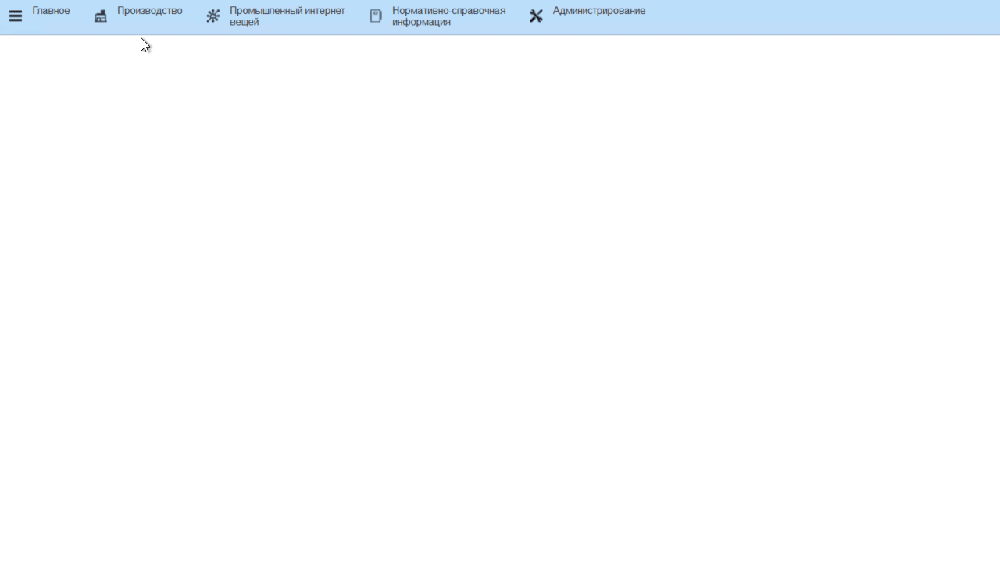

# Учет пакетов на переупаковку

Учет пакетов на переупаковку в системе происходит через обработку "Рабочее место начальника склада".

- Открыть "Рабочее место начальника склада":

- Открыть вкладку "Настройки" и указать участок, на котором нужно зафиксировать переупаковку:  
- Указать склад, на котором находится партия для указания переупаковки:  

<video source src="../AccountingRepackingPackages.assets/Pictures_02.mp4" width="1024" controls="controls"> </video>

- В таблице отобразятся все варки сыра. Выбрать ту, по которой нужно учесть переупаковку и нажать "Указать переупаковку":  
- Указать пакет, в который была переупакована партия:  
- Указать участок, на котором была переупаковка, если он еще не указан:  
- Указать количество использованных пакетов и подтвердить:

<video source src="../AccountingRepackingPackages.assets/Pictures_03.mp4" width="1024" controls="controls"> </video>