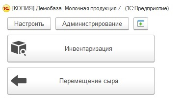

# Учет перемещений сыра

Для учета перемещений сыра водителю электрокара выдается специальное
устройство - ТСД, подключенное к системе. Для него настраивается
стартовая страница с кнопками, каждая из которых отвечает за
определенную операцию.

 

Возможный вид стартовой страницы:  

 
 

-   Нажать кнопку, соответствующую учитываемой операции

    

     

**По заданию**
---------------

     

-   В настройках можно указать маршрут, тогда задания, не принадлежащие ему, не будут отображаться:  
      
    
     
-   На вкладке "По заданиям" отображаются невыполненные задания,
    [сформированные другими ответственными лицами](../FormationTaskToTransferCheese/FormationTaskToTransferCheese.md):  
    
     
-   При помощи ТСД просканировать этикетки контейнеров, которые будут перемещены. Просканированные контейнеры в таблице отметятся зеленой галочкой:  
    
     
-   По завершении перемещения захваченных контейнеров нажать
    "Подтвердить все". Выполненные задания из таблицы пропадут.

    

**Без задания**
----------------

-   Если возникла необходимость переместить контейнеры без задания (освободить место или по иной причине), то на вкладке "Настройки" установить склад, на который будут перемещены контейнеры:  
      
    
     
-   Перейти на вкладку "Без задания" и просканировать этикетки
    перемещаемых на выбранный склад контейнеров. При сканировании в таблице будет появляться информация по контейнеру: какой сыр на нем лежит и на каком складе числится контейнер по учету в системе:  
    
     
-   По завершении перемещения нажать "Подтвердить все". Строки из
    таблицы исчезнут.