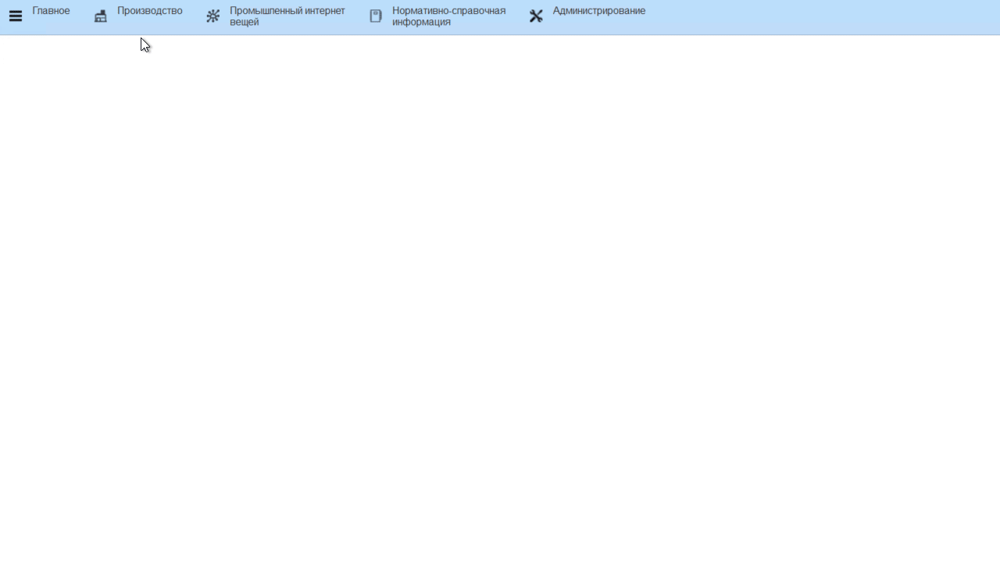

# Формирование заданий на перемещение сыра

Задания на перемещение контейнеров с сыром фомируются начальником склада
через его рабочее место.  
- Открыть "Рабочее место начальника склада":  

- На вкладке "Настройки" указать участок (участки), на котором зреет сыр:  
- Указать, что нужно отображение в разрезе тар:  
- Указать склады, в котором хранятся тары, необходимые к перемещению:

<video source src="../FormationTaskToTransferCheese.assets/Pictures_02.mp4" width="1024" controls="controls"> </video>

- Таблица заполнится всеми варками сыра с отображением в разрезе тары, которые на текущий момент находятся в одном из указанных складов. По каждой варке отобразится количество в кг и штуках, а по таре наличие задания на перемещение:  
- В панели отборов можно видеть текущую загруженность по выбранным складам:  
- Для выдачи нового задания выбрать в таблице строку с нужным контейнером и нажать "Переместить":  
- Указать склад получатель и плановую дату перемещения:  
- Подтвердить. В указанную дату у водителей электрокаров отобразится это задание.

<video source src="../FormationTaskToTransferCheese.assets/Pictures_03.mp4" width="1024" controls="controls"> </video>