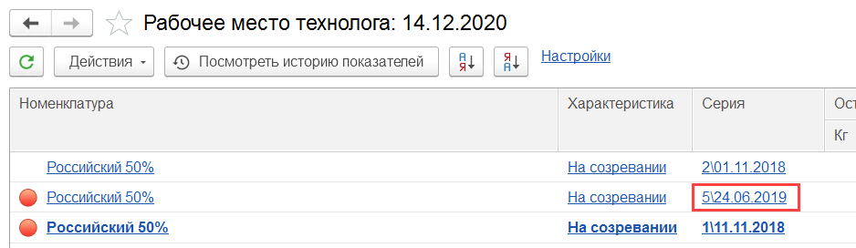
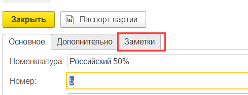
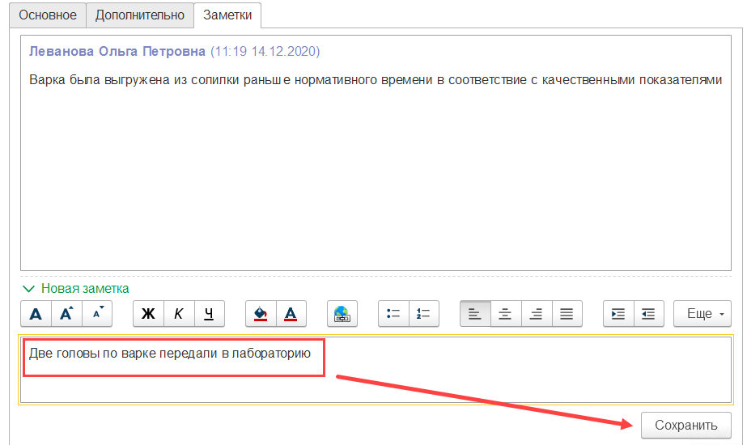

# Заметки по партии

В любой момент времени по любой партии производства можно оставлять разные заметки, доступные потом остальным сотрудникам.

- Открыть нужную партию, например, из рабочего места технолога:

  

- Перейти на вкладку "Заметки":

  

- Здесь видна история, а в соответствующем поле можно писать и отправлять свои заключения:

  