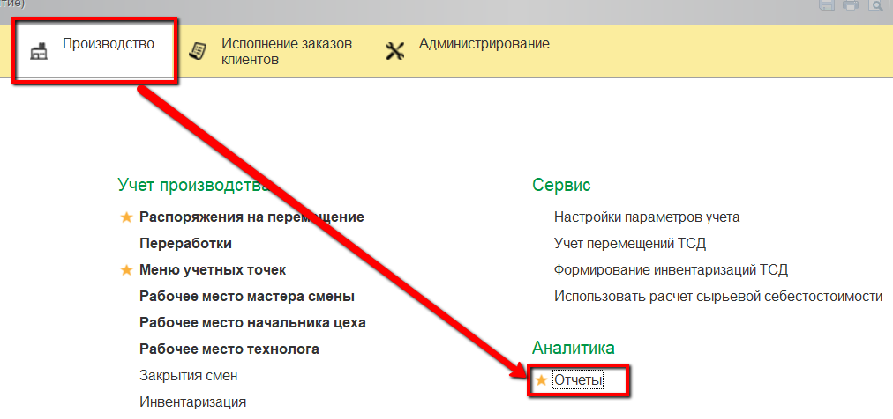
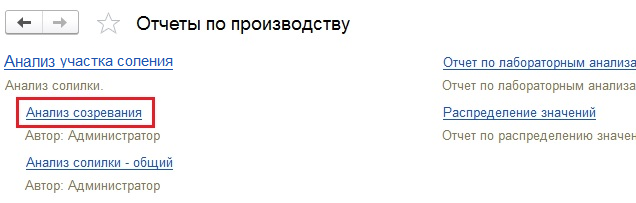
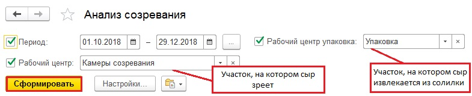

# Анализ эффективности по варкам

Анализ эффективности этапа созревания сыра можно провести, посмотрев
отчет "Анализ участка соления", вариант "Анализ созревания".

 

-   Открыть отчет:  
      
    
    
-   В параметрах указать:
    -   Период;
    -   Рабочий центр - участок, на котором сыр зреет;
    -   Рабочий центр упаковка - участок, на котором сыр извлекается из
    солилки и передается на созревание  
    и сформировать:  
    
    
-   По каждой варке будет видна следующая информация:
    -   Нормативное время созревания данного сыра (указанное в рецептуре) и
    фактическое время созревания конкретной варки;
    -   Сколько сыра было передано на созревание, сколько снято - в кг и
    штуках;
    -   Рассчитаны потери на данном этапе по весу и в процентном соотношении
    -   Усушка в процессе созревания;
    -   Рассчитана разница принятых и переданных голов сыра (можно смотреть,
    не "затерялись" ли головы в процессе передач  
    

