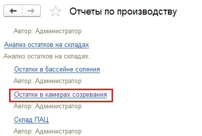
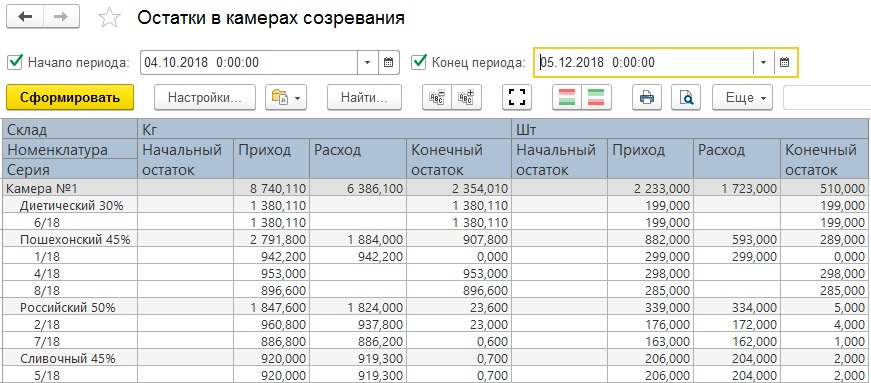
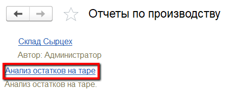
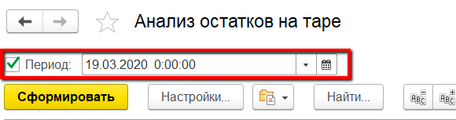
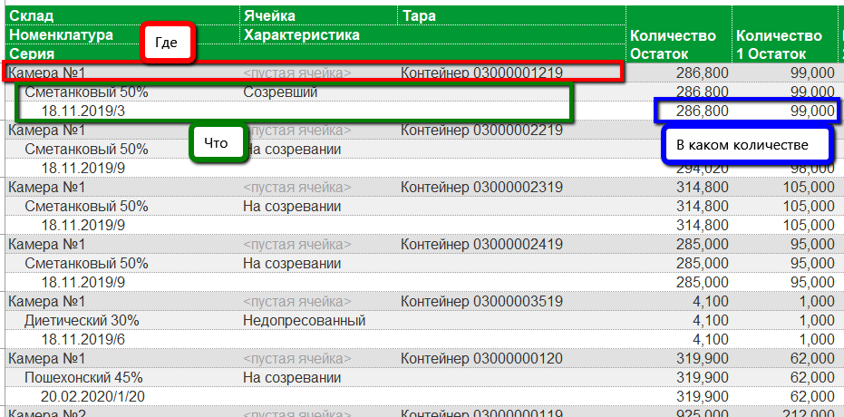
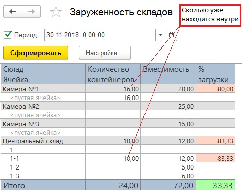

# Анализ созревания

 Начальный/конечный остаток и приход/расход по варкам сыра в кг и шт
    можно посмотреть в отчете "Анализ остатков на складах", вариант "Остатки в камерах
    созревания".  
    

- Необходимо установить параметры:
    -   Начало периода;
    -   Конец периода.  
    И сформировать:  
      
- В отчете по каждой камере созревания видно, какие варки сыра
    созревали в ней, а также по этим варкам отображается:  
    -   Начальный и конечный остаток в кг и штуках в пределах указанного
    периода в камерах созревания;
    -   Приход и расход в кг и штуках в пределах указанного периода.

В разрезе тар, если в камерах созревания по ней ведется учет,
    остатки кг и штук сыра можно посмотреть в отчете "Анализ остатков на
    таре":
    

-   Указать период (на конец которого нужно посмотреть остатки) и
    сформировать (в отчет попадают только те склады, на которых включен
    учет по таре):  
    
     
-   По складам отобразится информация, в каких контейнерах какие партии
    и в каком количестве там находятся:  
    

Информацию по загруженности камер созревания можно видеть в отчете
    "Анализ загруженности складов", вариант "Загруженность складов".  
    

-   Установить период - дату, относительно которой будет собрана
    информация, и сформировать:  
      
- По каждому складу, для которого была задана ограниченная вместимость (по количеству контейнеров), будет видно:
    -   Сколько контейнеров на момент, указанный в периоде, находится внутри
    него;
    -   Сколько контейнеров он максимально вмещает;
    -   Процент загрузки, подсвечивающийся разными цветами в зависимости от
    значения: чем больше загружен склад, тем краснее становится ячейка с
    процентом загрузки.

