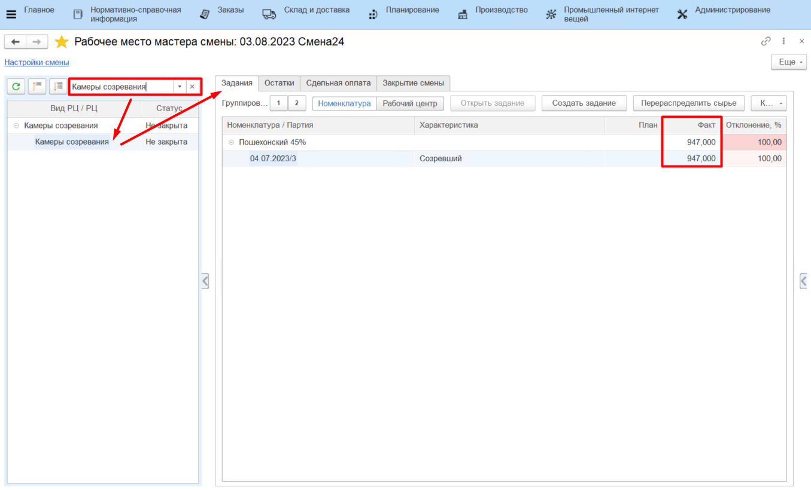
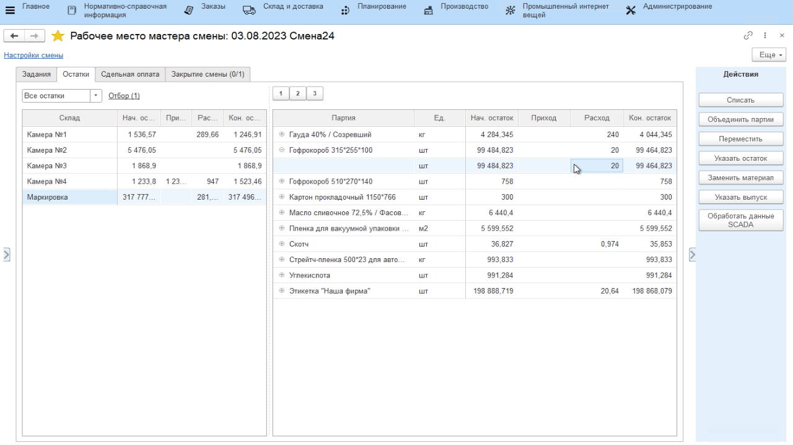
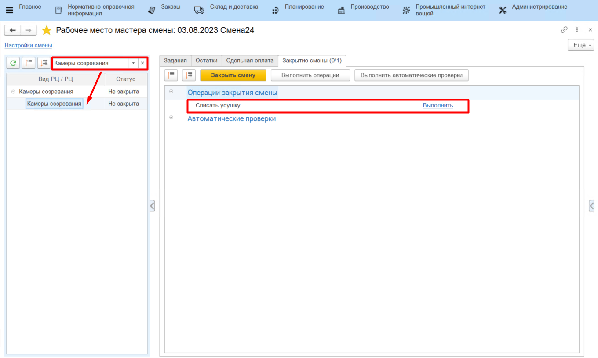
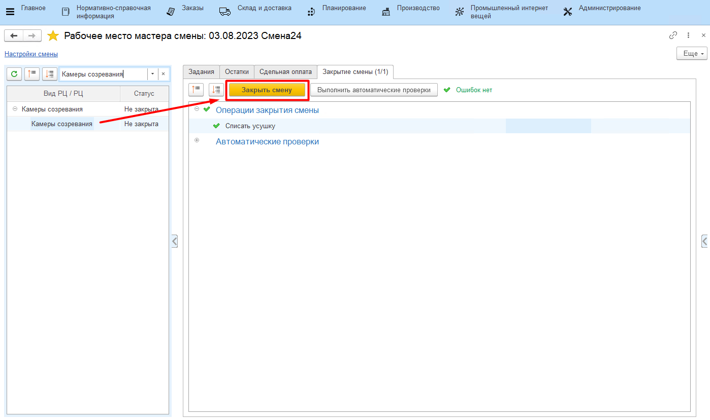

# Закрытие смен

Контроль всех введенных в систему данных за рабочую смену осуществляется
мастером смены через **"Рабочее место мастера смены"**.

-   Открыть **"Рабочее место мастера смены"**
-   Указать смену для контроля и вид рабочего центра, к которому относится участок созревания сыра;
-   В таблице ниже выбрать участок, на котором зреет сыр и который
    необходимо проверить на корректность. Справа заполнится различная
    информация по данному участку. Например, на вкладке *"Задания"*
    отображается вся информация по снятому с созреванию сыру за
    указанную смену:

На вкладке *"Остатки"* отображается информация по расходу материалов, использованных в процессе снятия сыра с созревания, за указанную смену/ Здесь же можно списать отбракованные за смену короба. Для этого:

-   Выбрать в таблице нужный короб, нажать *"Списать"*;
-   Указать, что списывается брак;
-   Указать статью списания для брака, количество и подтвердить
    действие:

-   На вкладке *"Остатки"* по каждой варке, снятой с
    созревания, отображаются условные остатки, получившиеся в результате
    разности веса переданного сыра на созревание и веса сыра снятого с
    созревания, т.е. усушки. Их необходимо при закрытии смены списать со статьей *"Усушка"*
    для дальнейшего анализа в системе (см. ниже).

После выполнения всех вышеперечисленных действий и проверки корректности всех данных, смену необходимо закрыть для невозможности внесения в нее изменений. Для этого:

-   Выбрать участок в таблице слева и перейти на вкладку *"Закрытие смены"*;
-   Выполнить операцию **"Списание усушки"**;
-   Нажать **"Закрыть"**: 

При закрытии могут возникнуть ошибки (например, отрицательных остатков - как следствие неточного или неоперативного учета). Исправить их, после чего вернуться и снова нажать **"Закрыть"**.

    

