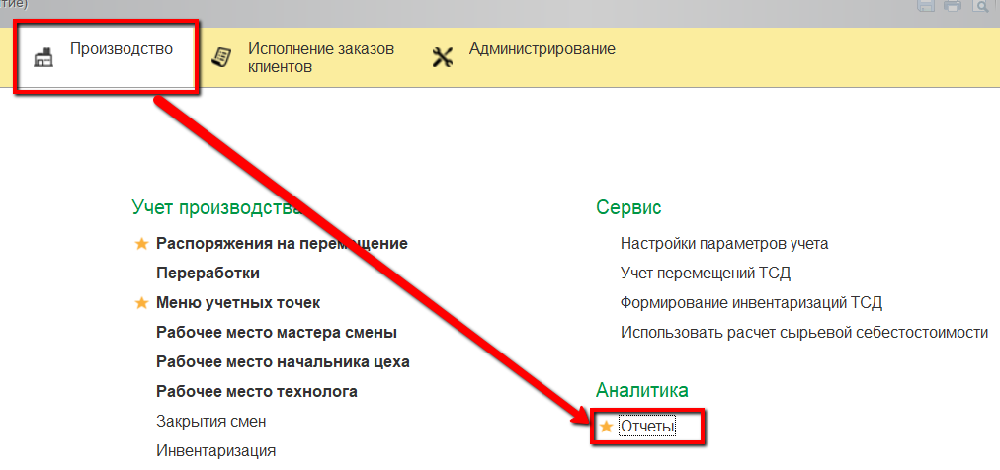
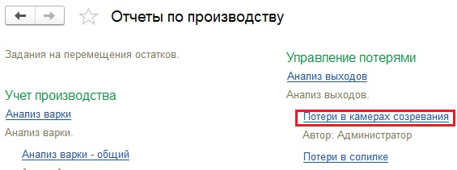
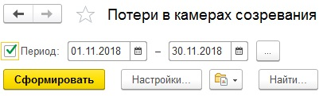
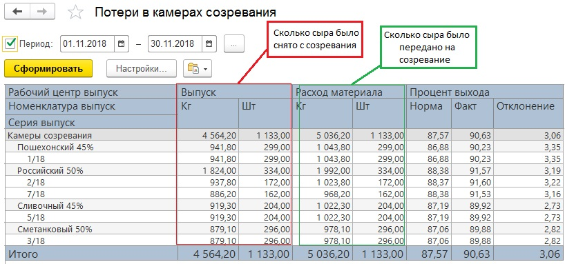

# Анализ потерь

Потери на данном этапе производства можно проследить как в отчете
"[Анализ созревания](../AnalysisMaturation/AnalysisMaturation.md)", так и
чуть более простом отчете "Анализ выходов", вариант "Потери в камерах
созревания".

-   Открыть отчет:  
      
      

-   Указать период, за который нужно получить информацию, и
    сформировать:  
    

-   По каждой варке можно видеть:
    -   Сколько сыра было передано на созревание и сколько снято в кг и
    штуках;
    -   Нормативный и фактический процент выхода, и рассчитанное на
    основании этих двух значений отклонение.  
    

