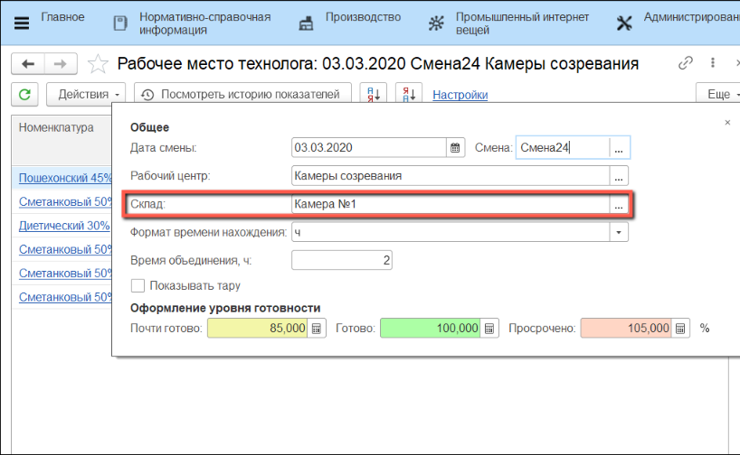
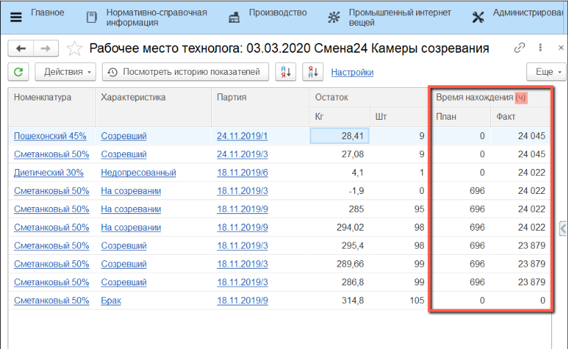

# Корректировка планового времени созревания сыра

Корректировка времени готовности конкретной партии сыра в системе происходит через
обработку **"Рабочее место технолога"**.

 

 

-   Открыть **"Рабочее место технолога"**:
    
    
-   На вкладке **"Настройки"** указать **"Дату смены"**:
    

-   Указать **"Смену"**:
    
    
-   Указать **"Рабочий центр"**, на котором зреет сыр:
    
    
-   Выбрать **"Склад"**, на котором находится нужная партия сыра (или её часть):
    
    
    
-   Указать **"Формат времени нахождения"** (минуты, часы, сутки):
    

-   Текущий **формат** отображается в заголовке колонки:
    

-   При изменении **формата** происходит пересчет и обновляется заголовок колонки:
    
    
-   Открыть **"Панель отборов"**:
    
    
-   В графе **"Характеристика"** указать стадию готовности сыра:
    
    
-   Выбрать **строку** с нужной **партией**:
    

-   Нажать **"Скорректировать время готовности"** в меню **"Действия"**:
    

    
-   Указать новое **"Плановое время нахождения"** или **"Плановую дату выхода"** (изменение одного приводит к пеесчету другого) и нажать **"Сохранить"**:
  
    
    
!!! attention ""Плановое время нахождения" указывается в том формате, который был выбран в настройках на форме "Рабочее место технолога""
    
-   В таблице **строка** подсветится жирным шрифтом, **плановое время** изменится:
    
