**Учетные точки**
=================

Настройка всех интерфейсов, через которые ведется оперативный учет на
сырцехе, происходит через справочники "Учетные точки" и "Кнопки учетных
точек".

**Справочник "Учетные точки"** 

Данный справочник используется для того,
чтобы отделить наборы операций, выполняемых на разных участках
производства. Например, логично отделить операции, связанные с выпусками
на этапе созревания сыра, от операций, связанных с выпусками на этапе
нормализации. При этом, если на предприятии на один только участок
созревания ставится несколько сенсорных киосков (в ключевых точках -
отдельно около места перевзвешивания сыра, отдельно для учета
перемещений контейнеров и тп), то разумно на каждый киоск сделать
отдельную учетную точку, пусть и  с одной операцией.
 

 

-   Открыть справочник "Учетные точки" и перейти к созданию нового
    элемента:
    
     
-   Указать наименование:
    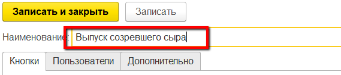
     
-   Указать список пользователей, у которых будет доступ к этой учетной
    точке (т.е. только они смогут выполнять операции, относящиеся к этой
    учетной точке):
    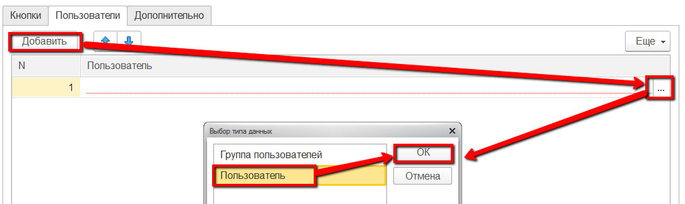
    
     
-   Нажать "Записать и закрыть".
     

**Справочник "Кнопки учетных точек"**  

Данный справочник используется для того, чтобы настраивать различные операции,
выполняемые на определенном участке производства. Например, для
этапа созревания сыра логично выделить кнопку для учета
перевзвешивания сыра по заданию.

  
-   Открыть справочник "Учетные точки". Среди списка найти нужную,
    открыть:
    
     
-   В таблице кнопок нажать "Создать":
    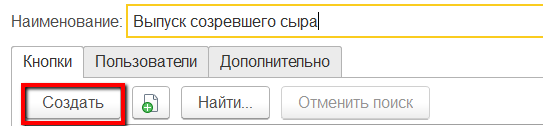
     
-   Указать наименование и выбрать обработку "Комплектация через весы" :
    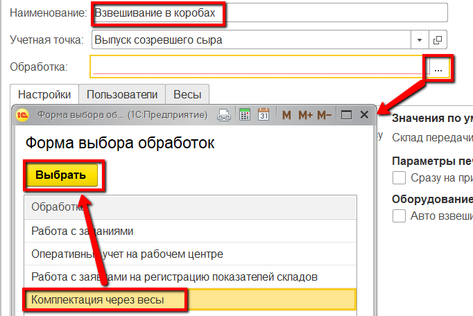
     
-   Указать в создаваемых документах "Переработка", "Упаковочный лист" и
    "Перемещение":
    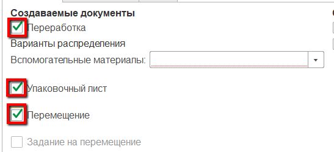
     
-   Указать, каким образом списываются вспомогательные материалы (серии
    коробов, если по таковым ведется учет, по-прежнему будут указываться
    оператором):
    -   По ФИФО - первые, пришедшие на склад упаковки партии;
    -   По ФЕФО - с самым ранним заканчивающимся сроком годности;
    -   Средневзвешанное - пропорциональное списание всех партий в остатках;
    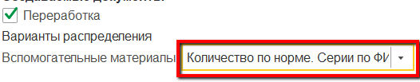
     
-   Указать  правило, по которому ведется списание материала, и правило,
    по которому происходит завешивание:
    -   Списывать материалы по нормативу - имеется ввиду без использования
    сканирования контейнеров, списываться будет материал из
    спецификации, серия в серию;
    -   Маркировка штуки - будет завешиваться каждая голова сыра, а не
    коробами с заданным вложением голов:
    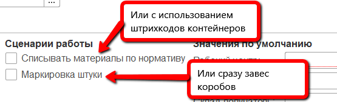
     
-   Указать участок перевзвешивания:
    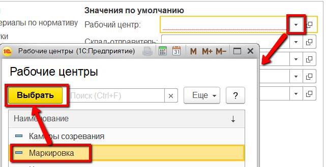
     
-   Указать склад-отправитель - с которого берется основной материал:
    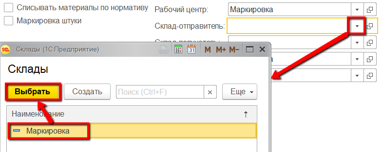
     
-   Указать склад-получатель - куда отправляют взвешенную продукцию:
    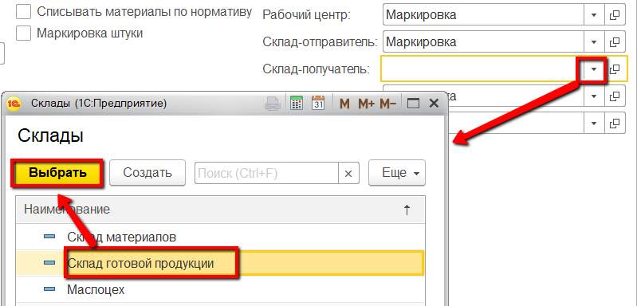
     
-   Указать склад передачи - участок, на котором происходит весь
    процесс:
    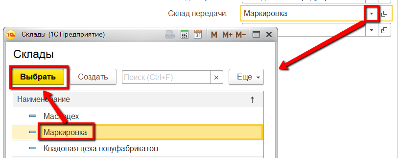
     
-   Указать организацию:
    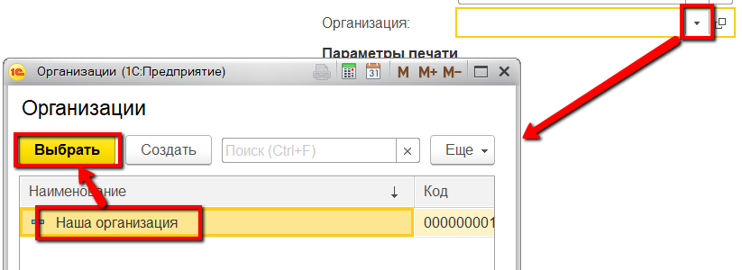
     
-   Отметить галочкой "Сразу на принтер", если необходимо, чтобы печать
    выводилась не на экран, а на подключенный принтер:
    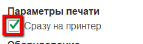
     
-   Нажать "Записать и закрыть".

 
Более подробная информация о параметрах кнопок учетных точек описана в
разделе ["Кнопки учетных точек"](../../../../CommonInformation/Handbooks/ButtonOfAccountPoint/readme.md).