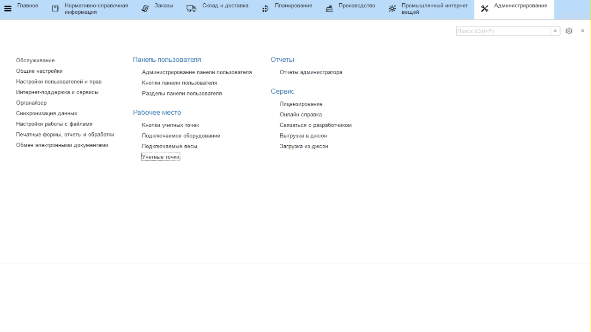
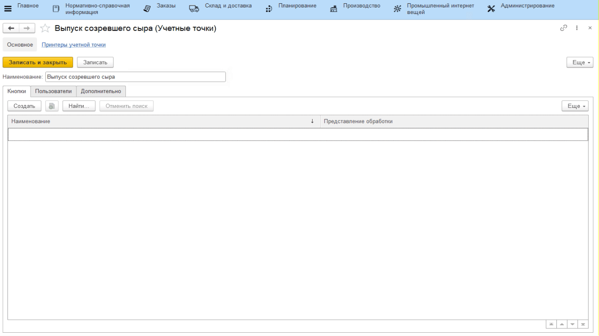
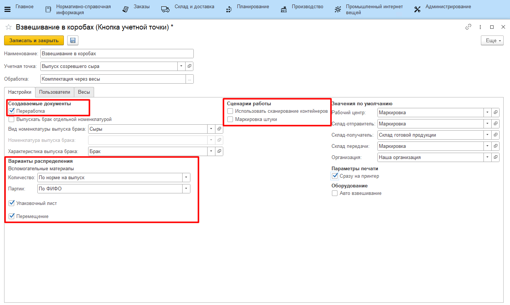

# Учетные точки

Настройка всех интерфейсов, через которые ведется оперативный учет на сырцехе, происходит через справочники **"Учетные точки"** и
**"Кнопки учетных точек"**.

## Справочник "Учетные точки"

Данный справочник используется для того,
чтобы отделить наборы операций, выполняемых на разных участках
производства. Например, логично отделить операции, связанные с выпусками на этапе созревания сыра, от операций, связанных с выпусками на этапе нормализации. При этом, если на предприятии на один только участок нормализации ставится несколько сенсорных киосков (в ключевых точках - отдельно около счетчика выпущенной смеси, отдельно для передачи смеси в сырцех), то разумно на каждый киоск сделать свою учетную точку, пусть и с одной операцией.
 

-   Открыть справочник **"Учетные точки"** и перейти к созданию нового элемента;
-   Указать наименование;
-   Указать список пользователей, у которых будет доступ к этой учетной
    точке (т.е. только они смогут выполнять операции, относящиеся к этой
    учетной точке);
-  Нажать **"Записать и закрыть"**.

## Справочник "Кнопки учетных точек"

Данный справочник используется для того, чтобы настраивать различные операции, выполняемые на определенном участке производства. Например, для этапа созревания сыра логично выделить кнопку для учета перевзвешивания сыра по заданию.

-   Открыть справочник **"Учетные точки"**. Среди списка найти нужную, открыть;  
-   В таблице кнопок нажать **"Создать"**;
-   Указать наименование и выбрать обработку **"Комплектация через весы"**:

-   Указать в создаваемых документах **"Переработка"**, **"Упаковочный лист"**, **"Перемещение"**;
-   Указать, что вспомогательные материалы списываются по норме с одним из вариантов подбора партий:
    - По ФИФО - первые, пришедшие на склад упаковки партии;
    - По ФЕФО - с самым ранним заканчивающимся сроком годности;

-   Указать  правило, по которому ведется списание материала, и правило, по которому происходит завешивание: 
    - Использовать сканирование контейнеров - если включено, материал считывается путем сканирования, если нет, то списываться будет материал из спецификации, партия в партию; 
    - Маркировка штуки - будет завешиваться каждая голова сыра, а не коробами с заданным вложением голов;
-   Указать участок перевзвешивания;
-   Указать склад, куда отправляют готовую продукцию;
-   Указать склад передачи - склад, на котором проводят взвешивание;
-   Отметить галочкой **"Сразу на принтер"**, если необходимо, чтобы печать выводилась не на экран, а на подключенный принтер;
-   Нажать **"Записать и закрыть"**.

Более подробная информация о параметрах кнопок учетных точек описана в
разделе ["Кнопки учетных точек"](../../../../CommonInformation/Handbooks/ButtonOfAccountPoint/readme.md).
