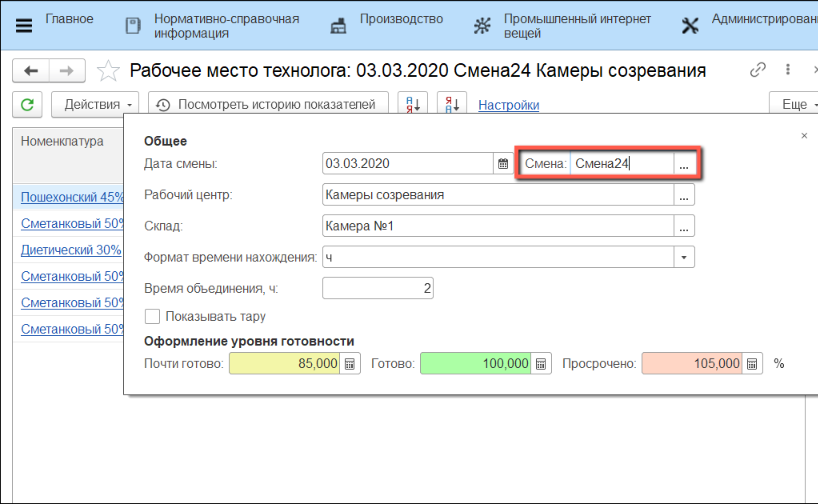
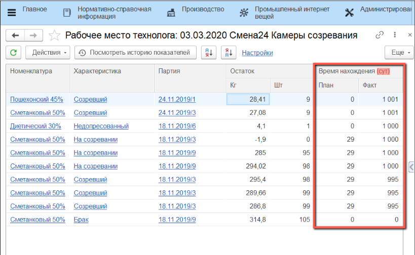
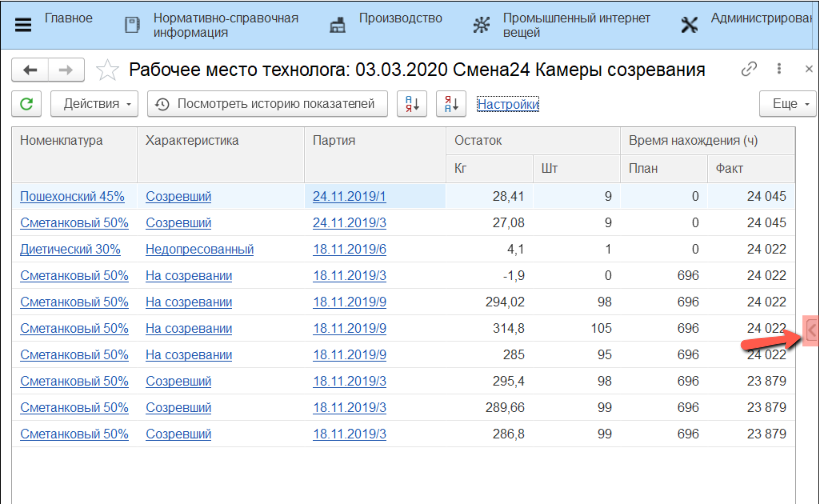
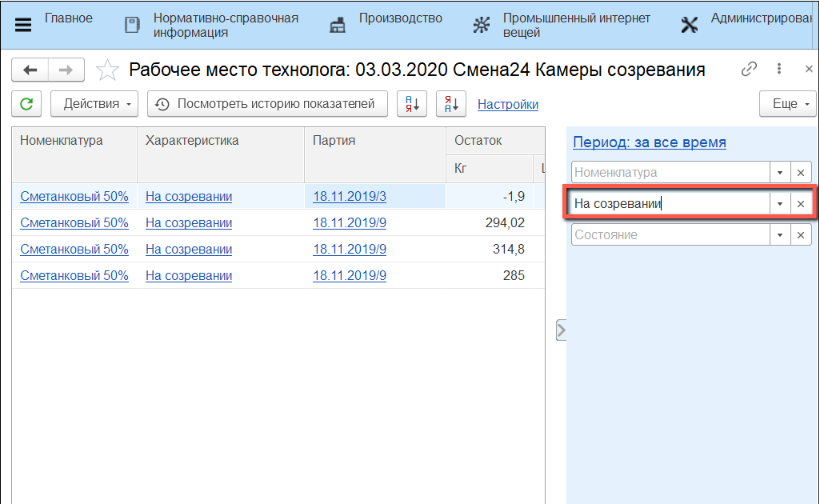

# Отбраковка сыра на созревании

Отбраковка сыра на созревании в системе происходит через обработку
**"Рабочее место технолога"**.

 

 

-   Открыть **"Рабочее место технолога"**:
    
    
-   На вкладке **"Настройки"** указать **"Дату смены"**:
    

-   Указать **"Смену"**:
    
    
-   Указать **"Рабочий центр"**, на котором нужно учесть брак:
    
    
-   Выбрать **"Склад"**, на котором нужно учесть брак:
    
    
    
-   Указать **"Формат времени нахождения"** (минуты, часы, сутки):
    

-   Текущий **формат** отображается в заголовке колонки:
    

-   При изменении **формата** происходит пересчет и обновляется заголовок колонки:
    

-   Так же в настройках необходимо включить **отображение тары**:
    
    
-   Открыть **"Панель отборов"**:
    
    
-   В графе **"Характеристика"** указать стадию готовности сыра, на которой
    был выявлен брак:
    
        
-   Выбрать **строку** с **партией**, в которой необходимо учесть брак:
    
    
-   Нажать **"Выпустить брак"** в меню **"Действия"**:
    

-   В открывшемся окне указать **характеристику** и **причину** брака:
    
    
-   Бракованное количество будет отражено в рабочем месте технолога с
    указанной **характеристикой** с датой проведения операции:
    
