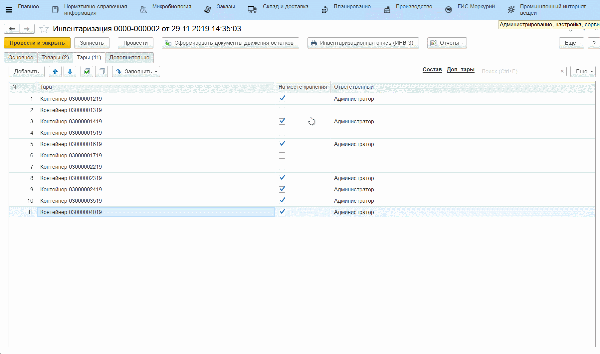

# Инвентаризация в камерах созревания

Инвентаризация в камерах созревания проводится с помощью специального
устройства - ТСД, подключенного к системе. Для него настраивается
стартовая страница с кнопками, каждая из которых отвечает за
определенную операцию.

-   На ТСД нажать кнопку, соответствующую операции инвентаризации;
-   На вкладке *"Настройки"* указать склад, на котором будет проведена
    инвентаризация;  
-   Если инвентаризация еще не была начата на указанном складе, то пропустить этот пункт. Если же была начата ранее, то нужно выбрать ранее созданный документ инвентаризации и продолжить его заполнение:  

-   Перейти на вкладку *"Товары"* и начать сканировать этикетки всех контейнеров, находящихся на указанном складе. При сканировании в таблице будет появляться информация по контейнеру - какой сыр на нем лежит и в каком количестве:  

  

!!! info "Важно"  
    Если какие либо контейнеры, по учету в системе находящиеся на
    складе, где была проведена инвентаризация, не были просканированы,
    они автоматически будут обнулены в созданном документе.

-   По завершении инвентаризации на складе ответственному лицу нужно
    проверить созданный документ и провести его, тем самым подтвердив
    корректность. Для этого открыть документы **"Инвентаризация"**;
-   Среди всех документов найти нужный, ориентируясь на время, склад и
    то, что документ **не проведен**;
-   Открыть документ, проверить таблицу на вкладке *"Тары"* и нажать
    **"Провести"**:

Теперь нужно создать документы **"Распоряжения на перемещение"**, тем самым учесть в системе неучтенные ранее перемещения (если вдруг по учету в системе и так все правильно - ни один документ не будет создан).

-   Нажать **"Сформировать документы движения остатков"**. Создастся документ **"Распоряжение на перемещение"**.

При этом, если какие-то контейнеры по учету размещены на другом складе, а были просканированы на текущем, то создадутся перемещения *на текущий склад* (в примере - первый документ). Если контейнеры по учету в системе находились на текущем складе, но не были просканированы, то они "отправятся" *на склад пересчета* (второй документ):  

  

!!! info ""
    Склад пересчета указывается в настройках параметров учета.  

