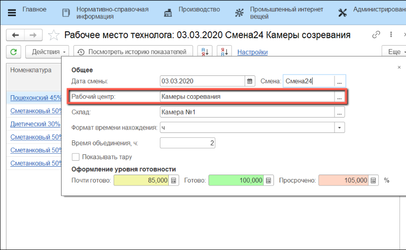

# Выпуск созревшего сыра без взвешивания

Выпуск созревшего сыра без взвешивания в системе происходит через
обработку **"Рабочее место технолога"**.

 

 

-   Открыть **"Рабочее место технолога"**:
    
    
-   На вкладке **"Настройки"** указать **"Дату смены"**:
    

-   Указать **"Смену"**:
    
    
-   Указать **"Рабочий центр"**, на котором зреет сыр:
    
    
-   Выбрать **"Склад"**, на котором нужно указать готовность сыра:
    
    
    
-   Указать **"Формат времени нахождения"** (минуты, часы, сутки):
    

-   Текущий **формат** отображается в заголовке колонки:
    

-   При изменении **формата** происходит пересчет и обновляется заголовок колонки:
    

-   Открыть фильтр отбора :  
    
    
-   В графе **"Характеристика"** указать стадию готовности сыра:
    
    
-   Выбрать **строку** с необходимой **партией**:
    
    
-   Нажать **"Подтвердить готовность"** в меню **"Действия"**:
    
    
-   Подтвердить готовность:  
    
    
-   **Характеристика** партии поменяется на **"Созревший"**:
    
