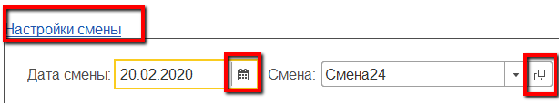
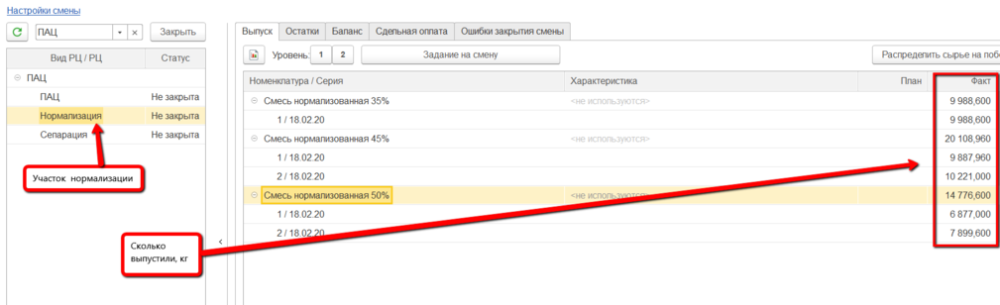
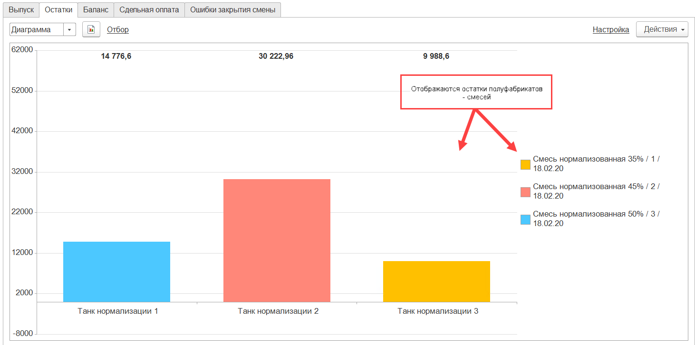
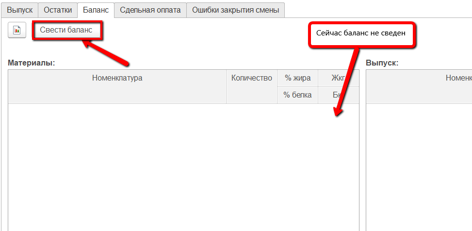
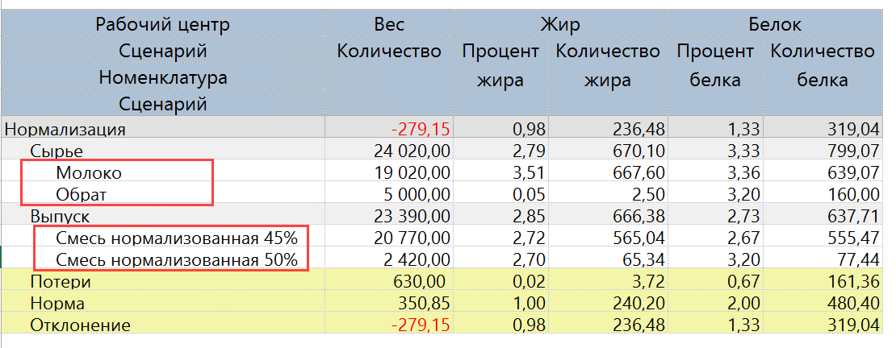
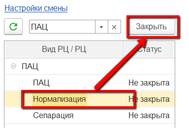
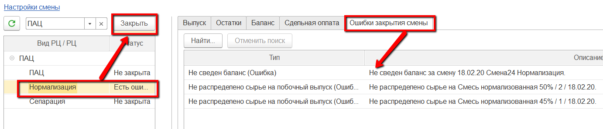

# Закрытие смены

Контроль всех введенных в систему данных за рабочую смену осуществляется
мастером смены через "Рабочее место мастера смены"

 

 

- Открыть "Рабочее место мастера смены":  
    

-   Указать смену для контроля и участок, на котором нормализуется
    молоко:  
  

    
-   В таблице ниже выбрать участок нормализации молока, который
    необходимо проверить на корректность. Справа заполнится различная
    информация по данному участку. Например, на вкладке "Выпуск"
    отображается вся информация по выпускам за указанную смену:  
 
    
-   На вкладке "Остатки" -\> "Изделия" отображается информация по
    оборотам нормализованного молока в каждом танке.
    Для просмотра только остатков (по данным системы) можно
    переключиться в режим диаграммы.  

    
    
     
    
-   На вкладке "Баланс" можно свести или посмотреть ранее сведенный
    баланс по жиру и белку (если он уже был сведен, таблицы выпуска и
    материалов будут заполнены). Для сведения баланса на участке нажать
    "Свести баланс":  

    
- После - таблицы заполнятся. Для более удобного просмотра можно
    сформировать отчет, в котором будет отображена информация из таблиц.
    Для этого нажать кнопку формирования отчета:  

    
- Здесь можно видеть:
    -   Сколько какого продукта было выпущено, сколько при этом потратилось
    сырья;
  -   Какое было содержание жира и белка в сырье, какое получилось в
    выпусках (как в кг, так и в %);
  -   Получившийся процент потерь по кг, жкг и бкг и нормативный.  

  
-   После выполнения всех вышеперечисленных действий и проверки
    корректности всех данных, смену необходимо закрыть для невозможности
    внесения в нее изменений. Для этого выбрать участок в таблице слева
    и нажать "Закрыть":  

    
-   При закрытии могут возникнуть ошибки (не сведен баланс, не
    распределено сырье или т.п.) . Исправить их, после чего вернуться и
    снова нажать  "Закрыть":  
